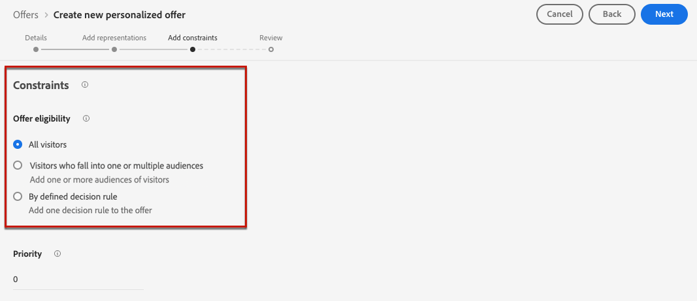
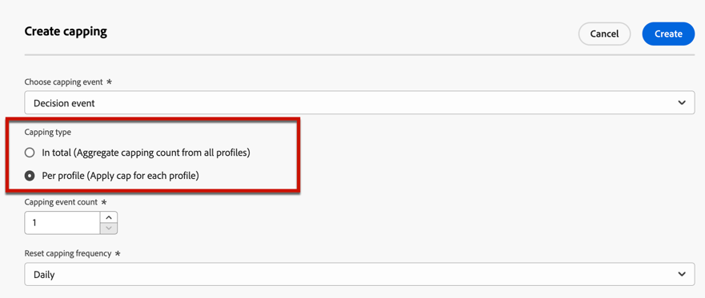

# Adición de restricciones a una oferta {#add-constraints}

>[!CONTEXTUALHELP]
>id="od_offer_constraints"
>title="Acerca de las restricciones de oferta"
>abstract="Con las restricciones, se puede especificar cómo se prioriza la oferta y cómo se presenta al usuario en comparación con otras ofertas."

>[!CONTEXTUALHELP]
>id="ajo_decisioning_constraints"
>title="Acerca de las restricciones de oferta"
>abstract="Con las restricciones, se puede especificar cómo se prioriza la oferta y cómo se presenta al usuario en comparación con otras ofertas."

>[!CONTEXTUALHELP]
>id="od_offer_priority"
>title="Acerca de la prioridad de las ofertas"
>abstract="En este campo, se puede especificar la configuración de prioridad de la oferta. La prioridad es un número que se utiliza para clasificar ofertas que cumplen todas las restricciones, como idoneidad, fechas y límite."

>[!CONTEXTUALHELP]
>id="ajo_decisioning_priority"
>title="Establecer prioridad"
>abstract="La prioridad ayuda a definir la prioridad de la oferta en comparación con otras si el usuario cumple los requisitos para más de una oferta. Cuanto mayor sea la prioridad de una oferta, mayor será su prioridad en comparación con otras ofertas."

Las restricciones permiten definir las condiciones en las que se mostrará una oferta.

1. Configure las variables **[!UICONTROL Elegibilidad de la oferta]**. [Más información](#eligibility)

   

1. Defina el **[!UICONTROL Prioridad]** de la oferta comparada con otras si el usuario cumple los requisitos para más de una oferta. Cuanto mayor sea la prioridad de una oferta, mayor será su prioridad en comparación con otras ofertas.

   

1. Especifique los **[!UICONTROL Restricción]**, lo que significa el número de veces que se presentará la oferta. [Más información](#capping)

   

1. Haga clic en **[!UICONTROL Siguiente]** para confirmar todas las restricciones definidas.

Por ejemplo, si establece las siguientes restricciones:

* La oferta se tendrá en cuenta para los usuarios que coincidan únicamente con la regla de decisión &quot;Clientes de Lealtad Dorada&quot;.
* La prioridad de la oferta se establece en &quot;50&quot;, lo que significa que la oferta se presentará antes que las ofertas con una prioridad entre 1 y 49, y después las que tengan una prioridad de al menos 51.
* La oferta se presentará solo una vez al mes por usuario en todas las ubicaciones.

## Elegibilidad {#eligibility}

>[!CONTEXTUALHELP]
>id="ajo_decisioning_eligibility"
>title="Definir idoneidad"
>abstract="De forma predeterminada, cualquier perfil podrá recibir la oferta, pero puede utilizar segmentos o reglas de decisión para restringir la oferta a perfiles específicos."

>[!CONTEXTUALHELP]
>id="od_offer_eligibility"
>title="Acerca de la idoneidad de la oferta"
>abstract="En esta sección, puede utilizar reglas de decisión para determinar qué usuarios podrán recibir la oferta."
>additional-url="https://video.tv.adobe.com/v/329373" text="Ver vídeo de demostración"

>[!CONTEXTUALHELP]
>id="ajo_decisioning_total_profile_estimate"
>title="Estimación total del perfil"
>abstract="Al seleccionar segmentos o reglas de decisión, puede ver información sobre los perfiles cualificados estimados."

La variable **[!UICONTROL Elegibilidad de la oferta]** le permite restringir la oferta a perfiles específicos que defina mediante segmentos o reglas de decisión.

>[!NOTE]
>
>Obtenga más información sobre el uso de **segmentos** versus **reglas de decisión** en [esta sección](#segments-vs-decision-rules).

* De forma predeterminada, la variable **[!UICONTROL Todos los visitantes]** está seleccionada, lo que significa que cualquier perfil puede presentarse como oferta.

   

* También puede limitar la presentación de la oferta a los miembros de una o varias [Segmentos de Adobe Experience Platform](../../segment/about-segments.md).

   Para ello, active la variable **[!UICONTROL Visitantes que entran en uno o varios segmentos]** , luego agregue uno o varios segmentos del panel izquierdo y combínelos usando la opción **[!UICONTROL Y]** / **[!UICONTROL O]** operadores lógicos.

   

* Si desea asociar un [regla de decisión](../offer-library/creating-decision-rules.md) a la oferta, seleccione **[!UICONTROL Por regla de decisión definida]** y, a continuación, arrastre la regla que desee desde el panel izquierdo hasta la **[!UICONTROL Regla de decisión]** .

   

   >[!CAUTION]
   >
   >Actualmente, las ofertas basadas en eventos no son compatibles con [!DNL Journey Optimizer]. Si crea una regla de decisión basada en un [evento](https://experienceleague.adobe.com/docs/experience-platform/segmentation/ui/segment-builder.html?lang=en#events){target="_blank"}, no podrá aprovecharlo en una oferta.

Al seleccionar segmentos o reglas de decisión, puede ver información sobre los perfiles cualificados estimados. Haga clic en **[!UICONTROL Actualizar]** para actualizar los datos.

>[!NOTE]
>
>Las estimaciones de perfil no están disponibles cuando los parámetros de regla incluyen datos que no están en el perfil, como los datos de contexto. Por ejemplo, una regla de aceptación que requiera que el clima actual sea ≥ 80 grados.

### Uso de segmentos frente a reglas de decisión {#segments-vs-decision-rules}

Para aplicar una restricción, puede restringir la selección de ofertas a los miembros de una o varias **Segmentos de Adobe Experience Platform** o puede usar un **regla de decisión**, ambas soluciones corresponden a diferentes usos.

Básicamente, el resultado de un segmento es una lista de perfiles, mientras que una regla de decisión es una función ejecutada bajo demanda contra un solo perfil durante el proceso de toma de decisiones. A continuación se detalla la diferencia entre estos dos usos.

* **Segmentos**

   Por un lado, los segmentos son un grupo de perfiles de Adobe Experience Platform que coinciden con una lógica determinada basada en atributos de perfil y eventos de experiencia. Sin embargo, Administración de ofertas no vuelve a calcular el segmento, el cual puede no estar actualizado al presentar la oferta.

   Obtenga más información sobre los segmentos en [esta sección](../../segment/about-segments.md).

* **Reglas de decisión**

   Por otro lado, una regla de decisión se basa en los datos disponibles en Adobe Experience Platform y determina a quién se puede mostrar una oferta. Una vez seleccionada en una oferta o una decisión para una ubicación determinada, la regla se ejecuta cada vez que se toma una decisión, lo que garantiza que cada perfil obtenga la oferta más reciente y la mejor.

   Obtenga más información sobre las reglas de decisión en [esta sección](creating-decision-rules.md).

## Restricción {#capping}

>[!CONTEXTUALHELP]
>id="od_offer_globalcap"
>title="Acerca del límite de ofertas"
>abstract="En este campo, se puede especificar cuántas veces se puede presentar la oferta."

>[!CONTEXTUALHELP]
>id="ajo_decisioning_capping"
>title="Usar límite"
>abstract="Para evitar un exceso de solicitudes a sus clientes, utilice la función de límite para definir el número máximo de veces que se puede presentar una oferta."
>additional-url="https://experienceleague.adobe.com/docs/journey-optimizer/using/offer-decisioning/managing-offers-in-the-offer-library/configure-offers/add-constraints.html?lang=es#capping-change-date" text="Cambiar fechas puede afectar al límite"

>[!CONTEXTUALHELP]
>id="ajo_decisioning_frequency_capping"
>title="Definir la frecuencia de límite"
>abstract="Puede elegir restablecer el contador de límite de ofertas de forma diaria, semanal o mensual. Tenga en cuenta que después de guardar la oferta, no podrá cambiar la frecuencia seleccionada."

>[!CONTEXTUALHELP]
>id="ajo_decisioning_frequency_capping_impression"
>title="Impresión"
>abstract="El uso de impresiones como eventos de límite solo está disponible para canales entrantes."

El límite se utiliza como una restricción para definir el número máximo de veces que se puede presentar una oferta.

Limitar el número de veces que los usuarios obtienen ofertas específicas le permite evitar saturar a sus clientes y, por lo tanto, optimizar cada punto de contacto con la mejor oferta.

Para definir el límite, siga los pasos principales a continuación.

1. Asegúrese de que la variable **[!UICONTROL Incluir restricción]** está seleccionado. El límite está incluido de forma predeterminada.

   >[!CAUTION]
   >
   >No es posible habilitar o deshabilitar el límite de frecuencia para ofertas creadas anteriormente. Para ello, debe duplicar la oferta o crear una nueva.

1. Defina qué **[!UICONTROL Evento de restricción]** se tiene en cuenta para aumentar el contador. [Más información](#capping-event)

1. Establezca el número de veces que se puede presentar la oferta. [Más información](#capping-count)

1. Elija si desea que el límite se aplique a todos los usuarios o solo a un perfil. [Más información](#capping-type)

1. Configure las variables **[!UICONTROL Frecuencia]** para definir la frecuencia con la que se restablece el recuento de límite. [Más información](#frequency-capping)

1. Si ha definido varias [representaciones](add-representations.md) para la oferta, especifique si desea aplicar restricciones **[!UICONTROL En todas las ubicaciones]** o **[!UICONTROL Para cada ubicación]**. [Más información](#placements)

1. Una vez guardada y aprobada, si la oferta se ha presentado el número de veces especificado en este campo según los criterios y el periodo de tiempo definido, su envío se detendrá.

El número de veces que se propone una oferta se calcula en el momento de la preparación del correo electrónico. Por ejemplo, si prepara un mensaje de correo electrónico con una serie de ofertas, esos números se cuentan hasta el límite máximo, independientemente de si se envía o no el correo electrónico.

<!--If an email delivery is deleted or if the preparation is done again before being sent, the capping value for the offer is automatically updated.-->

>[!NOTE]
>
>Los contadores de límite se restablecerán cuando la oferta caduque o 2 años después de la fecha de inicio de la oferta, lo que suceda primero. Aprenda a definir la fecha de una oferta en [esta sección](creating-personalized-offers.md#create-offer).

### Evento de restricción {#capping-event}

La variable **[!UICONTROL Evento de restricción]** permite definir qué **[!UICONTROL Evento de restricción]** se tiene en cuenta para aumentar el contador:

* **[!UICONTROL Evento de decisión]** (valor predeterminado): Número máximo de veces que se puede presentar una oferta.
* **[!UICONTROL Impresión]**: Número máximo de veces que se puede mostrar la oferta a un usuario.

   >[!NOTE]
   >
   >El uso de impresiones como eventos de restricción está disponible para **canales entrantes** solo.

* **[!UICONTROL Clics]**: Número máximo de veces que un usuario puede hacer clic en la oferta.
* **[!UICONTROL Evento personalizado]**: Puede definir un evento personalizado que se utilizará para limitar el número de ofertas enviadas. Por ejemplo, puede limitar el número de reembolsos hasta que sean iguales a 10000 o hasta que un perfil dado haya redimido 1 vez. Para ello, utilice [Adobe Experience Platform XDM](https://experienceleague.adobe.com/docs/experience-platform/xdm/home.html?lang=es){target="_blank"} esquemas para crear una regla de evento personalizada.

   <!--For example, you can cap on the number of redemptions so that the offer can be shown until redemptions equal 10000. You can only select XDM ExperienceEvents. -->

   En el siguiente ejemplo, desea limitar el número de cierres de compra.

   1. Select **[!UICONTROL Evento personalizado]** de la lista y utilice el **[!UICONTROL Añadir evento personalizado]** botón.

      

   1. Utilice la variable **[!UICONTROL Crear reglas de evento personalizadas]** generador para seleccionar el evento relevante. Puede elegir cualquier acción del usuario en la que quiera limitar las ofertas.

      Elija **[!UICONTROL Comercio]** > **[!UICONTROL Cierres de compra]** > **[!UICONTROL Valor]** y seleccione **[!UICONTROL existe]** en la lista desplegable.

      

   1. Una vez creada la regla, aparece en la sección **[!UICONTROL Consulta de evento personalizada]** campo .

      
   >[!CAUTION]
   >
   >Para todos los eventos de límite excepto el evento de decisión, es posible que los comentarios de administración de decisiones no se recopilen automáticamente, por lo que asegúrese de que los datos estén llegando. [Más información sobre la recopilación de datos](../data-collection/data-collection.md)

### Recuento de restricciones {#capping-count}

La variable **[!UICONTROL Recuento de restricciones]** permite especificar el número de veces que se puede presentar la oferta.

>[!NOTE]
>
>El número debe ser un número entero bueno a 0.

Por ejemplo, se ha definido un evento de límite personalizado como el número de cierres de compra que se tiene en cuenta. Si introduce 10 en la variable **[!UICONTROL Recuento de restricciones]** , no se enviarán más ofertas después de 10 cierres de compra.

### Tipo de restricción {#capping-type}

También puede especificar si desea que el límite se aplique a todos los usuarios o a un perfil específico:

* Select **[!UICONTROL En total]** para definir cuántas veces se puede proponer una oferta en la audiencia de destino combinada, es decir, en todos los usuarios.

   Por ejemplo, si es un minorista de electrónica que tiene una &quot;oferta de proveedor de televisión&quot;, desea que la oferta solo se devuelva 200 veces en todos los perfiles.

* Select **[!UICONTROL Por perfil]** para definir cuántas veces se puede proponer una oferta al mismo usuario.

   Por ejemplo, si es un banco con una oferta de &quot;tarjeta de crédito Platinum&quot;, no desea que esta oferta se muestre más de 5 veces por perfil. De hecho, cree que si el usuario ha visto la oferta 5 veces y no ha actuado en ella, tiene más posibilidades de actuar en la siguiente mejor oferta.

### Restricción de frecuencia {#frequency-capping}

La variable **[!UICONTROL Frecuencia]** le permite definir con qué frecuencia se restablece el recuento de límite. Para ello, defina el periodo de tiempo para el recuento (diario, semanal o mensual) e introduzca el número de días/semanas/meses de su elección.

>[!NOTE]
>
>El restablecimiento se realiza a las 12:00 UTC, el día que haya definido o el primer día de la semana/mes, si corresponde. El día de inicio de la semana es domingo. Cualquier duración que elija no puede exceder de 2 años (es decir, el número correspondiente de meses, semanas o días).

Por ejemplo, si desea que el recuento de límite se restablezca cada 2 semanas, seleccione **[!UICONTROL Semanal]** de la variable **[!UICONTROL Repetir]** tipo y lista desplegable **2** en el otro campo. El reinicio se realizará cada dos domingos a las 12pm UTC.

>[!CAUTION]
>
>Después de guardar la oferta, no podrá cambiar el período de tiempo (mensual, semanal o diario) que haya seleccionado para la frecuencia.

### Restricciones y ubicaciones {#placements}

Si ha definido varias [representaciones](add-representations.md) para la oferta, especifique si desea aplicar restricciones **[!UICONTROL En todas las ubicaciones]** o **[!UICONTROL Para cada ubicación]**.

* **[!UICONTROL En todas las ubicaciones]**: los recuentos de límite totales calcularán todas las decisiones en las ubicaciones asociadas a la oferta.

   Por ejemplo, si una oferta tiene una **Correo electrónico** ubicación y **Web** ubicación y establezca el límite en **2 por perfil en todas las ubicaciones**, cada perfil podría recibir la oferta hasta 2 veces en total, independientemente de la combinación de ubicación.

* **[!UICONTROL Para cada ubicación]**: los recuentos de límite aplicarán recuentos de decisión para cada ubicación por separado.

   Por ejemplo, si una oferta tiene una **Correo electrónico** ubicación y **Web** ubicación y establezca el límite en **2 por perfil para cada ubicación**, cada perfil podría recibir la oferta hasta 2 veces para la ubicación del correo electrónico y otras 2 veces para la ubicación web.

### Influencia del cambio de fechas en el límite {#capping-change-date}

>[!CONTEXTUALHELP]
>id="ajo_decisioning_offer_change_date"
>title="Cambiar fechas puede afectar al límite"
>abstract="Si se aplica un límite a esta oferta, este se puede ver afectado al cambiar la fecha de inicio o de finalización."

Se debe tener cuidado al cambiar la fecha de una oferta, ya que esto puede tener un impacto en el límite si se cumplen las siguientes condiciones:

* La oferta es [aprobado](#review).
* [Restricción](#capping) ya se aplica a la oferta.
* El límite se define por perfil.

>[!NOTE]
>
>Aprenda a definir la fecha de una oferta en [esta sección](creating-personalized-offers.md#create-offer).

La restricción por perfil almacena los recuentos de límite de cada perfil. Al cambiar la fecha de inicio y finalización de una oferta aprobada, el recuento de límite de algunos perfiles podría verse afectado según los diferentes escenarios que se describen a continuación.

Estos son los escenarios posibles cuando **cambio de la fecha de inicio de una oferta**:

| Escenario: Si... | Qué sucede: entonces... | Posible impacto en el recuento de límite |
|--- |--- |--- |
| ... la fecha de inicio de la oferta se actualiza antes de que comience la fecha de inicio de la oferta original, | ... el recuento de límite empezará en la nueva fecha de inicio. | No |
| ... la nueva fecha de inicio es anterior a la fecha de finalización actual, | ... el límite continuará con una nueva fecha de inicio y el recuento de límite anterior para cada perfil seguirá adelante. | No |
| ... la nueva fecha de inicio es posterior a la fecha de finalización actual, | ... el límite actual caducará y el nuevo recuento de límite volverá a empezar desde 0 para todos los perfiles en la nueva fecha de inicio. | Sí |

Estos son los escenarios posibles cuando **ampliación de la fecha de finalización de una oferta**:

| Escenario: Si... | Qué sucede: entonces... | Posible impacto en el recuento de límite |
|--- |--- |--- |
| ... se produce una solicitud de toma de decisiones antes de la fecha de finalización de la oferta original, | ... el recuento de límite se actualizará y el recuento de límite anterior para cada perfil se mantendrá. | No |
| ... no se produce ninguna solicitud de toma de decisiones antes de la fecha de finalización original, | ... el recuento de límite se restablecerá en la fecha de finalización original de cada perfil. El nuevo recuento de límite vuelve a empezar desde 0 para cualquier nueva solicitud de toma de decisiones que se produzca después de la fecha de finalización original. | Sí |

**Ejemplo**

Supongamos que tiene una oferta con una fecha de inicio original configurada como **Enero de 1**, caducando el **31 de enero**.

1. La oferta se presenta con los perfiles X, Y y Z.
1. Activado **Enero de 10**, la fecha de finalización de la oferta cambia a **15 de febrero**.
1. **Del 11 de enero al 31 de enero**, solo se presenta la oferta en el perfil Z.

   * Debido a que se produjo una solicitud de toma de decisiones antes de la fecha de finalización original **para el perfil Z**, la fecha de finalización de la oferta se puede ampliar a **15 de febrero**.
   * Sin embargo, como no se produjo ninguna actividad antes de la fecha de finalización original de **perfiles X e Y**, sus contadores caducarán y sus recuentos de límite se restablecerán a 0 en **31 de enero**.

