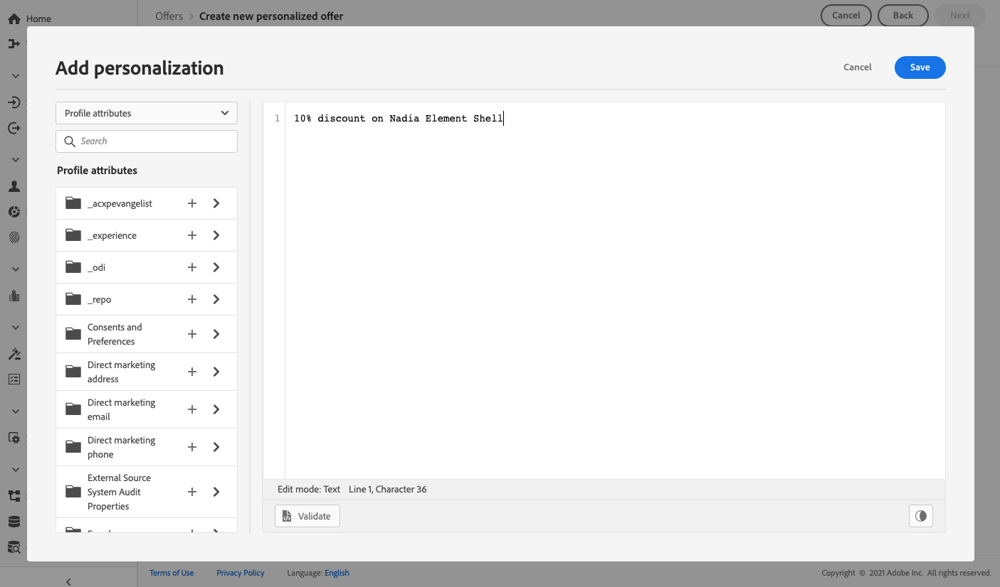
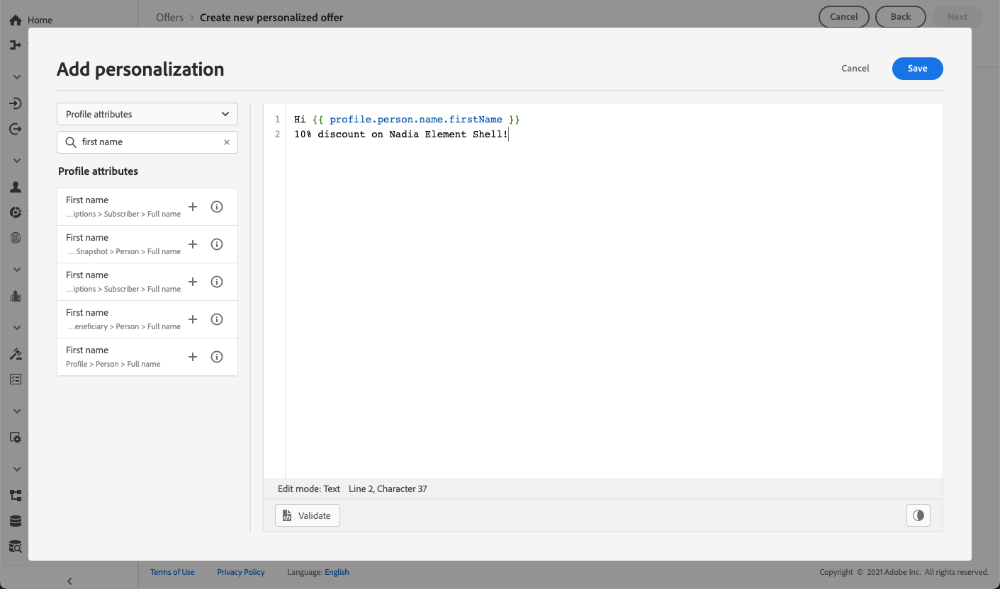

# Añadir representaciones a una oferta {#add-representations}

>[!CONTEXTUALHELP]
>id="ajo_decisioning_representation"
>title="Representaciones"
>abstract="Añada representaciones para definir dónde se mostrará la oferta en el mensaje. Cuantas más representaciones tenga una oferta, más oportunidades habrá de utilizar la oferta en diferentes contextos de ubicación."

Una oferta se puede mostrar en diferentes lugares de un mensaje: en un banner superior con una imagen, como texto en un párrafo, como un bloque HTML, etc. Cuantas más representaciones tenga una oferta, más oportunidades habrá de utilizar la oferta en diferentes contextos de ubicación.

## Configuración de las representaciones de la oferta {#representations}

Para añadir una o varias representaciones a la oferta y configurarlas, siga los pasos a continuación.

1. Para la primera representación, comience seleccionando la **[!UICONTROL Canal]** que se utilizará.

   

   >[!NOTE]
   >
   >En la pantalla solo se muestran las ubicaciones disponibles para el canal seleccionado **[!UICONTROL Ubicación]** lista desplegable.

1. Seleccione una ubicación de la lista.

   También puede utilizar el botón situado junto al **[!UICONTROL Ubicación]** para examinar todas las ubicaciones.

   

   Allí aún puede filtrar las ubicaciones según su canal o tipo de contenido. Seleccione una ubicación y haga clic en **[!UICONTROL Seleccionar]**.

   

1. Añada contenido a su representación. Descubra cómo en [esta sección](#content).

1. Al agregar contenido, como una imagen o una dirección URL, puede especificar un **[!UICONTROL Vínculo de destino]**: los usuarios que hacen clic en la oferta se dirigen a la página correspondiente.

   

1. Finalmente, seleccione el idioma de su elección para identificar y administrar qué mostrar a los usuarios.

1. Para añadir otra representación, utilice el **[!UICONTROL Añadir representación]** y añada tantas representaciones como sea necesario.

   

1. Una vez añadidas todas las representaciones, seleccione **[!UICONTROL Siguiente]**.

## Definición del contenido de las representaciones {#content}

Se pueden añadir distintos tipos de contenido a una representación.

>[!NOTE]
>
>Solo el contenido correspondiente al tipo de contenido de la ubicación está disponible para su uso.

### Adición de imágenes {#images}

Si la ubicación seleccionada es de tipo imagen, puede añadir contenido procedente del **Recurso de Adobe Experience Cloud** biblioteca, un repositorio centralizado de recursos proporcionado por [!DNL Adobe Experience Manager Assets].

>[!NOTE]
>
> Para trabajar con [Adobe Experience Manager Assets Essentials](https://experienceleague.adobe.com/docs/experience-manager-assets-essentials/help/introduction.html){target="_blank"}, you need to deploy [!DNL Assets Essentials] for your organization and make sure that users are a part of the **Assets Essentials Consumer Users** or/and **Assets Essentials Users** Product profiles. Learn more on [this page](https://experienceleague.adobe.com/docs/experience-manager-assets-essentials/help/get-started-admins/deploy-administer.html){target="_blank"}.

1. Elija la **[!UICONTROL Biblioteca de recursos]** opción.

1. Seleccionar **[!UICONTROL Examinar]**.

   

1. Examine los recursos para seleccionar la imagen que desee

1. Haga clic en **[!UICONTROL Seleccionar]**.

   

### Añadir archivos HTML o JSON {#html-json}

Si la ubicación seleccionada es de tipo HTML, también puede añadir contenido JSON o de HTML procedente del [Biblioteca de recursos de Adobe Experience Cloud](https://experienceleague.adobe.com/docs/experience-manager-assets-essentials/help/introduction.html){target="_blank"}).

Por ejemplo, ha creado una plantilla de correo electrónico de HTML en [Adobe Experience Manager](https://experienceleague.adobe.com/docs/experience-manager.html){target="_blank"} y desea utilizar ese archivo para el contenido de la oferta. En lugar de crear un nuevo archivo, simplemente puede cargar la plantilla en el **Biblioteca de recursos** para poder reutilizarlo en las representaciones de la oferta.

Para reutilizar el contenido en una representación, examine la **Biblioteca de recursos** como se describe en [esta sección](#images) y seleccione el HTML o el archivo JSON de su elección.


### Añadir URL {#urls}

Para añadir contenido desde una ubicación pública externa, seleccione **[!UICONTROL URL]** A continuación, introduzca la dirección URL del contenido que desea añadir.

Puede personalizar las direcciones URL mediante el Editor de expresiones. Más información sobre [personalización](../../personalization/personalize.md#use-expression-editor).


Por ejemplo, se desea personalizar la imagen que se muestra como oferta. Desea que los usuarios que favorecen las vacaciones en la ciudad vean el horizonte de Nueva York y los usuarios que favorecen las vacaciones en la playa vean la costa norte de Hawai.

Utilice el Editor de expresiones para recuperar atributos de perfil almacenados en Adobe Experience Platform mediante esquemas de unión. [Más información](https://experienceleague.adobe.com/docs/experience-platform/profile/union-schemas/union-schemas-overview.html){target="_blank"}


Si especifica un **[!UICONTROL Vínculo de destino]** Además, también puede personalizar la dirección URL a la que se dirigirán los usuarios que hacen clic en la oferta.

### Añadir texto personalizado {#custom-text}

También puede insertar contenido de tipo texto al seleccionar una ubicación compatible.

1. Seleccione el **[!UICONTROL Personalizado]** y haga clic en **[!UICONTROL Añadir contenido]**.

   

   >[!NOTE]
   >
   >Esta opción no está disponible para ubicaciones de tipo imagen.

1. Escriba el texto que se mostrará en la oferta.

   

   Puede personalizar el contenido mediante el Editor de expresiones. Más información sobre [personalización](../../personalization/personalize.md#use-expression-editor).

   

   >[!NOTE]
   >
   >Solo el **[!UICONTROL Atributos de perfil]**, **[!UICONTROL Audiencias]** y **[!UICONTROL Funciones de ayuda]** Hay fuentes de disponibles para Gestión de decisiones.

## Personalizar representaciones basadas en datos de contexto{#context-data}

Cuando los datos de contexto se pasan en [Edge Decisioning](../api-reference/offer-delivery-api/edge-decisioning-api.md) Al llamar a, puede aprovechar estos datos para personalizar las representaciones de forma dinámica. Por ejemplo, puede adaptar la representación de una oferta en función de factores en tiempo real como las condiciones meteorológicas actuales en el momento en que se toma la decisión.

Para ello, incorpore la variable de datos de contexto directamente dentro del contenido de representación utilizando `profile.timeSeriesEvents.` namespace.

Este es un ejemplo de sintaxis utilizado para personalizar la representación de una oferta en función de los sistemas operativos de los usuarios:

```
 iosandroid 
```

La solicitud de Edge Decisioning correspondiente, incluidos los datos de contexto, es la siguiente:

```
{
    "body": {
        "xdm": {
            "identityMap": {
                "Email": [
                    {
                        "id": "xyz@abc.com"
                    }
                ]
            },
            "device": {
                "model": "Apple"
            }
        },
        "extra": {
            "query": {
                "decisionScopes": [
                    "eyJ4ZG06..."
                ]
            }
        }
    }
}
```
