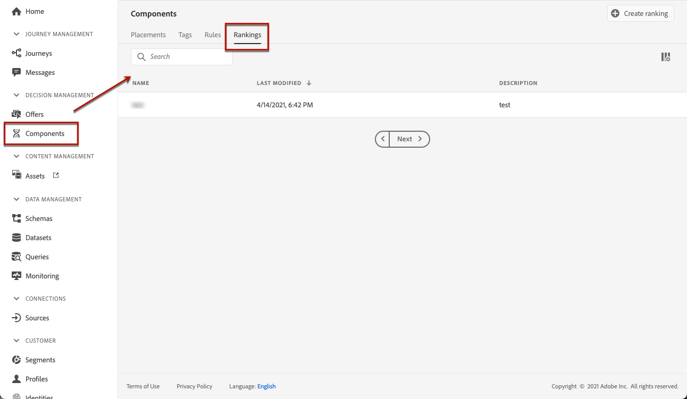

# Creación de fórmulas de clasificación {#create-ranking-formulas}

## Acerca de la clasificación de fórmulas {#about-ranking-formulas}

**Las** fórmulas de clasificación le permiten definir reglas que determinarán qué oferta debe presentarse primero para una ubicación determinada, en lugar de tener en cuenta las puntuaciones de prioridad de las ofertas.

Las fórmulas de clasificación se expresan en **sintaxis PQL** y pueden aprovechar los atributos de perfil, los datos de contexto y los atributos de oferta. Para obtener más información sobre cómo utilizar la sintaxis PQL, consulte la [documentación dedicada](https://experienceleague.adobe.com/docs/experience-platform/segmentation/pql/overview.html).

Una vez creada una fórmula de clasificación, puede asignarla a una colocación en una decisión (anteriormente conocida como actividad de oferta). Para obtener más información sobre esto, consulte [Configuración de la selección de ofertas en decisiones](../offer-activities/configure-offer-selection.md).

## Crear una fórmula de clasificación {#create-ranking-formula}

Para crear una fórmula de clasificación, siga los pasos a continuación:

1. Acceda al menú **[!UICONTROL Components]** y seleccione la pestaña **[!UICONTROL Rankings]** . Se muestra la lista de clasificaciones creadas anteriormente.

   

1. Haga clic en **[!UICONTROL Create ranking]** para crear una nueva fórmula de clasificación.

   

1. Especifique el nombre, la descripción y la fórmula de la fórmula de clasificación.

   En este ejemplo, deseamos aumentar la prioridad de todas las ofertas con el atributo &quot;hot&quot; si el tiempo real está caliente. Para ello, se pasó el **contextData.weather=hot** en la llamada de decisión.

   

1. Haga clic en **[!UICONTROL Save]**. Se crea la fórmula de clasificación, puede seleccionarla de la lista para obtener detalles y editarla o eliminarla.

   Ahora está listo para utilizarse en una decisión para clasificar ofertas aptas para una ubicación (consulte [Configurar selección de ofertas en decisiones](../offer-activities/configure-offer-selection.md)).

   
