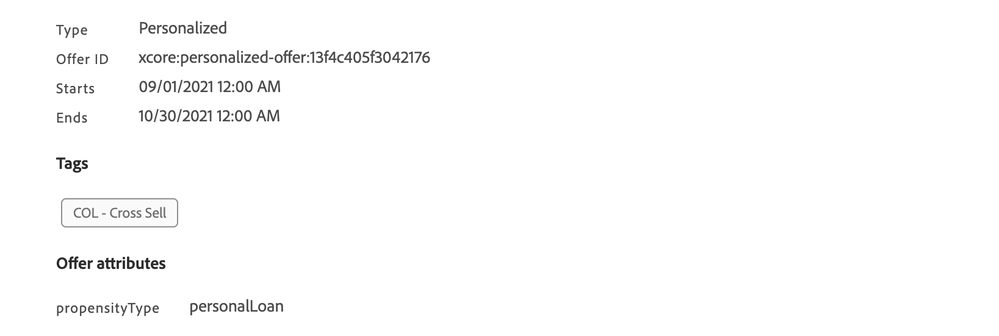

# Crear fórmulas de clasificación {#create-ranking-formulas}

## Acerca de la clasificación de fórmulas {#about-ranking-formulas}

**Las** fórmulas de clasificación le permiten definir reglas que determinarán qué oferta debe presentarse primero para una ubicación determinada, en lugar de tener en cuenta las puntuaciones de prioridad de las ofertas.

Las fórmulas de clasificación se expresan en **sintaxis PQL** y pueden aprovechar los atributos de perfil, los datos de contexto y los atributos de oferta. Para obtener más información sobre cómo utilizar la sintaxis PQL, consulte la [documentación dedicada](https://experienceleague.adobe.com/docs/experience-platform/segmentation/pql/overview.html).

Una vez creada una fórmula de clasificación, puede asignarla a una colocación en una decisión (anteriormente conocida como actividad de oferta). Para obtener más información sobre esto, consulte [Configuración de la selección de ofertas en decisiones](../offer-activities/configure-offer-selection.md).

## Crear una fórmula de clasificación {#create-ranking-formula}

Para crear una fórmula de clasificación, siga los pasos a continuación:

1. Acceda al menú **[!UICONTROL Components]** y seleccione la pestaña **[!UICONTROL Rankings]** . Se muestra la lista de clasificaciones creadas anteriormente.

   

1. Haga clic en **[!UICONTROL Create ranking]** para crear una nueva fórmula de clasificación.

   

1. Especifique el nombre, la descripción y la fórmula de la fórmula de clasificación.

   En este ejemplo, deseamos aumentar la prioridad de todas las ofertas con el atributo &quot;hot&quot; si el tiempo real está caliente. Para ello, se pasó el **contextData.weather=hot** en la llamada de decisión.

   

1. Haga clic en **[!UICONTROL Save]**. Se crea la fórmula de clasificación, puede seleccionarla de la lista para obtener detalles y editarla o eliminarla.

   Ahora está listo para utilizarse en una decisión para clasificar ofertas aptas para una ubicación (consulte [Configurar selección de ofertas en decisiones](../offer-activities/configure-offer-selection.md)).

   

## Ejemplos de fórmulas de clasificación {#ranking-formula-examples}

Puede crear muchas fórmulas de clasificación diferentes según sus necesidades. A continuación se muestran algunos ejemplos.

<!--
Boost by offer ID

Boost the priority of an offer with the offer ID *xcore:personalized-offer:13d213cd4cb328ec* by 5.

**Ranking formula:**

```
if( offer._id = "xcore:personalized-offer:13d213cd4cb328ec", offer.rank.priority + 5, offer.rank.priority)
```

Change the offer priority based on a certain profile attribute

Set the offer priority to 30 for offer *xcore:personalized-offer:13d213cd4cb328ec* if the user lives in the city of Bondi.

**Ranking formula:**

```
if( offer._id = "xcore:personalized-offer:13d213cd4cb328ec" and homeAddress.city.equals("Bondi", false), 30, offer.rank.priority)
```

Boost multiple offers by offer ID based on the presence of a profile's segment membership

Boost the priority of offers based on whether the user is a member of a priority segment, which is configured as an attribute in the offer.

**Ranking formula:**

```
if( segmentMembership.get("ups").get(offer.characteristics.prioritySegmentId).status in (["realized","existing"]), offer.rank.priority + 10, offer.rank.priority)
```
-->

### Mejore las ofertas con un determinado atributo de oferta basado en el atributo de perfil

Si el perfil se encuentra en la ciudad correspondiente a la oferta, duplique la prioridad de todas las ofertas de esa ciudad.

**Fórmula de clasificación:**

```
if( offer.characteristics.city = homeAddress.city, offer.rank.priority * 2, offer.rank.priority)
```

### Ofertas de ampliación en las que la fecha de finalización es inferior a 24 horas a partir de ahora

**Fórmula de clasificación:**

```
if( offer.selectionConstraint.endDate occurs <= 24 hours after now, offer.rank.priority * 3, offer.rank.priority)
```

### Mejore las ofertas con cierto atributo de oferta basado en datos de contexto

Mejore ciertas ofertas en función de los datos de contexto que se pasan en la llamada de decisión. Por ejemplo, si el `contextData.weather=hot` se pasa en la llamada de decisión, se debe aumentar la prioridad de todas las ofertas con `attribute=hot`.

**Fórmula de clasificación:**

```
if (@{_xdm.context.additionalParameters;version=1}.weather.isNotNull()
and offer.characteristics.weather=@{_xdm.context.additionalParameters;version=1}.weather, offer.rank.priority + 5, offer.rank.priority)
```

Tenga en cuenta que al utilizar la API de decisiones, los datos de contexto se añaden al elemento de perfil en el cuerpo de la solicitud, como en el ejemplo siguiente.

**Fragmento del cuerpo de la solicitud:**

```
"xdm:profiles": [
{
    "xdm:identityMap": {
        "crmid": [
            {
            "xdm:id": "CRMID1"
            }
        ]
    },
    "xdm:contextData": [
        {
            "@type":"_xdm.context.additionalParameters;version=1",
            "xdm:data":{
                "xdm:weather":"hot"
            }
        }
    ]
 }],
```

### Mejore las ofertas en función de la propensión de los clientes a comprar el producto ofrecido

Si tenemos dos instancias de *CustomerAI* que calculan la propensión a comprar *travelInsurance* y *extraBaggage* para una compañía aérea, la siguiente fórmula de clasificación aumentará la prioridad (en 50 puntos) de la oferta específica para el seguro o el equipaje si la puntuación de propensión del cliente para comprar ese producto es mayor que 90.

Sin embargo, como cada instancia *CustomerAI* crea su propio objeto dentro del esquema de perfil unificado, no es posible seleccionar dinámicamente la puntuación en función del tipo de inclinación de oferta. Por lo tanto, debe encadenar las instrucciones `if` para comprobar primero el tipo de inclinación de la oferta y, a continuación, extraer la puntuación del campo de perfil correspondiente.

**Fórmula de clasificación:**

```
if ( offer.characteristics.propensityType = "extraBaggagePropensity" and _salesvelocity.CustomerAI.extraBaggagePropensity.score > 90, offer.rank.priority + 50,
    (
        if ( offer.characteristics.propensityType = "travelInsurancePropensity" and _salesvelocity.CustomerAI.insurancePropensity.score > 90, offer.rank.priority + 50, offer.rank.priority )
    )
)
```

Una mejor solución es almacenar las puntuaciones en una matriz del perfil. El siguiente ejemplo funcionará en una variedad de puntuaciones de inclinación diferentes utilizando solo una fórmula de clasificación sencilla. La expectativa es que tiene un esquema de perfil con una matriz de puntuaciones. En este ejemplo, el inquilino de instancia es *_salesvelocity* y el esquema de perfil contiene lo siguiente:


En este caso, para un perfil como:

```
{"_salesvelocity": {"individualScoring": [
                    {"core": {
                            "category":"insurance",
                            "propensityScore": 96.9
                        }},
                    {"core": {
                            "category":"personalLoan",
                            "propensityScore": 45.3
                        }},
                    {"core": {
                            "category":"creditCard",
                            "propensityScore": 78.1
                        }}
                    ]}
}
```

Las ofertas contendrían un atributo para *propensityType* que coincide con la categoría de las puntuaciones:



La fórmula de clasificación puede establecer la prioridad de cada oferta para que sea igual a los clientes *propensityScore* para ese *propensityType*. Si no se encuentra ninguna puntuación, utilice la prioridad estática establecida en la oferta:

```
let score = (select _Individual_Scoring1 from _salesvelocity.individualScoring
             where _Individual_Scoring1.core.category.equals(offer.characteristics.propensityType, false)).head().core.propensityScore
in if(score.isNotNull(), score, offer.rank.priority)
```
