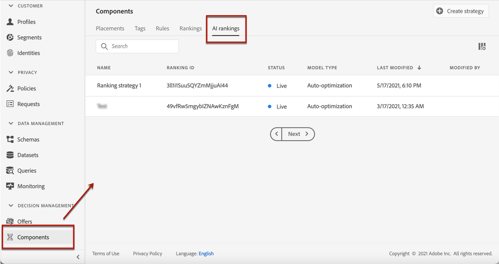
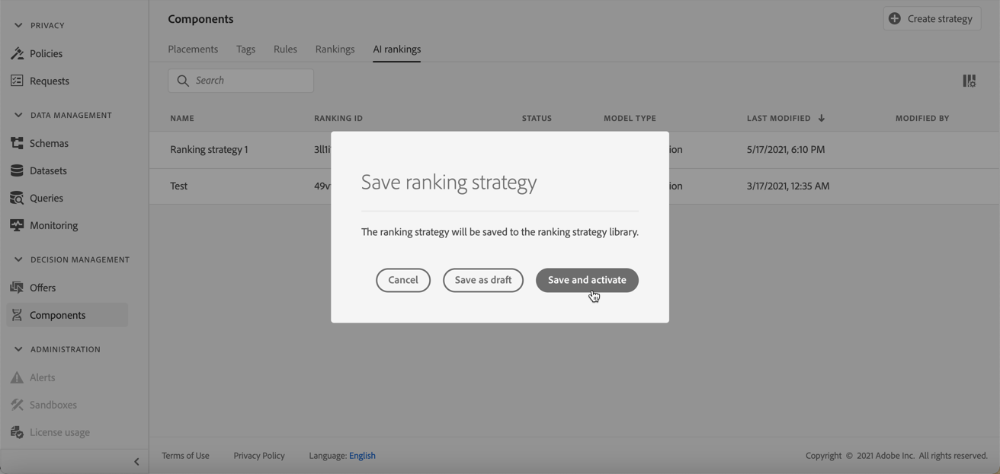
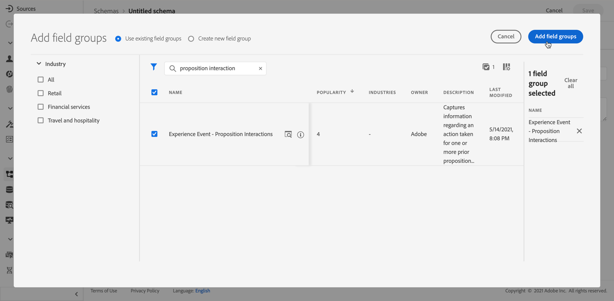

# Clasificación de IA {#ai-rankings}

## Introducción a las clasificaciones de IA

<!--If you are an [Adobe Experience Platform](https://experienceleague.adobe.com/docs/experience-platform/landing/home.html){target="_blank"} user leveraging the **Offer Decisioning** application service,-->You can use an trained model system that ranks offers to display for a given profile.

>[!CAUTION]
>
>El uso de la clasificación AI está disponible actualmente en el acceso anticipado solo para usuarios seleccionados.

Esta función le permite crear diferentes **estrategias de clasificación** en función de sus objetivos comerciales. Utilizando estas diferentes estrategias basadas en objetivos en una decisión (anteriormente conocida como actividad de oferta), el sistema de modelos entrenado le ayudará a comprender cómo las diferentes estrategias de clasificación afectan a sus objetivos.

Por ejemplo, puede seleccionar una estrategia de clasificación para el canal de correo electrónico y otra para el canal push. Para cada canal, el sistema de modelos entrenado utilizará múltiples puntos de datos para determinar qué oferta debe presentarse primero para una ubicación determinada, en lugar de tener en cuenta las puntuaciones de prioridad de las ofertas o una [fórmula de clasificación](create-ranking-formulas.md).

<!--This feature is not enabled by default. To be able to use it, reach out to your Adobe contact.-->

Una vez creada una estrategia de clasificación, asígnela a una colocación en una decisión. Obtenga más información en [Configurar la selección de ofertas en decisiones](../offer-activities/configure-offer-selection.md).

### Modelo de optimización automática {#auto-optimization}

Actualmente en [!DNL Journey Optimizer] el único tipo de modelo admitido para la clasificación AI es **optimización automática**.

Un modelo de optimización automática tiene como objetivo ofrecer ofertas que maximicen el retorno, en función de los indicadores de rendimiento clave (KPI) que establezca. <!--These KPIs could be in the form of conversion rates, revenue, etc.-->En este punto, la optimización automática se centra en optimizar los clics de ofertas con la conversión de ofertas como destino.

>[!NOTE]
>
>El modelo de optimización automática no utiliza ningún dato contextual o de perfil de usuario. Optimiza los resultados en función del rendimiento global de las ofertas.

Con la optimización automática, el desafío es equilibrar el aprendizaje de exploración y la explotación de ese aprendizaje. Este principio se conoce como **enfoque &quot;multi-armed bandit&quot;**.

Para hacer frente a este desafío, el modelo de optimización automática utiliza la variable **Muestreo Thompson** , que permite identificar qué opción buscar para maximizar las recompensas esperadas. En otras palabras, el Muestreo Thompson es un tipo de técnica de aprendizaje reforzado para resolver el dilema de la exploración y explotación en un problema multi-armed bandit.

El método de muestreo Thompson también permite controlar desafíos como el problema de &quot;inicio en frío&quot;, es decir, cuando se introduce una nueva oferta en la campaña, no tiene ningún historial del que pueda formarse.

## Crear una estrategia de clasificación {#create-ranking-strategy}

Para crear una estrategia de clasificación, siga los pasos a continuación:

1. Acceda a la **[!UICONTROL Components]** y, a continuación, seleccione **[!UICONTROL AI rankings]** pestaña .

   

   Se muestran todas las estrategias de clasificación creadas hasta el momento.

1. Haga clic en el botón **[!UICONTROL Create strategy]**.

1. Complete los campos siguientes:

   

   * **[!UICONTROL Name]**: Nombre único que debe proporcionar.

   * **[!UICONTROL Model type]**: Actualmente, el único tipo de modelo admitido es **[!UICONTROL Auto-optimization]**.<!--More will be supported in the future so the drop-down list will be enabled.-->

   * **[!UICONTROL Optimization metric]**

      Esta opción permite a los especialistas en marketing elegir cómo se debe crear y entrenar el modelo de aprendizaje automático: en función de las ofertas mostradas, las ofertas en las que se hizo clic en el correo electrónico o las ofertas en las que se hizo clic en la web.

      >[!NOTE]
      >
      >Puede seleccionar todos los tipos de métricas si es necesario.

      Existen dos tipos de métricas de optimización:
      * **[!UICONTROL Impression]**: Los eventos de impresión actuales corresponden a todas las ofertas que se muestran.
      * **[!UICONTROL Conversion]**: Los eventos de conversión corresponden a todas las ofertas que resultan en clics a través del correo electrónico o la web.

      Todos los eventos de impresión o de conversión seleccionados se capturarán automáticamente mediante el SDK web o el SDK móvil que se haya proporcionado. Obtenga más información sobre esto en [Información general del SDK web de Adobe Experience Platform](https://experienceleague.adobe.com/docs/experience-platform/edge/home.html?lang=es).

   * **[!UICONTROL Dataset ID]**: Para la conversión, debe proporcionar un conjunto de datos donde se recopilen los eventos seleccionándolo en la lista desplegable. Obtenga información sobre cómo crear este conjunto de datos en [esta sección](#create-dataset). <!--This dataset needs to be associated with a schema that must have the **[!UICONTROL Proposition Interactions]** field group (previously known as mixin) associated with it.-->

   

   >[!CAUTION]
   >
   >Solo los conjuntos de datos creados a partir de esquemas asociados con la variable **[!UICONTROL Experience Event - Proposition Interactions]** el grupo de campos (anteriormente conocido como mezcla) se muestra en la lista desplegable.

1. Guarde y active la estrategia de clasificación.

   

Ahora está listo para utilizarse en una decisión para clasificar ofertas aptas para una colocación. Obtenga más información en [esta sección](../offer-activities/configure-offer-selection.md#use-ranking-strategy).<!--TBC?-->

## Crear un conjunto de datos para recopilar eventos {#create-dataset}

Debe crear un conjunto de datos donde se recopilen los eventos de conversión. Comience creando el esquema que se utilizará en el conjunto de datos:

1. En el **[!UICONTROL Data Management]** seleccione **[!UICONTROL Schema]**, vaya a la **[!UICONTROL Browse]** y haga clic en **[!UICONTROL Create schema]**.

   

1. Choose **[!UICONTROL XDM ExperienceEvent]**.

   

   >[!NOTE]
   >
   >    Obtenga más información sobre los esquemas XDM y los grupos de campos en la [Documentación de información general del sistema XDM](https://experienceleague.adobe.com/docs/experience-platform/xdm/home.html?lang=es).


1. En el **[!UICONTROL Search]** , escriba &quot;interacción de propuesta&quot; y seleccione la **[!UICONTROL Experience Event - Proposition Interactions]** grupo de campos.

   

   >[!CAUTION]
   >
   >    El esquema que se utilizará en el conjunto de datos debe tener la variable **[!UICONTROL Experience Event - Proposition Interactions]** grupo de campos asociado a él. De lo contrario, no podrá utilizarlo en su estrategia de clasificación.

1. Haga clic en **[!UICONTROL Add field groups]**.

   

   >[!NOTE]
   >El grupo de campo se conocía anteriormente como mezcla.


1. Escriba un nombre y guarde el esquema.<!--How do you edit the fields in this new schema? Examples?-->

>[!NOTE]
>
>    Obtenga más información sobre la creación de esquemas en [Aspectos básicos de la composición del esquema](https://experienceleague.adobe.com/docs/experience-platform/xdm/schema/composition.html?lang=en#understanding-schemas).

Ya está listo para crear un conjunto de datos con este esquema. Para realizar esto, siga los pasos a continuación:

1. En el **[!UICONTROL Data Management]** seleccione **[!UICONTROL Datasets]**, vaya a la **[!UICONTROL Browse]** y haga clic en **[!UICONTROL Create dataset]**.

   

1. Seleccione **[!UICONTROL Create dataset from schema]**.

   

1. Seleccione el esquema que acaba de crear en la lista.

   

1. Haga clic en **[!UICONTROL Next]**.

1. Proporcione un nombre único para el conjunto de datos en la variable **[!UICONTROL Name]** y haga clic en **[!UICONTROL Finish]**.

   

El conjunto de datos ya está listo para seleccionarse para recopilar datos de evento cuando [creación de una estrategia de clasificación](#create-ranking-strategy).

## Requisitos del esquema de oferta {#schema-requirements}

En este punto debe tener:

* creó la estrategia de clasificación,
* se ha definido qué tipo de evento desea capturar: oferta mostrada (impresión) u oferta pulsada (conversión),
* y en qué conjunto de datos desea recopilar los datos de evento.

Ahora, cada vez que se muestra una oferta o se hace clic en ella, desea que el evento correspondiente sea capturado automáticamente por la variable **[!UICONTROL Experience Event - Proposition Interactions]** grupo de campos con la variable [SDK web de Adobe Experience Platform](https://experienceleague.adobe.com/docs/experience-platform/edge/web-sdk-faq.html#what-is-adobe-experience-platform-web-sdk%3F){target=&quot;_blank&quot;} o SDK móvil.

Para poder enviar tipos de eventos (oferta mostrada u oferta pulsada), debe establecer el valor correcto para cada tipo de evento en un evento de experiencia que se envíe a Adobe Experience Platform. A continuación se muestran los requisitos de esquema que debe implementar en el código JavaScript:

**Escenario:** Oferta mostrada
**Tipo de evento:** `decisioning.propositionDisplay`
**Fuente:** Web.sdk/Alloy.js (`sendEvent command -> xdm : {eventType, interactionMixin}`) o ingesta por lotes
**Carga útil de muestra:**

```
{
    "@id": "a7864a96-1eac-4934-ab44-54ad037b4f2b",
    "xdm:timestamp": "2020-09-26T15:52:25+00:00",
    "xdm:eventType": "decisioning.propositionDisplay",
    "https://ns.adobe.com/experience/decisioning/propositions":
    [
        {
            "xdm:items":
            [
                {
                    "xdm:id": "personalized-offer:f67bab756ed6ee4",
                },
                {
                    "xdm:id": "personalized-offer:f67bab756ed6ee5",
                }
            ],
            "xdm:id": "3cc33a7e-13ca-4b19-b25d-c816eff9a70a", //decision event id - taken from experience event for “nextBestOffer”
            "xdm:scope": "scope:12cfc3fa94281acb", //decision scope id - taken from experience event for “nextBestOffer”
        }
    ]
}
```

**Escenario:** Oferta en la que se hizo clic
**Tipo de evento:** `decisioning.propositionInteract`
**Fuente:** Web.sdk/Alloy.js (`sendEvent command -> xdm : {eventType, interactionMixin}`) o ingesta por lotes
**Carga útil de muestra:**

```
{
    "@id": "a7864a96-1eac-4934-ab44-54ad037b4f2b",
    "xdm:timestamp": "2020-09-26T15:52:25+00:00",
    "xdm:eventType": "decisioning.propositionInteract",
    "https://ns.adobe.com/experience/decisioning/propositions":
    [
        {
            "xdm:items":
            [
                {
                    "xdm:id": "personalized-offer:f67bab756ed6ee4"
                },
                {
                    "xdm:id": "personalized-offer:f67bab756ed6ee5"
                },
            ],
            "xdm:id": "3cc33a7e-13ca-4b19-b25d-c816eff9a70a", //decision event id
            "xdm:scope": "scope:12cfc3fa94281acb", //decision scope id
        }
    ]
}
```

<!--
## Using a ranking strategy {#using-ranking}

To use the ranking strategy you created above, follow the steps below:

Once a ranking strategy has been created, you can assign it to a placement in a decision (previously known as offer activity). For more on this, see [Configure offers selection in decisions](../offer-activities/configure-offer-selection.md).

1. Create a decision.
1. Add a placement.
1. Add a collection.
1. Choose to rank offers by AI ranking (select it from the drop-down list).
1. Click Add ranking.
1. Select the ranking strategy that you created. All the details of the ranking strategy are displayed.
1. Click Next to confirm.
1. Save your decision.

It is now ready to be used in a decision to rank eligible offers for a placement (see [Configure offers selection in decisions](../offer-activities/configure-offer-selection.md)).
-->

