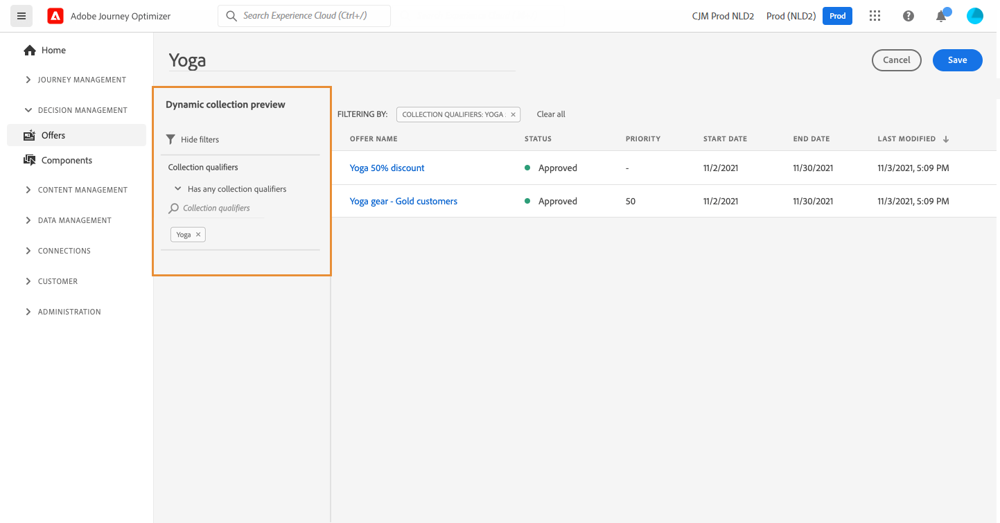

# Crear colecciones {#create-collections}

>[!CONTEXTUALHELP]
>id="ajo_decisioning_decision_collection"
>title="Acerca de las colecciones de ofertas"
>abstract="Con las colecciones de ofertas, puede organizar las ofertas reagrupándolas en las categorías que desee."

Las colecciones le permiten organizar sus ofertas reagrupándolas en categorías de su elección. Por ejemplo, puede crear una colección &quot;sport&quot; que contenga únicamente ofertas relacionadas con el deporte.

➡️ [Descubra esta función en vídeo](#video)

Se puede acceder a la lista de colecciones de ofertas en la **[!UICONTROL Ofertas]** menú.

Puede crear dos tipos de colecciones:

* **Colecciones dinámicas** son colecciones de ofertas basadas en calificadores de colección (anteriormente conocidas como &quot;etiquetas&quot;). Estas colecciones se actualizan automáticamente. Por ejemplo, si se crea una oferta nueva con el calificador de recopilación seleccionado, esta se agrega automáticamente a la colección.

* **Colecciones estáticas** son colecciones creadas seleccionando manualmente ofertas individuales para incluirlas en la colección. La colección solo se puede actualizar añadiendo manualmente más ofertas.

Para crear una colección, siga estos pasos:

1. Vaya a la **[!UICONTROL Colecciones]** y haga clic en **[!UICONTROL Crear colección]**.

1. Especifique el nombre y el tipo de colección que desea crear.

   

1. Para crear una colección dinámica, utilice el panel izquierdo para seleccionar el calificador de colección de las ofertas que desea agregar a la colección y haga clic en **[!UICONTROL Guardar]**. Todas las ofertas con el calificador de colección seleccionado se guardarán en la colección.

   Para obtener más información sobre la creación de calificadores de colección, consulte [Crear calificadores de colección](../offer-library/creating-tags.md).

   

1. Para crear una colección estática, utilice el panel izquierdo para filtrar la lista de ofertas (estado, calificador de colección, fecha, canal, tipo de contenido) y, a continuación, seleccione las ofertas que desea agregar a la colección.

   

   >[!NOTE]
   >
   >Las colecciones estáticas no se actualizan automáticamente. Para añadir ofertas a una colección estática, debe editarlas y añadirlas manualmente.

1. Para asignar etiquetas de uso de datos personalizadas o principales a una colección estática, seleccione **[!UICONTROL Administrar acceso]**. [Obtenga más información sobre el Control de acceso de nivel de objeto (OLAC)](../../administration/object-based-access.md)

   >[!NOTE]
   >
   >El uso de OLAC no está disponible para colecciones dinámicas. Debe administrarse en el nivel de oferta. Por lo tanto, es posible que no vea ninguna oferta en una colección dinámica si no tiene acceso a ninguna de estas ofertas.

1. Una vez creada la colección, se muestra en la lista. Puede seleccionarlo para editarlo o eliminarlo.

   

## Vídeo explicativo {#video}

>[!VIDEO](https://video.tv.adobe.com/v/329376?quality=12)

