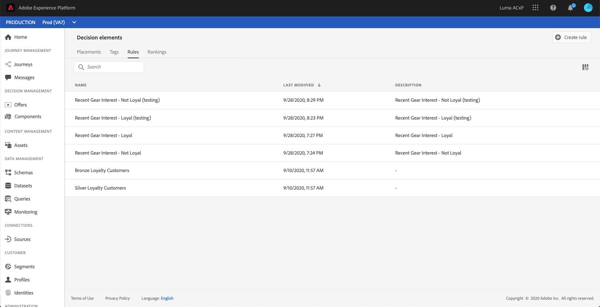

# Crear reglas de decisión {#creating-decision-rules}

Puede crear reglas de decisión de oferta basadas en los datos disponibles en Adobe Experience Platform. Las reglas de decisión determinan a quién se puede mostrar una oferta.

Por ejemplo, puede especificar que solo desea que se muestre una “Oferta de ropa de invierno femenina” cuando (Sexo = &#39;Mujer&#39;) y (Región = &#39;Noreste&#39;).

➡️ [Descubra esta función en vídeo](#video)

Se puede acceder a la lista de reglas de decisión creadas en la **[!UICONTROL Components]** para abrir el Navegador.

Para crear una regla de decisión, siga estos pasos:

1. Vaya a la **[!UICONTROL Rules]** a continuación, haga clic en **[!UICONTROL Create rule]**.

   

1. Asigne un nombre a la regla, proporcione una descripción y, a continuación, configure la regla según sus necesidades.

   Para ello, el **Generador de segmentos** está disponible para ayudarle a crear las condiciones de la regla. [Más información](../../segment/about-segments.md)

   En este ejemplo, la regla se dirigirá a los clientes que tengan el nivel de lealtad &quot;Oro&quot;.

   

   >[!NOTE]
   >
   >El Generador de segmentos proporcionado para crear reglas de decisión presenta algunas características específicas en comparación con la que se usa con la variable **[!UICONTROL Audience Destinations]** servicio. Por ejemplo, la variable **[!UICONTROL Segments]** no está disponible para usar. Sin embargo, el proceso global descrito en la documentación del Generador de segmentos sigue siendo válido para generar reglas de decisiones de ofertas.

1. Haga clic en **[!UICONTROL Save]** para confirmar.

1. Una vez creada la regla, esta se muestra en la lista de reglas. Puede seleccionarlo para mostrar sus propiedades y editarlo o eliminarlo.

   

>[!CAUTION]
>
>Actualmente, las ofertas basadas en eventos no son compatibles con [!DNL Journey Optimizer]. Si crea una regla de decisión basada en un [evento](https://experienceleague.adobe.com/docs/experience-platform/segmentation/ui/segment-builder.html?lang=en#events){target=&quot;_blank&quot;}, no podrá aprovecharlo en una oferta.

## Tutorial en vídeo {#video}

>[!NOTE]
>
>Este vídeo se aplica al servicio de aplicaciones de Offer decisioning creado en Adobe Experience Platform. Sin embargo, proporciona una guía genérica para utilizar Offer en el contexto de Journey Optimizer.

>[!VIDEO](https://video.tv.adobe.com/v/329373?quality=12)
