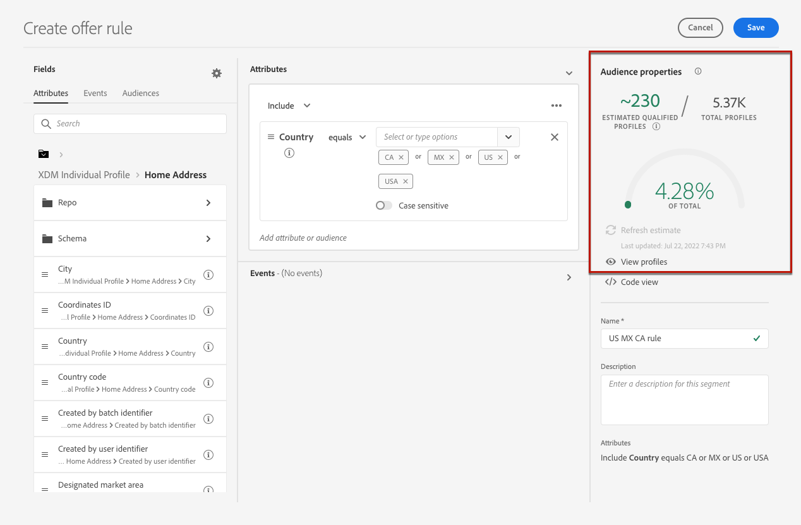

# Crear reglas de decisión {#create-decision-rules}

## Acerca de las reglas decisión {#about}

Puede crear reglas de decisión de ofertas basadas en los datos disponibles en Adobe Experience Platform. Las reglas de decisión determinan a quién se puede mostrar una oferta.

Por ejemplo, puede especificar que solo desea que se muestre una “Oferta de ropa de invierno femenina” cuando (Sexo = &#39;Mujer&#39;) y (Región = &#39;Noreste&#39;).

➡️ [Descubra esta función en vídeo](#video)

Esta es una lista de limitaciones que deben tenerse en cuenta al trabajar con reglas de decisión:

* Al crear una regla, puede utilizar eventos históricos, pero existen limitaciones en cuanto a cuándo se pueden utilizar estas reglas.
* La toma de decisiones perimetral utiliza el perfil perimetral que no almacena eventos, por lo que cualquier regla utilizada en una decisión perimetral no será válida.
* Los recorridos que utilicen Decisiones de oferta no consultarán los eventos históricos, por lo que estas reglas no serán válidas.
* Las solicitudes de decisión que utilicen el perfil de concentrador consultarán los últimos 100 eventos de experiencia del perfil para evaluar las reglas que hacen referencia a eventos de experiencia históricos.

## Crear una regla de decisión {#create}

Se puede acceder a la lista de reglas de decisión creadas en el **[!UICONTROL Componentes]** menú.

Para crear una regla de decisión, siga estos pasos:

1. Vaya a la **[!UICONTROL Reglas]** y haga clic en **[!UICONTROL Crear regla]**.

   

1. Asigne un nombre a la regla, proporcione una descripción y, a continuación, configure la regla según sus necesidades.

   Para ello, utilice la Adobe Experience Platform **Generador de segmentos** está disponible para ayudarle a crear las condiciones de la regla. [Obtenga información sobre cómo crear definiciones de segmentos](../../audience/creating-a-segment-definition.md)

   <!--In this example, the rule will target customers that have the "Gold" loyalty level.-->

   

   >[!NOTE]
   >
   >El Generador de segmentos que se proporciona para crear reglas de decisión presenta algunas particularidades en comparación con el que se utiliza con **[!UICONTROL Segmentación]** servicio. Sin embargo, el proceso global descrito en la [Generador de segmentos](../../audience/creating-a-segment-definition.md) La documentación de sigue siendo válida para generar reglas de decisiones de ofertas. Obtenga más información en la [documentación del Servicio de segmentación de Adobe Experience Platform](https://experienceleague.adobe.com/docs/experience-platform/segmentation/ui/segment-builder.html?lang=es).

1. Al añadir y configurar nuevos campos en el espacio de trabajo, la variable **[!UICONTROL Propiedades de audiencia]** Este panel muestra información sobre los perfiles estimados que pertenecen a la audiencia. Clic **[!UICONTROL Actualizar estimación]** para actualizar los datos.

   

   >[!NOTE]
   >
   >Las estimaciones de perfil no están disponibles cuando los parámetros de regla incluyen datos que no están en el perfil, como datos de contexto. Por ejemplo, una regla de idoneidad que requiere que el clima actual sea de ≥80 grados.

1. Haga clic en **[!UICONTROL Guardar]** para confirmar.

1. Una vez creada la regla, se muestra en el **[!UICONTROL Reglas]** lista. Puede seleccionarlo para mostrar sus propiedades y editarlo o eliminarlo.

   

>[!CAUTION]
>
>Actualmente no se admiten ofertas basadas en eventos en [!DNL Journey Optimizer]. Si crea una regla de decisión basada en un [evento](https://experienceleague.adobe.com/docs/experience-platform/segmentation/ui/segment-builder.html#events){target="_blank"}, no podrá aprovecharlo en una oferta de.

## Tutorial en vídeo {#video}

>[!VIDEO](https://video.tv.adobe.com/v/329373?quality=12)
