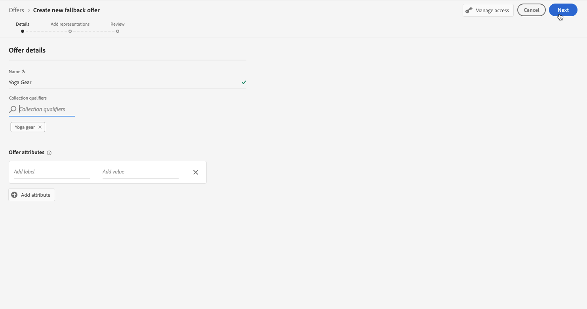

# Crear ofertas de reserva {#create-fallback-offers}

>[!TIP]
>
>Decisioning, la nueva funcionalidad de toma de decisiones de [!DNL Adobe Journey Optimizer], ya está disponible a través de los canales de experiencia basada en código y de correo electrónico. [Más información](../../experience-decisioning/gs-experience-decisioning.md)

>[!CONTEXTUALHELP]
>id="ajo_decisioning_new_fallback"
>title="Oferta de reserva"
>abstract="Una oferta de reserva es la oferta predeterminada que se muestra cuando un usuario final no cumple los requisitos para ninguna de las ofertas personalizadas."

>[!CONTEXTUALHELP]
>id="ajo_decisioning_fallback_offer_details "
>title="Detalles de oferta de reserva"
>abstract="Especifique el nombre de la oferta de reserva. También puede asociarle uno o varios calificadores de colección existentes, lo que le permite buscar y organizar la biblioteca de ofertas más fácilmente."

La oferta de reserva se envía a los clientes si no cumplen los requisitos para otras ofertas. Los pasos para crear una oferta de reserva consisten en crear una o varias representaciones, como al crear una oferta.

➡️ [Descubra esta funcionalidad en vídeo](#video)

Se puede acceder a la lista de ofertas de reserva en el menú **[!UICONTROL Ofertas]**.

Para crear una oferta de reserva, siga estos pasos:

>[!NOTE]
>
>Tenga en cuenta que, a diferencia de las ofertas personalizadas, las ofertas de reserva no tienen reglas de elegibilidad ni parámetros de restricción, ya que se presentan a los clientes como últimos recursos sin condición.

1. Haga clic en **[!UICONTROL Crear oferta]** y luego seleccione **[!UICONTROL Oferta de reserva]**.

   

1. Especifique el nombre de la oferta de reserva. También puede asociarle uno o varios calificadores de colección existentes (anteriormente conocidos como &quot;etiquetas&quot;), lo que le permite buscar y organizar la biblioteca de ofertas más fácilmente.

   

1. Para asignar etiquetas de uso de datos principales o personalizadas a la oferta, seleccione **[!UICONTROL Administrar acceso]**. [Más información acerca del Control de acceso de nivel de objeto (OLAC)](../../administration/object-based-access.md)

1. Cree una o varias representaciones para la oferta de reserva. Para ello, arrastre y suelte las ubicaciones desde el panel izquierdo, como cuando crea una oferta personalizada. Ver [Crear ofertas personalizadas](../offer-library/creating-personalized-offers.md).

   

   >[!CAUTION]
   >
   >Las ofertas de reserva deben contener todas las representaciones utilizadas dentro de una [decisión](../offer-activities/create-offer-activities.md). Por ejemplo, si tiene 5 ofertas en una decisión y cada una de ellas tiene una representación diferente, se deben incluir 5 representaciones en la oferta de reserva.

1. Una vez añadidas las representaciones de la oferta de reserva, se muestra un resumen. Si todo está configurado correctamente y la oferta de reserva está lista para presentarse a los clientes, haga clic en **[!UICONTROL Finalizar]** y, a continuación, seleccione **[!UICONTROL Guardar y aprobar]**.

   También puede guardar la oferta de reserva como borrador para editarla y aprobarla más adelante.

   

1. La oferta de reserva se muestra en la lista con el estado **[!UICONTROL Activo]** o **[!UICONTROL Borrador]**, en función de si la aprobó o no en el paso anterior.

   Ahora está listo para entregarse a los clientes. Puede seleccionarlo para mostrar sus propiedades y editarlo. <!-- no suppression? -->

   

## Vídeo práctico {#video}

>[!VIDEO](https://video.tv.adobe.com/v/341344?captions=spa&quality=12)

