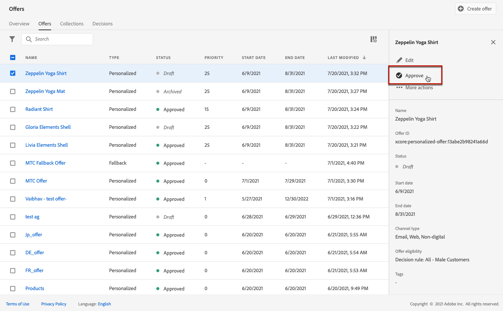

# Crear ofertas personalizadas {#create-personalized-offers}

>[!TIP]
>
>Decisioning, la nueva funcionalidad de toma de decisiones de [!DNL Adobe Journey Optimizer], ya está disponible a través de los canales de experiencia basada en código y de correo electrónico. [Más información](../../experience-decisioning/gs-experience-decisioning.md)

Antes de crear una oferta, asegúrese de que ha creado lo siguiente:

* Una **ubicación** en la que se mostrará la oferta. Ver [Crear ubicaciones](../offer-library/creating-placements.md)
* Si desea agregar una condición de elegibilidad: una **regla de decisión** que definirá la condición bajo la cual se presentará la oferta. Consulte [Crear reglas de decisión](../offer-library/creating-decision-rules.md).
* Uno o varios **calificadores de colección** (anteriormente conocidos como &quot;etiquetas&quot;) que quizá desee asociar a la oferta. Consulte [Crear calificadores de colección](../offer-library/creating-tags.md).

➡️ [Descubra esta funcionalidad en vídeo](#video)

Se puede acceder a la lista de ofertas personalizadas en el menú **[!UICONTROL Ofertas]**.

## Crear una oferta {#create-offer}

>[!CONTEXTUALHELP]
>id="ajo_decisioning_offer_details"
>title="Detalles de oferta"
>abstract="Rellene el nombre de la oferta y sus fechas de inicio y finalización. Fuera de estas fechas, el motor de decisión no selecciona la oferta. "

>[!CONTEXTUALHELP]
>id="od_offer_attributes"
>title="Acerca de los atributos de oferta"
>abstract="Con los atributos de oferta, puede asociar pares de valores clave con la oferta para realizar informes y análisis."

>[!CONTEXTUALHELP]
>id="ajo_decisioning_offer_attributes"
>title="Atributos de oferta"
>abstract="Con los atributos de oferta, puede asociar pares de valores clave con la oferta para realizar informes y análisis."

>[!CONTEXTUALHELP]
>id="ajo_decisioning_new_personalized"
>title="Oferta personalizada"
>abstract="Una oferta personalizada es un mensaje personalizable basado en reglas de elegibilidad y restricciones."

Para crear una **oferta**, siga estos pasos:

1. Haga clic en **[!UICONTROL Crear oferta]** y, a continuación, seleccione **[!UICONTROL Oferta personalizada]**.

   

1. Especifique el nombre de la oferta, así como su fecha y hora de inicio y finalización. Fuera de estas fechas, el motor de decisión no selecciona la oferta. 

   >[!NOTE]
   >
   >Al seleccionar horas, se tiene en cuenta la zona horaria actual.

   

   >[!CAUTION]
   >
   >La actualización de las fechas de inicio y finalización puede afectar al límite. [Más información](add-constraints.md#capping-change-date)

1. También puede asociar uno o varios **[!UICONTROL calificadores de colección]** existentes a la oferta, lo que le permite buscar y organizar la Biblioteca de ofertas con mayor facilidad. [Más información](creating-tags.md).

1. La sección **[!UICONTROL Atributos de oferta]** le permite asociar pares clave-valor con la oferta para fines de informes y análisis.

1. Para asignar etiquetas de uso de datos principales o personalizadas a la oferta, seleccione **[!UICONTROL Administrar acceso]**. [Más información acerca del Control de acceso de nivel de objeto (OLAC)](../../administration/object-based-access.md)

   

1. Añada representaciones para definir dónde se mostrará la oferta en el mensaje. [Más información](add-representations.md)

   

   >[!CAUTION]
   >
   >El tamaño de una oferta, incluidas todas sus representaciones, no puede superar los 300 KB.

1. Añada restricciones para definir las condiciones en las que se mostrará la oferta. [Más información](add-constraints.md)

   >[!NOTE]
   >
   >Al seleccionar audiencias o reglas de decisión, puede ver información sobre los perfiles cualificados estimados. Haga clic en **[!UICONTROL Actualizar]** para actualizar los datos.
   >
   >Tenga en cuenta que las estimaciones de perfil no están disponibles cuando los parámetros de regla incluyen datos que no están en el perfil, como datos de contexto. Por ejemplo, una regla de idoneidad que requiere que el clima actual sea de ≥80 grados.

   

1. Revise y guarde la oferta. [Más información](#review)

## Revisión de la oferta {#review}

Una vez definidas las reglas de idoneidad y las restricciones, se muestra un resumen de las propiedades de la oferta.

1. Asegúrese de que todo está configurado correctamente.

1. Puede mostrar información sobre los perfiles cualificados estimados. Haga clic en **[!UICONTROL Actualizar]** para actualizar los datos.

   

1. Cuando la oferta esté lista para ser presentada a los usuarios, haga clic en **[!UICONTROL Finalizar]**.

1. Seleccione **[!UICONTROL Guardar y aprobar]**.

   

   También puede guardar la oferta como borrador para editarla y aprobarla más adelante.

La oferta se muestra en la lista con el estado **[!UICONTROL Aprobado]** o **[!UICONTROL Borrador]**, en función de si la aprobó o no en el paso anterior.

Ahora está listo para entregarse a los usuarios.

## Administración de ofertas {#offer-list}

En la lista de oferta, se puede seleccionar la oferta para mostrar sus propiedades. También puede editarla, cambiar su estado (**Borrador**, **Aprobado**, **Archivado**), duplicar la oferta o eliminarla.

Seleccione el botón **[!UICONTROL Editar]** para volver al modo de edición de la oferta, donde puede modificar los [detalles](#create-offer), las [representaciones](add-representations.md#representations) de la oferta, así como editar las [reglas de elegibilidad y las restricciones](add-constraints.md#eligibility).

Seleccione una oferta aprobada y haga clic en **[!UICONTROL Deshacer aprobación]** para volver a establecer el estado de la oferta en **[!UICONTROL Borrador]**.

Para volver a establecer el estado en **[!UICONTROL Aprobado]**, seleccione el botón correspondiente que ahora se muestra.

El botón **[!UICONTROL Más acciones]** habilita las acciones que se describen a continuación.

* **[!UICONTROL Duplicate]**: crea una oferta con las mismas propiedades, representaciones, reglas de elegibilidad y restricciones. De manera predeterminada, la nueva oferta tiene el estado **[!UICONTROL Borrador]**.
* **[!UICONTROL Delete]**: quita la oferta de la lista.

  >[!CAUTION]
  >
  >Ya no se podrá acceder a la oferta ni a su contenido. Esta acción no se puede deshacer.
  >
  >Si la oferta se utiliza en una colección o una decisión, no se puede eliminar. Primero debe eliminar la oferta de cualquier objeto.

* **[!UICONTROL Archivo]**: establece el estado de la oferta en **[!UICONTROL Archivado]**. La oferta aún está disponible en la lista, pero no puedes volver a establecer su estado en **[!UICONTROL Borrador]** o **[!UICONTROL Aprobado]**. Solo puede duplicarlo o eliminarlo.

También puede eliminar o cambiar el estado de varias ofertas al mismo tiempo seleccionando las casillas de verificación correspondientes.

Si desea cambiar el estado de varias ofertas con diferentes estados, solo se cambiarán los estados relevantes.

Una vez creada una oferta, se puede hacer clic en su nombre desde la lista.

Esto le permite acceder a información detallada de esa oferta. Seleccione la ficha **[!UICONTROL Registro de cambios]** para [supervisar todos los cambios](../get-started/user-interface.md#changes-logs) realizados en la oferta.

## Tutorial en vídeo {#video}

>[!VIDEO](https://video.tv.adobe.com/v/329375?quality=12)
