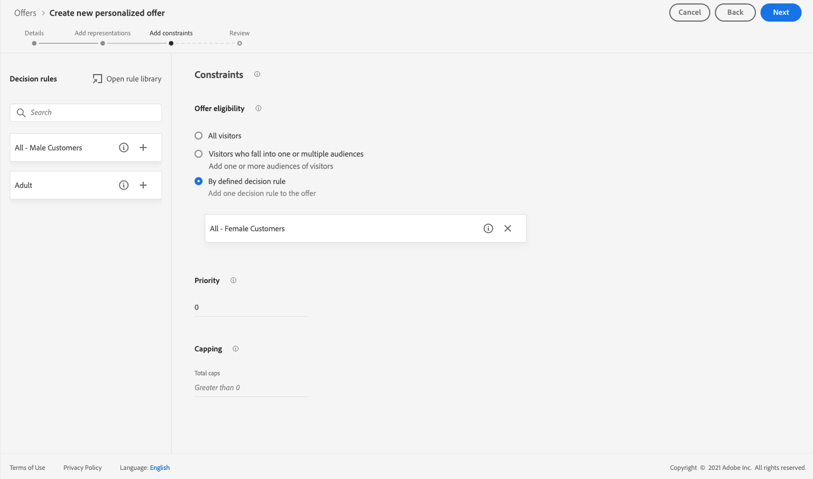
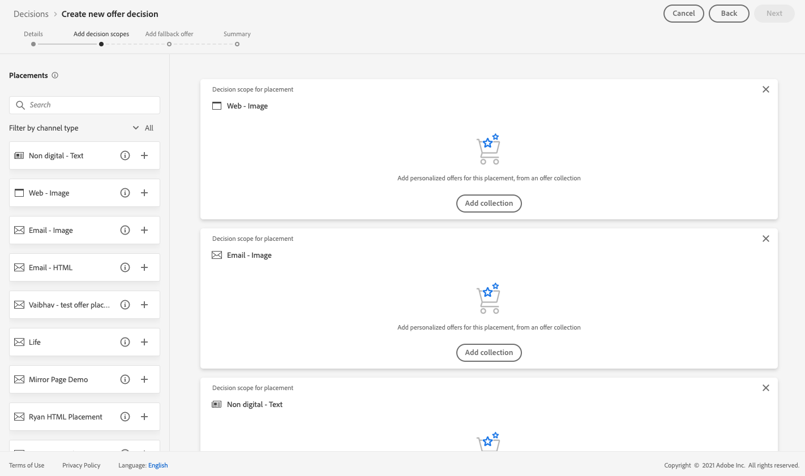

# Caso de uso: Configuración de ofertas personalizadas para utilizarlas en un correo electrónico {#configure-add-personalized-offers-email}

Esta sección presenta un ejemplo completo para mostrar cómo configurar ofertas y utilizarlas en un mensaje de correo electrónico, en función de una decisión que haya creado anteriormente.

## Pasos principales {#main-steps}

A continuación se enumeran los pasos clave para configurar ofertas, incluirlas en una decisión y aprovechar esta decisión en un correo electrónico:

1. Antes de crear ofertas, [defina los componentes](#define-components)

   * Crear ubicaciones
   * Crear reglas de decisión
   * Crear calificadores de colección (anteriormente conocidos como &quot;etiquetas&quot;)
   * Crear clasificaciones (opcional)

1. [Configuración de las ofertas](#configure-offers)

   * Crear ofertas
   * Para cada oferta:

      * Cree representaciones y seleccione una colocación y un recurso para cada representación
      * Añadir una regla para cada oferta
      * Definir una prioridad para cada oferta

1. [Crear una oferta de reserva](#create-fallback)

1. [Crear una colección](#create-collection) para incluir las ofertas personalizadas que creó

1. [Configurar la decisión](#configure-decision)

   * Crear una decisión
   * Seleccione las ubicaciones que ha creado
   * Para cada ubicación, seleccione la colección
   * Para cada ubicación, seleccione una clasificación (opcional)
   * Seleccionar la reserva

1. [Inserción de la decisión en un correo electrónico](#insert-decision-in-email)

   * Seleccione una ubicación que coincida con las ofertas que desea mostrar
   * Seleccione la decisión entre los elementos compatibles con la ubicación seleccionada
   * Previsualización de ofertas

El proceso general de Gestión de decisiones para utilizar ofertas en un correo electrónico se puede describir de la siguiente manera:

## Definición de los componentes {#define-components}

Antes de empezar a crear ofertas, debe definir varios componentes que utilizará en las ofertas.

Los encontrará en el **[!UICONTROL menú Administración de decisiones]** > **[!UICONTROL Componentes]**.

1. Comience creando **ubicaciones** para sus ofertas.

   Utilizará estas ubicaciones para definir dónde aparecerá la oferta resultante al definir la decisión de oferta.

   En este ejemplo, cree tres ubicaciones con los siguientes tipos de canal y contenido:

   * *Web - Imagen*
   * *Correo electrónico: imagen*
   * *No digital - Texto*

   

   Los pasos detallados para crear ubicaciones se describen en [esta sección](../../using/offers/offer-library/creating-placements.md).

1. Crear **reglas de decisión**.

   Las reglas de decisión proporcionarán la mejor oferta a un perfil en Adobe Experience Platform.

   Configure dos reglas simples usando el atributo **[!UICONTROL XDM Individual Profile > Person > Gender]**:

   * *Clientes mujeres*
   * *Clientes masculinos*

   

   Los pasos detallados para crear reglas se describen en [esta sección](../../using/offers/offer-library/creating-decision-rules.md).

1. También puede crear un **calificador de colección**.

   A continuación, podrá asociarlo a sus ofertas y utilizar este calificador de recopilación para agrupar sus ofertas en una colección.

   En este ejemplo, cree el calificador de colección *Yoga*.

   

   Los pasos detallados para crear calificadores de colección se describen en [esta sección](../../using/offers/offer-library/creating-tags.md).

1. Si desea definir reglas que determinen qué oferta debe presentarse primero para una ubicación determinada (en lugar de tener en cuenta las puntuaciones de prioridad de las ofertas), puede crear una **fórmula de clasificación**.

   Los pasos detallados para crear fórmulas de clasificación se describen en [esta sección](../../using/offers/ranking/create-ranking-formulas.md#create-ranking-formula).

   >[!NOTE]
   >
   >En este ejemplo, solo utilizaremos las puntuaciones de prioridad. Más información sobre [reglas de elegibilidad y restricciones](../../using/offers/offer-library/add-constraints.md#eligibility).

## Configuración de ofertas {#configure-offers}

Ahora puede crear y configurar sus ofertas. En este ejemplo, creará cuatro ofertas que desea mostrar según cada perfil específico.

1. Cree una oferta. Obtenga más información en [esta sección](../../using/offers/offer-library/creating-personalized-offers.md#create-offer).

1. En esta oferta, cree tres representaciones. Cada representación debe ser una combinación de una ubicación que haya creado anteriormente y un recurso:

   * Uno correspondiente a la ubicación *Web - Image*
   * Uno correspondiente a la ubicación *Correo electrónico: imagen*
   * Uno correspondiente a la ubicación *No digital - Texto*

   >[!NOTE]
   >
   >Una oferta se puede mostrar en diferentes lugares de un mensaje para crear más oportunidades de utilizar la oferta en diferentes contextos de colocación.

   Obtenga más información acerca de las representaciones en [esta sección](../../using/offers/offer-library/add-representations.md#representations).

1. Seleccione una imagen adecuada para las dos primeras ubicaciones. Escriba texto personalizado para la ubicación *No digital - Texto*.

   

1. En la sección **[!UICONTROL Elegibilidad para la oferta]**, seleccione **[!UICONTROL Por regla de decisión definida]** y arrastre y suelte la regla que elija.

   

1. Rellene **[!UICONTROL Prioridad]**. En este ejemplo, agregue *25*.

1. Revisa tu oferta y luego haz clic en **[!UICONTROL Guardar y aprobar]**.

   

1. En este ejemplo, cree tres ofertas más con las mismas representaciones, pero con recursos diferentes. Asígneles reglas y prioridades diferentes, como, por ejemplo:

   * Primera oferta - Regla de decisión: *Clientes mujeres*, Prioridad: *25*
   * Segunda oferta - Regla de decisión: *Clientes mujeres*, Prioridad: *15*
   * Tercera oferta - Regla de decisión: *Clientes masculinos*, Prioridad: *25*
   * Cuarta oferta - Regla de decisión: *Clientes masculinos*, Prioridad: *15*

   

Los pasos detallados para crear y configurar ofertas se describen en [esta sección](../../using/offers/offer-library/creating-personalized-offers.md).

## Crear una oferta de reserva {#create-fallback}

1. Crear una oferta de reserva.

1. Defina las mismas representaciones que para las ofertas, con los recursos adecuados (deben ser diferentes de los utilizados en las ofertas).

   Cada representación debe ser una combinación de una ubicación que haya creado anteriormente y un recurso:

   * Uno correspondiente a la ubicación *Web - Image*
   * Uno correspondiente a la ubicación *Correo electrónico: imagen*
   * Uno correspondiente a la ubicación *No digital - Texto*

   

1. Revisa tu oferta de reserva y luego haz clic en **[!UICONTROL Guardar y aprobar]**.

La oferta de reserva ya está lista para utilizarse en una decisión.

Los pasos detallados para crear y configurar una oferta de reserva se describen en [esta sección](../../using/offers/offer-library/creating-fallback-offers.md).

## Crear una colección {#create-collection}

Al configurar la decisión, deberá agregar sus ofertas personalizadas como parte de una colección.

1. Para acelerar el proceso de decisión, cree una colección dinámica.

1. Use el calificador de la colección *Yoga* para seleccionar las cuatro ofertas personalizadas que creó anteriormente.

   

Los pasos detallados para crear una colección se describen en [esta sección](../../using/offers/offer-library/creating-collections.md).

## Configurar la decisión {#configure-decision}

Ahora debe crear una decisión que combine ubicaciones con las ofertas personalizadas y la oferta de reserva que acaba de crear.

El motor de decisión utilizará esta combinación para encontrar la mejor oferta para un perfil específico: en este ejemplo, se basa en la prioridad y la regla de decisión que asignó a cada oferta.

Para crear y configurar una decisión de oferta, siga los pasos principales a continuación:

1. Cree una decisión. Obtenga más información en [esta sección](../../using/offers/offer-activities/create-offer-activities.md#create-activity).

1. Seleccione las ubicaciones *Web - Imagen*, *Correo electrónico - Imagen* y *No digital - Texto*.

   

1. Para cada ubicación, agregue la colección que ha creado.

   

1. Si definió una clasificación al [crear sus componentes](#define-components), puede asignarla a una ubicación en la decisión. Si se pueden presentar varias ofertas en esta ubicación, la decisión utilizará esta fórmula para calcular qué oferta se entregará primero.

   Los pasos detallados para asignar una fórmula de clasificación a una ubicación se describen en [esta sección](../../using/offers/offer-activities/configure-offer-selection.md#assign-ranking-formula).

1. Seleccione la oferta de reserva que ha creado. Se mostrará como una oferta de reserva disponible para las tres ubicaciones seleccionadas.

   

1. Revisa tu decisión y luego haz clic en **[!UICONTROL Guardar y aprobar]**.

   

Su decisión ya está lista para utilizarse para ofrecer ofertas optimizadas y personalizadas.

Los pasos detallados para crear y configurar una decisión se describen en [esta sección](../../using/offers/offer-activities/create-offer-activities.md).

## Inserción de la decisión en un correo electrónico {#insert-decision-in-email}

Ahora que la decisión está activa, puede insertarla en un mensaje de correo electrónico. Para ello, siga los pasos detallados en [esta página](../../using/email/add-offers-email.md).

