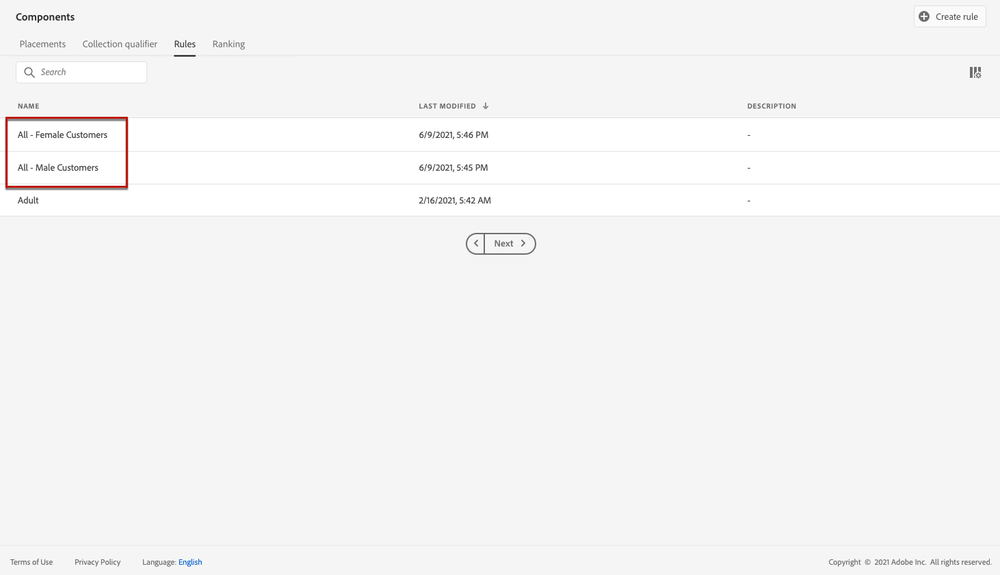
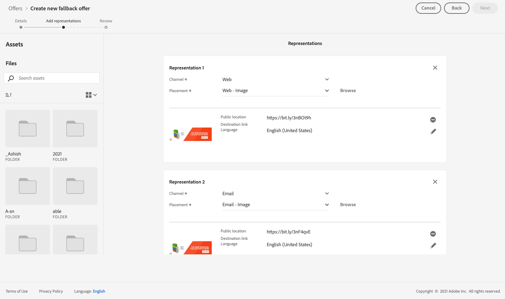

# Caso de uso: Configurar ofertas personalizadas para utilizarlas en un correo electrónico {#configure-add-personalized-offers-email}

Esta sección presenta un ejemplo completo de cómo configurar ofertas y utilizarlas en un mensaje de correo electrónico, en función de una decisión que haya creado anteriormente.

## Pasos principales {#main-steps}

A continuación se enumeran los pasos clave para configurar ofertas, incluirlas en una decisión y aprovechar esta decisión en un correo electrónico:

1. Antes de crear ofertas, [definir sus componentes](#define-components)

   * Crear ubicaciones
   * Crear reglas de decisión
   * Crear etiquetas
   * Crear clasificaciones (opcional)

1. [Configuración de las ofertas](#configure-offers)

   * Cree ofertas
   * Para cada oferta:

      * Cree representaciones y seleccione una colocación y un recurso para cada representación
      * Agregar una regla para cada oferta
      * Definir una prioridad para cada oferta

1. [Crear una oferta de reserva](#create-fallback)

1. [Crear una colección](#create-collection) para incluir las ofertas personalizadas que ha creado

1. [Configurar la decisión](#configure-decision)

   * Crear una decisión
   * Seleccione las ubicaciones que ha creado
   * Para cada ubicación, seleccione la colección
   * Para cada ubicación, seleccione una clasificación (opcional)
   * Seleccione la reserva

1. [Inserte la decisión en un correo electrónico](#insert-decision-in-email)

   * Seleccione una colocación que coincida con las ofertas que desee mostrar
   * Seleccione la decisión entre los elementos compatibles con la colocación seleccionada
   * Previsualizar las ofertas

El proceso general de gestión de decisiones para utilizar ofertas en un correo electrónico se puede describir de la siguiente manera:

## Definir los componentes {#define-components}

Antes de comenzar a crear ofertas, debe definir varios componentes que utilizará en las ofertas.

Los encontrará en la sección **[!UICONTROL Decision Management]** > **[!UICONTROL Components menu]**.

1. Comience creando **ubicaciones** para sus ofertas.

   Se utilizan estas ubicaciones para definir dónde aparecerá la oferta resultante al definir la decisión de la oferta.

   En este ejemplo, cree tres ubicaciones con los siguientes tipos de contenido y canal:

   * *Web - Imagen*
   * *Correo electrónico: imagen*
   * *No digital: texto*

   

   Los pasos detallados para crear ubicaciones se describen en [esta sección](../../using/offers/offer-library/creating-placements.md).

1. Crear **reglas de decisión**.

   Las reglas de decisión proporcionarán la mejor oferta a un perfil en Adobe Experience Platform.

   Configure dos reglas sencillas usando la variable **[!UICONTROL XDM Individual Profile > Person > Gender]** atributo:

   * *Clientes femeninos*
   * *Clientes masculinos*

   

   Los pasos detallados para crear reglas se describen en [esta sección](../../using/offers/offer-library/creating-decision-rules.md).

1. También puede crear un **etiqueta**.

   A continuación, podrá asociarlo a sus ofertas y utilizar esta etiqueta para agrupar las ofertas en una colección.

   En este ejemplo, cree la variable *Yoga* etiqueta.

   

   Los pasos detallados para crear etiquetas se describen en [esta sección](../../using/offers/offer-library/creating-tags.md).

1. Si desea definir reglas que determinen qué oferta debe presentarse primero para una ubicación determinada (en lugar de tener en cuenta las puntuaciones de prioridad de las ofertas), puede crear una **fórmula de clasificación**.

   Los pasos detallados para crear fórmulas de clasificación se describen en [esta sección](../../using/offers/ranking/create-ranking-formulas.md#create-ranking-formula).

   >[!NOTE]
   >
   >En este ejemplo, solo utilizaremos las puntuaciones de prioridad. Más información sobre [reglas y restricciones de elegibilidad](../../using/offers/offer-library/creating-personalized-offers.md#eligibility).

## Configurar ofertas {#configure-offers}

Ahora puede crear y configurar sus ofertas. En este ejemplo, creará cuatro ofertas que desea mostrar según cada perfil específico.

1. Crear una oferta. Obtenga más información en [esta sección](../../using/offers/offer-library/creating-personalized-offers.md#create-offer).

1. En esta oferta, cree tres representaciones. Cada representación debe ser una combinación de una colocación que haya creado anteriormente y un recurso:

   * Uno correspondiente a la variable *Web - Imagen* placement
   * Uno correspondiente a la variable *Correo electrónico: imagen* placement
   * Uno correspondiente a la variable *No digital: texto* placement

   >[!NOTE]
   >
   >Una oferta se puede mostrar en diferentes lugares de un mensaje para crear más oportunidades de utilizar la oferta en diferentes contextos de ubicación.

   Obtenga más información sobre las representaciones en [esta sección](../../using/offers/offer-library/creating-personalized-offers.md#representations).

1. Seleccione una imagen adecuada para las dos primeras ubicaciones. Escriba texto personalizado para el *No digital: texto* ubicación.

   

1. En el **[!UICONTROL Offer eligibility]** , seleccione **[!UICONTROL By defined decision rule]** y arrastre y suelte la regla que desee.

   

1. Complete el **[!UICONTROL Priority]**. En este ejemplo, agregue *25*.

1. Revise la oferta y haga clic en **[!UICONTROL Save and approve]**.

   

1. En este ejemplo, cree tres ofertas más con las mismas representaciones, pero diferentes recursos. Asignarlos con distintas reglas y prioridades, como:

   * Primera oferta: Regla de decisión: *Clientes femeninos*, Prioridad: *25*
   * Segunda oferta: Regla de decisión: *Clientes femeninos*, Prioridad: *15*
   * Tercera oferta: Regla de decisión: *Clientes masculinos*, Prioridad: *25*
   * Cuarta oferta: Regla de decisión: *Clientes masculinos*, Prioridad: *15*

   

Los pasos detallados para crear y configurar ofertas se describen en [esta sección](../../using/offers/offer-library/creating-personalized-offers.md).

## Crear una oferta de reserva {#create-fallback}

1. Crear una oferta de reserva.

1. Defina las mismas representaciones que para las ofertas, con los recursos adecuados (deben ser diferentes de los utilizados en las ofertas).

   Cada representación debe ser una combinación de una colocación que haya creado anteriormente y un recurso:

   * Uno correspondiente a la variable *Web - Imagen* placement
   * Uno correspondiente a la variable *Correo electrónico: imagen* placement
   * Uno correspondiente a la variable *No digital: texto* placement

   

1. Revise la oferta de reserva y haga clic en **[!UICONTROL Save and approve]**.

La oferta de reserva ya está lista para utilizarse en una decisión.

Los pasos detallados para crear y configurar una oferta de reserva se describen en [esta sección](../../using/offers/offer-library/creating-fallback-offers.md).

## Crear una colección {#create-collection}

Al configurar la decisión, debe añadir las ofertas personalizadas como parte de una colección.

1. Para acelerar el proceso de decisión, cree una colección dinámica.

1. Utilice la variable *Yoga* para seleccionar las cuatro ofertas personalizadas que ha creado anteriormente.

   

Los pasos detallados para crear una colección se describen en [esta sección](../../using/offers/offer-library/creating-collections.md).

## Configurar la decisión {#configure-decision}

Ahora debe crear una decisión que combine ubicaciones con las ofertas personalizadas y la oferta de reserva que acaba de crear.

El motor de toma de decisiones utilizará esta combinación para encontrar la mejor oferta para un perfil específico: en este ejemplo, se basa en la regla de prioridad y decisión que asignó a cada oferta.

Para crear y configurar una decisión de oferta, siga los pasos principales a continuación:

1. Crear una decisión. Obtenga más información en [esta sección](../../using/offers/offer-activities/create-offer-activities.md#create-activity).

1. Seleccione el *Web - Imagen*, *Correo electrónico: imagen* y *No digital: texto* ubicaciones.

   

1. Para cada ubicación, agregue la colección que ha creado.

   

1. Si ha definido una clasificación cuando [creación de componentes](#define-components), puede asignarlo a una colocación en la decisión. Si se pueden presentar varias ofertas en esta ubicación, la decisión utilizará esta fórmula para calcular qué oferta enviar primero.

   Los pasos detallados para asignar una fórmula de clasificación a una ubicación se describen en [esta sección](../../using/offers/offer-activities/configure-offer-selection.md#assign-ranking-formula).

1. Seleccione la oferta de reserva que ha creado. Se muestra como una oferta de reserva disponible para las tres ubicaciones seleccionadas.

   

1. Revise su decisión y haga clic en **[!UICONTROL Save and approve]**.

   

Su decisión ya está lista para utilizarse para ofrecer ofertas optimizadas y personalizadas.

Los pasos detallados para crear y configurar una decisión se describen en [esta sección](../../using/offers/offer-activities/create-offer-activities.md).

## Inserte la decisión en un correo electrónico {#insert-decision-in-email}

Ahora que su decisión está activa, puede insertarla en un mensaje de correo electrónico. Para ello, siga los pasos detallados en [esta página](../../using/design/deliver-personalized-offers.md).

