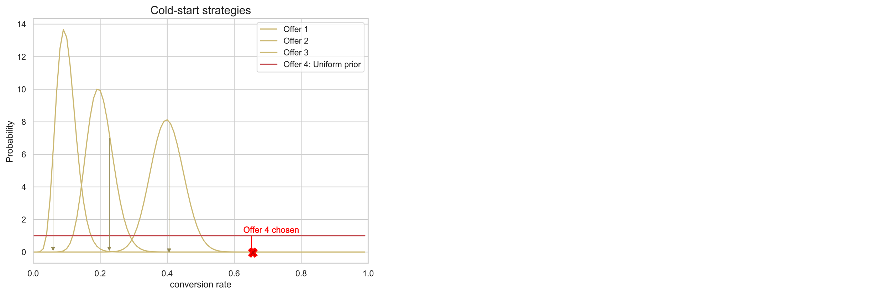

# Modelos de optimización automática {#auto-optimization-model}

>[!TIP]
>
>Decisioning, la nueva funcionalidad de toma de decisiones de [!DNL Adobe Journey Optimizer], ya está disponible a través de los canales de experiencia basada en código y de correo electrónico. [Más información](../../experience-decisioning/gs-experience-decisioning.md)

Un modelo de optimización automática tiene como objetivo ofrecer ofertas que maximicen el rendimiento (KPI) establecido por los clientes empresariales. Estos KPI pueden adoptar la forma de tasas de conversión, ingresos, etc. En este punto, la optimización automática se centra en optimizar los clics de oferta con la conversión de ofertas como objetivo. La optimización automática no está personalizada y se optimiza en función del rendimiento &quot;global&quot; de las ofertas.

## Requisitos del conjunto de datos

Para entrenar un modelo de optimización automática, el conjunto de datos debe cumplir los siguientes requisitos mínimos:

* Al menos 2 ofertas del conjunto de datos deben tener al menos 100 eventos de visualización y 5 eventos de clic en los últimos 14 días.
* El modelo tratará las ofertas con menos de 100 visualizaciones o eventos de 5 clics en los últimos 14 días como nuevas ofertas y solo son elegibles para ser servidas por el bandido de exploración.
* El modelo tratará las ofertas con más de 100 visualizaciones y eventos de 5 clics en los últimos 14 días como ofertas existentes y pueden ser servidas por bandidos de exploración y explotación.

Hasta la primera vez que se entrene un modelo de optimización automática, las ofertas dentro de una estrategia de selección que utilice un modelo de optimización automática se servirán al azar.

## Limitaciones {#limitations}

El uso de modelos de optimización automática para la administración de decisiones está sujeto a las siguientes limitaciones:

* Los modelos de optimización automática no funcionan con la API de decisiones por lotes.
* Los comentarios necesarios para crear un modelo deben enviarse como un evento de experiencia. No se debe enviar automáticamente en [!DNL Journey Optimizer] canales.

## Terminología {#terminology}

Los siguientes términos pueden resultar útiles al tratar el tema de la optimización automática:

* **Multi-armed bandit**: Un enfoque de [multi-armed bandit](https://en.wikipedia.org/wiki/Multi-armed_bandit){target="_blank"} en la optimización equilibra el aprendizaje exploratorio y la explotación de ese aprendizaje.

* **Muestreo Thomson**: El muestreo Thompson es un algoritmo para problemas de decisiones en línea en el que las acciones se toman secuencialmente de una manera que debe equilibrar entre la explotación de lo que se sabe que maximiza el rendimiento inmediato y la inversión para acumular información nueva que pueda mejorar el rendimiento futuro. [Más información](#thompson-sampling)

* [**Distribución de Beta**](https://en.wikipedia.org/wiki/Beta_distribution){target="_blank"}: conjunto de [distribuciones de probabilidad](https://en.wikipedia.org/wiki/Probability_distribution){target="_blank"} continuas definidas en el intervalo [0, 1] [parametrizadas](https://en.wikipedia.org/wiki/Statistical_parameter){target="_blank"} por dos [parámetros de forma](https://en.wikipedia.org/wiki/Shape_parameter){target="_blank"} positivos.

## Muestreo Thompson {#thompson-sampling}

El algoritmo subyacente a la optimización automática es **Muestreo Thompson**. En esta sección, analizamos la intuición detrás del muestreo Thompson.

[Muestreo Thompson](https://en.wikipedia.org/wiki/Thompson_sampling){target="_blank"}, o bandidos bayesianos, es un enfoque bayesiano del problema de los bandidos multiarmados.  La idea básica es tratar la recompensa promedio 𝛍 de cada oferta como una **variable aleatoria** y usar los datos que hemos recopilado hasta el momento para actualizar nuestra &quot;creencia&quot; sobre la recompensa promedio. Esta &quot;creencia&quot; está representada matemáticamente por una **distribución de probabilidad posterior**, esencialmente un rango de valores para la recompensa promedio, junto con la plausibilidad (o probabilidad) de que la recompensa tenga ese valor para cada oferta. Entonces, por cada decisión, **muestrearemos un punto de cada una de estas distribuciones de recompensa posterior** y seleccionaremos la oferta cuya recompensa muestreada tenga el valor más alto.

Este proceso se ilustra en la figura siguiente, donde tenemos 3 ofertas diferentes. Inicialmente no tenemos evidencia de los datos y asumimos que todas las ofertas tienen una distribución de recompensa posterior uniforme. Tomamos una muestra de la distribución posterior de recompensas de cada oferta. La muestra seleccionada en la distribución de la oferta 2 tiene el valor más alto. Este es un ejemplo de **exploración**. Después de mostrar la Oferta 2, recopilamos cualquier recompensa potencial (por ejemplo, conversión/no conversión) y actualizamos la distribución posterior de la Oferta 2 usando el Teorema de Bayes como se explica a continuación.  Continuamos este proceso y actualizamos las distribuciones posteriores cada vez que se muestra una oferta y se obtiene la recompensa. En la segunda cifra, se selecciona la Oferta 3: a pesar de que la Oferta 1 tiene la recompensa promedio más alta (su distribución de recompensa posterior está más a la derecha), el proceso de muestreo de cada distribución nos ha llevado a elegir una Oferta 3 aparentemente subóptima. Al hacerlo, nos damos la oportunidad de aprender más acerca de la verdadera distribución de recompensas de Offer 3.

A medida que se recolectan más muestras, la confianza aumenta y se obtiene una estimación más precisa de la posible recompensa (correspondiente a distribuciones de recompensa más estrechas). Este proceso de actualizar nuestras creencias a medida que se dispone de más evidencia se conoce como **Inferencia bayesiana**.

Finalmente, si una oferta (por ejemplo, la oferta 1) es un claro ganador, su distribución de recompensa posterior se separará de las demás. En este punto, para cada decisión, es probable que la recompensa muestreada de la Oferta 1 sea la más alta y la elegiremos con una mayor probabilidad. Esta es **explotación** - creemos firmemente que la Oferta 1 es la mejor, y por lo tanto se elige para maximizar las recompensas.

**Figura 1**: *Por cada decisión, tomamos una muestra de un punto de las distribuciones de recompensa posteriores. Se elige la oferta con el valor de muestra más alto (tasa de conversión). En la fase inicial, todas las ofertas tienen una distribución uniforme, ya que no tenemos ninguna evidencia sobre las tasas de conversión de las ofertas a partir de los datos. A medida que recogemos más muestras, las distribuciones posteriores se vuelven más estrechas y precisas. En última instancia, se elegirá siempre la oferta con la tasa de conversión más alta.*

<!--

-->

+++**Detalles técnicos**

Para calcular/actualizar distribuciones, usamos el **Teorema de Bayes**. Para cada oferta ***i***, queremos calcular su ***P(𝛍i | data)*** es decir, para cada oferta ***i***, la probabilidad de que haya un valor de recompensa&#x200B;**𝛍 i**, dados los datos que hemos recopilado hasta ahora para esa oferta.

Del Teorema De Bayes:

***Posterior = Probabilidad * Anterior***

La **probabilidad anterior** es la suposición inicial acerca de la probabilidad de producir un resultado. La probabilidad, después de que se hayan recopilado algunas pruebas, se conoce como la **probabilidad posterior**. 

La optimización automática está diseñada para tener en cuenta las recompensas binarias (clic/sin clic). En este caso, la probabilidad representa el número de éxitos de N ensayos y está modelada por una **distribución binomial**. Para algunas funciones de probabilidad, si se elige una determinada anterior, la posterior termina estando en la misma distribución que la anterior. A este tipo de prior se le denomina **conjugado prior**. Este tipo de antecedente hace que el cálculo de la distribución posterior sea muy sencillo. La **distribución Beta** es un conjugado anterior a la probabilidad binomial (recompensas binarias), y por lo tanto es una opción conveniente y sensata para las distribuciones de probabilidad anterior y posterior.La distribución de Beta toma dos parámetros, **&#x200B;**&#x200B;**&#x200B; y &#x200B;**&#x200B;**&#x200B;**. Estos parámetros pueden considerarse como el recuento de éxitos y errores y el valor medio proporcionado por:

La función de probabilidad como explicamos arriba está modelada por una distribución binomial, con s éxitos (conversiones) y f errores (sin conversiones) y q es una [variable aleatoria](https://en.wikipedia.org/wiki/Random_variable){target="_blank"} con una [distribución beta](https://en.wikipedia.org/wiki/Beta_distribution){target="_blank"}.

La distribución anterior se modela mediante Beta y la posterior toma la siguiente forma:

La parte posterior se calcula simplemente agregando el número de aciertos y errores a los parámetros existentes **&#x200B;**&#x200B;**, &#x200B;**&#x200B;**&#x200B;**.

Para la optimización automática, como se muestra en el ejemplo anterior, comenzamos con una distribución anterior ***Beta(1, 1)*** (distribución uniforme) para todas las ofertas y después de obtener los éxitos y los errores de una oferta determinada, la posterior se convierte en una distribución Beta con los parámetros ***(s+, f+)*** para esa oferta.
+++

**Temas relacionados**:

Para profundizar en el muestreo Thompson, lea los siguientes artículos de investigación:

* [Evaluación empírica del muestreo Thompson](https://proceedings.neurips.cc/paper/2011/file/e53a0a2978c28872a4505bdb51db06dc-Paper.pdf){target="_blank"}
* [Análisis del muestreo Thompson para el problema de bandidos multiarmados](https://proceedings.mlr.press/v23/agrawal12/agrawal12.pdf){target="_blank"}

## Problema de arranque en frío {#cold-start}

El problema de &quot;inicio en frío&quot; se produce cuando se agrega una nueva oferta a una campaña y no hay datos disponibles sobre la tasa de conversión de la nueva oferta. Durante este periodo, tenemos que idear una estrategia con respecto a la frecuencia con la que se elige esta nueva oferta para minimizar la caída de rendimiento, mientras recopilamos información sobre la tasa de conversión de esta nueva oferta. Hay múltiples soluciones disponibles para abordar este problema. La clave es encontrar un equilibrio entre la exploración de esta nueva oferta mientras no sacrificamos mucho la explotación. Actualmente utilizamos &quot;distribución uniforme&quot; como aproximación inicial sobre la tasa de conversión de la nueva oferta (distribución anterior). Básicamente, damos a todos los valores de tasa de conversión la misma probabilidad de ocurrencia.

**Figura 2**: *Considere una campaña con 3 ofertas. Mientras la campaña está activa, la oferta 4 se añade a la campaña. Inicialmente no tenemos datos sobre la tasa de conversión de la oferta 4 y tenemos que hacer frente al problema de arranque en frío. Utilizamos la distribución uniforme como nuestra estimación inicial sobre la tasa de conversión de la oferta 4, mientras que recopilamos datos para esta nueva oferta. Como se explica en la sección [Muestreo Thompson](#thompson-sampling), para elegir qué oferta se mostrará a un usuario, tomamos muestras de los puntos de las distribuciones de recompensas posteriores de las ofertas y seleccionamos la oferta con el valor de muestra más alto. En el ejemplo anterior, se elige la oferta 4 y más adelante en función de la recompensa obtenida, la distribución posterior de esta oferta se actualiza tal como se explica en la sección [Muestreo Thompson](#thompson-sampling).*

## Medida de alza {#lift}

&quot;Alza&quot; es la métrica utilizada para medir el rendimiento de cualquier estrategia implementada en el servicio de clasificación, en comparación con la estrategia de línea de base (servir ofertas solo aleatoriamente).

Por ejemplo, si estamos interesados en medir el rendimiento de una estrategia de Muestreo Thompson (TS) utilizada en el servicio de clasificación y el KPI es la tasa de conversión (CVR), el &quot;alza&quot; de la estrategia de TS respecto a la estrategia de línea de base se define como:

