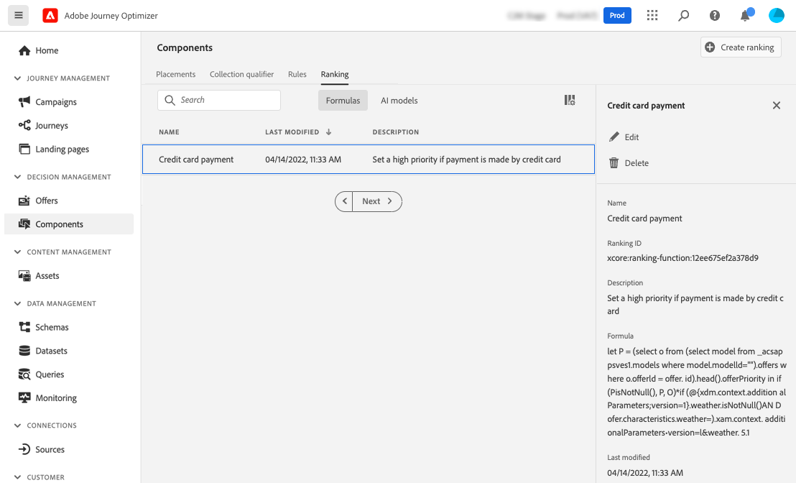

# Fórmulas de clasificación {#create-ranking-formulas}

## Acerca de las fórmulas de clasificación {#about-ranking-formulas}

**Clasificar fórmulas** permite definir reglas que determinan qué oferta debe presentarse primero para una ubicación determinada, en lugar de tener en cuenta las puntuaciones de prioridad de las ofertas.

Las fórmulas de clasificación se expresan en **Sintaxis PQL** y pueden aprovechar atributos de perfil, datos de contexto y atributos de oferta. Para obtener más información sobre cómo utilizar la sintaxis PQL, consulte la [documentación dedicada](https://experienceleague.adobe.com/docs/experience-platform/segmentation/pql/overview.html?lang=es).

Una vez creada una fórmula de clasificación, puede asignarla a una ubicación en una decisión. Para obtener más información, consulte [Configurar la selección de ofertas en decisiones](../offer-activities/configure-offer-selection.md).

## Crear una fórmula de clasificación {#create-ranking-formula}

Para crear una fórmula de clasificación, siga los pasos a continuación:

1. Acceda a la **[!UICONTROL Componentes]** y, a continuación, seleccione la **[!UICONTROL Clasificación]** pestaña. El **[!UICONTROL Fórmulas]** está seleccionada de forma predeterminada. Se muestra la lista de fórmulas creadas anteriormente.

   

1. Clic **[!UICONTROL Crear clasificación]** para crear una nueva fórmula de clasificación.

   

1. Especifique el nombre, la descripción y la fórmula de la fórmula.

   En este ejemplo, queremos aumentar la prioridad de todas las ofertas con el atributo &quot;hot&quot; si el tiempo real es caluroso. Para ello, la variable **contextData.weather=hot** se pasó en la llamada de toma de decisiones.

   

   >[!IMPORTANT]
   >
   >Al crear una fórmula de clasificación, no se admite retroceder a un período de tiempo anterior. Por ejemplo, si especifica un evento de experiencia que se produjo durante el último mes como componente de la fórmula. Cualquier intento de incluir un período retroactivo durante la creación de la fórmula generará un déclencheur de error al guardarla.

1. Haga clic en **[!UICONTROL Guardar]**. Cuando se crea la fórmula de clasificación, puede seleccionarla en la lista para obtener detalles y editarla o eliminarla.

   Ahora está listo para utilizarse en una decisión para clasificar ofertas aptas para una ubicación (consulte [Configuración de la selección de ofertas en decisiones](../offer-activities/configure-offer-selection.md)).

   

## Ejemplos de fórmulas de clasificación {#ranking-formula-examples}

Puede crear muchas fórmulas de clasificación diferentes según sus necesidades. A continuación se muestran algunos ejemplos.

<!--
Boost by offer ID

Boost the priority of an offer with the offer ID *xcore:personalized-offer:13d213cd4cb328ec* by 5.

**Ranking formula:**

```
if( offer._id = "xcore:personalized-offer:13d213cd4cb328ec", offer.rank.priority + 5, offer.rank.priority)
```

Change the offer priority based on a certain profile attribute

Set the offer priority to 30 for offer *xcore:personalized-offer:13d213cd4cb328ec* if the user lives in the city of Bondi.

**Ranking formula:**

```
if( offer._id = "xcore:personalized-offer:13d213cd4cb328ec" and homeAddress.city.equals("Bondi", false), 30, offer.rank.priority)
```

Boost multiple offers by offer ID based on the presence of a profile's audience membership

Boost the priority of offers based on whether the user is a member of a priority audience, which is configured as an attribute in the offer.

**Ranking formula:**

```
if( segmentMembership.get("ups").get(offer.characteristics.get("prioritySegmentId")).status in (["realized","existing"]), offer.rank.priority + 10, offer.rank.priority)
```
-->

### Aumente las ofertas con ciertos atributos de oferta según el atributo del perfil

Si el perfil vive en la ciudad correspondiente a la oferta, duplique la prioridad para todas las ofertas de esa ciudad.

**Fórmula de clasificación:**

```
if( offer.characteristics.get("city") = homeAddress.city, offer.rank.priority * 2, offer.rank.priority)
```

### Ampliar ofertas en las que la fecha de finalización sea en menos de 24 horas a partir de ahora

**Fórmula de clasificación:**

```
if( offer.selectionConstraint.endDate occurs <= 24 hours after now, offer.rank.priority * 3, offer.rank.priority)
```

### Aumente las ofertas con ciertos atributos de oferta según los datos de contexto

Impulse determinadas ofertas en función de los datos de contexto que se pasan en la llamada de toma de decisiones. Por ejemplo, si la variable `contextData.weather=hot` se pasa en la llamada de decisión, la prioridad de todas las ofertas con `attribute=hot` debe ser potenciado.

**Fórmula de clasificación:**

```
if (@event{_xdm.context.additionalParameters;version=1}.weather.isNotNull()
and offer.characteristics.get("weather")=@event{_xdm.context.additionalParameters;version=1}.weather, offer.rank.priority + 5, offer.rank.priority)
```

Tenga en cuenta que, al utilizar la API de decisiones, los datos de contexto se añaden al elemento de perfil en el cuerpo de la solicitud, como en el ejemplo siguiente.

**Fragmento del cuerpo de la solicitud:**

```
"xdm:profiles": [
{
    "xdm:identityMap": {
        "crmid": [
            {
            "xdm:id": "CRMID1"
            }
        ]
    },
    "xdm:contextData": [
        {
            "@type":"_xdm.context.additionalParameters;version=1",
            "xdm:data":{
                "xdm:weather":"hot"
            }
        }
    ]
 }],
```

### Aumente las ofertas en función de la tendencia de los clientes a comprar el producto ofrecido

Puede aumentar la puntuación de una oferta en función de una puntuación de tendencia del cliente.

En este ejemplo, el inquilino de instancia es *_salesvelocity* y el esquema de perfil contiene un rango de puntuaciones almacenadas en una matriz:


Teniendo en cuenta esto, para un perfil como:

```
{"_salesvelocity": {"individualScoring": [
                    {"core": {
                            "category":"insurance",
                            "propensityScore": 96.9
                        }},
                    {"core": {
                            "category":"personalLoan",
                            "propensityScore": 45.3
                        }},
                    {"core": {
                            "category":"creditCard",
                            "propensityScore": 78.1
                        }}
                    ]}
}
```

Las ofertas contendrían un atributo para *propensityType* que coincide con la categoría de las puntuaciones:


La fórmula de clasificación puede establecer la prioridad de cada oferta para que sea igual a los clientes *propensityScore* por eso *propensityType*. Si no se encuentra ninguna puntuación, utilice la prioridad estática establecida en la oferta:

```
let score = (select _Individual_Scoring1 from _salesvelocity.individualScoring
             where _Individual_Scoring1.core.category.equals(offer.characteristics.get("propensityType"), false)).head().core.propensityScore
in if(score.isNotNull(), score, offer.rank.priority)
```
