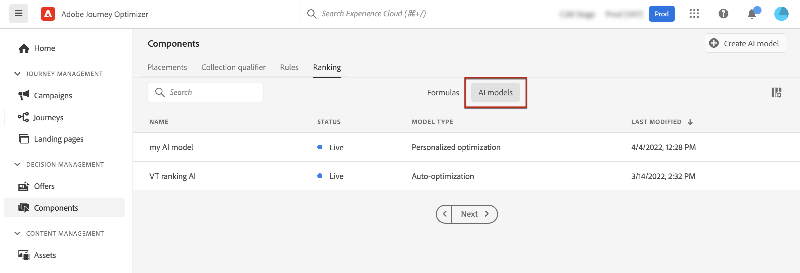

# Creación de modelos de IA {#ai-rankings}

[!DNL Journey Optimizer] le permite crear **modelos de IA** para clasificar ofertas según sus objetivos comerciales.

>[!CAUTION]
>
>Para crear, editar o eliminar modelos de IA, debe tener el permiso **Administrar estrategias de clasificación**. [Más información](../../administration/high-low-permissions.md#manage-ranking-strategies)

## Creación de un modelo de IA {#create-ranking-strategy}

>[!CONTEXTUALHELP]
>id="ajo_decisioning_ai_model_metric"
>title="Métrica de optimización"
>abstract="[!DNL Journey Optimizer] clasifica ofertas según la **tasa de conversión** (la tasa de conversión es igual al número total de eventos de conversión/número total de eventos de impresión). La tasa de conversión se calcula usando dos tipos de métricas: **Eventos de impresión** (ofertas que se muestran) y **Eventos de conversión** (ofertas que se generan por clics de correos electrónicos o por la web). Estos eventos se capturan automáticamente mediante el SDK web o el SDK móvil proporcionado."

Para crear un modelo de IA, siga los pasos a continuación:

1. Cree un conjunto de datos donde se recopilen los eventos de conversión. [Descubra cómo](../data-collection/create-dataset.md)

1. En el menú **[!UICONTROL Componentes]**, acceda a la pestaña **[!UICONTROL Clasificación]** y, a continuación, seleccione **[!UICONTROL modelos de IA]**.

   

   Se muestran todos los modelos de IA creados hasta el momento.

1. Haga clic en el botón **[!UICONTROL Crear modelo de IA]**.

1. Especifique un nombre único y una descripción para el modelo de IA y, a continuación, seleccione el tipo de modelo de IA que desea crear:

   * **[!UICONTROL Optimización automática]** optimiza las ofertas basándose en el rendimiento de las ofertas anteriores. [Más información](auto-optimization-model.md)
   * **[!UICONTROL Optimización personalizada]** optimiza y personaliza ofertas basadas en audiencias y rendimiento de ofertas. [Más información](personalized-optimization-model.md)

   

   >[!NOTE]
   >
   >La sección **[!UICONTROL Métrica de optimización]** proporciona información sobre el evento de conversión utilizado por el modelo de IA para calcular la clasificación de las ofertas.
   >
   >[!DNL Journey Optimizer] clasifica ofertas según la **tasa de conversión** (la tasa de conversión es igual al número total de eventos de conversión/número total de eventos de impresión). La tasa de conversión se calcula mediante dos tipos de métricas:
   >* **Eventos de impresión** (ofertas que se muestran)
   >* **Eventos de conversión** (ofertas que generan clics por correo electrónico o web).
   >
   >Estos eventos se capturan automáticamente mediante el Web SDK o el Mobile SDK que se ha proporcionado. Obtenga más información sobre esto en [Información general de Adobe Experience Platform Web SDK](https://experienceleague.adobe.com/docs/experience-platform/edge/home.html?lang=es).

1. Seleccione los conjuntos de datos donde se recopilan los eventos de conversión e impresión. Aprenda a crear este conjunto de datos en [esta sección](../data-collection/create-dataset.md). <!--This dataset needs to be associated with a schema that must have the **[!UICONTROL Proposition Interactions]** field group (previously known as mixin) associated with it.-->

   

   >[!CAUTION]
   >
   >En la lista desplegable solo se muestran los conjuntos de datos creados a partir de esquemas asociados con el grupo de campos **[!UICONTROL Evento de experiencia: interacciones de propuesta]** (anteriormente conocido como mixin).

1. Si está creando un modelo de IA de **[!UICONTROL optimización personalizada]**, seleccione los segmentos que se usarán para entrenar el modelo de IA.

   ➡️ [Descubra esta funcionalidad en vídeo](#video)

   

   >[!NOTE]
   >
   >Puede seleccionar hasta cinco audiencias.

1. Guarde y active el modelo de IA.

   

<!--At this point, you must have:

* created the AI model,
* defined which type of event you want to capture - offer displayed (impression) and/or offer clicked (conversion),
* and in which dataset you want to collect the event data.-->

Ahora, cada vez que se muestra una oferta o se hace clic en ella, desea que el grupo de campos **[!UICONTROL Evento de experiencia - Interacciones de propuesta]** capture automáticamente el evento correspondiente mediante [Adobe Experience Platform Web SDK](https://experienceleague.adobe.com/docs/experience-platform/edge/web-sdk-faq.html?lang=es#what-is-adobe-experience-platform-web-sdk%3F){target="_blank"} o Mobile SDK.

Para poder enviar tipos de eventos (oferta mostrada u oferta seleccionada), debe establecer el valor correcto para cada tipo de evento en un evento de experiencia que se envíe a Adobe Experience Platform. [Descubra cómo](../data-collection/schema-requirement.md)

## Vídeo práctico {#video}

Obtenga información sobre cómo crear un modelo de optimización personalizado y cómo aplicarlo a una decisión.

>[!VIDEO](https://video.tv.adobe.com/v/3419954?quality=12)
