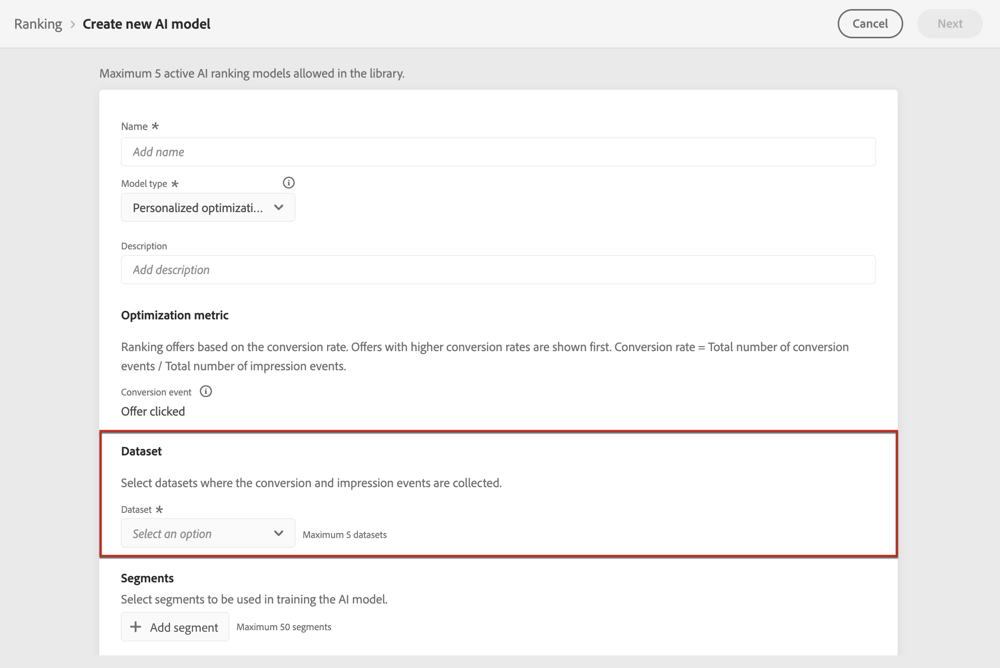

# Creación de modelos de IA {#ai-rankings}

[!DNL Journey Optimizer] permite crear **Modelos de IA** para clasificar las ofertas según los objetivos comerciales.

>[!CAUTION]
>
>Para crear, editar o eliminar modelos de IA, debe tener la variable **Administrar estrategias de clasificación** permiso. [Más información](../../administration/high-low-permissions.md#manage-ranking-strategies)

## Creación de un modelo de IA {#create-ranking-strategy}

Para crear un modelo de IA, siga los pasos a continuación:

1. En el **[!UICONTROL Components]** , acceda al menú **[!UICONTROL Ranking]** y, a continuación, seleccione **[!UICONTROL AI models]**.

   

   Se muestran todos los modelos de IA creados hasta ahora.

1. Haga clic en el botón **[!UICONTROL Create AI model]**.

1. Especifique un nombre único y una descripción para el modelo de IA y, a continuación, seleccione el tipo de modelo de IA que desea crear:

   * **[!UICONTROL Auto-optimization]** optimiza las ofertas en función del rendimiento de ofertas anteriores. [Más información](auto-optimization-model.md)
   * **[!UICONTROL Personalized]** optimiza y personaliza las ofertas en función de segmentos y del rendimiento de las ofertas. [Más información](personalized-optimization-model.md)

   

   >[!NOTE]
   >
   >La variable **[!UICONTROL Optimization metric]** proporciona información sobre el evento de conversión utilizado por el modelo de IA para calcular la clasificación de las ofertas.
   >
   >[!DNL Journey Optimizer] clasificar ofertas en función de **tasa de conversión** (Tasa de conversión = Número total de eventos de conversión/Número total de eventos de impresión). La tasa de conversión se calcula mediante dos tipos de métricas:
   >* **Eventos de impresión** (ofertas que se muestran)
   >* **Eventos de conversión** (ofertas que resultan en clics por correo electrónico o web).

   >
   >Estos eventos se capturan automáticamente mediante el SDK web o el SDK móvil que se ha proporcionado. Obtenga más información sobre esto en [Información general del SDK web de Adobe Experience Platform](https://experienceleague.adobe.com/docs/experience-platform/edge/home.html?lang=es).

1. Seleccione los conjuntos de datos donde se recopilan los eventos de impresión y conversión. Obtenga información sobre cómo crear este conjunto de datos en [esta sección](#create-dataset). <!--This dataset needs to be associated with a schema that must have the **[!UICONTROL Proposition Interactions]** field group (previously known as mixin) associated with it.-->

   

   >[!CAUTION]
   >
   >Solo los conjuntos de datos creados a partir de esquemas asociados con la variable **[!UICONTROL Experience Event - Proposition Interactions]** el grupo de campos (anteriormente conocido como mezcla) se muestra en la lista desplegable.

1. Si está creando un **[!UICONTROL Personalization]** Modelo AI, seleccione los segmentos que se utilizarán para entrenar el modelo AI.

   

   >[!NOTE]
   >
   >Puede seleccionar hasta 5 segmentos.

1. Guarde y active el modelo de IA.

   
