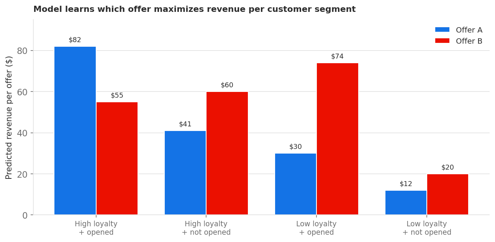

# Modelo de optimización personalizado {#personalized-optimization-model}

>[!TIP]
>
>Decisioning, la nueva funcionalidad de toma de decisiones de [!DNL Adobe Journey Optimizer], ya está disponible a través de los canales de experiencia basada en código y de correo electrónico. [Más información sobre la toma de decisiones](../../experience-decisioning/gs-experience-decisioning.md)

Al aprovechar las tecnologías de vanguardia en aprendizaje automático supervisado y aprendizaje profundo, la optimización personalizada permite a un usuario empresarial (experto en marketing) definir los objetivos comerciales y utilizar los datos de sus clientes para formar modelos empresariales orientados a ofrecer ofertas personalizadas y maximizar los KPI.

A diferencia de la clasificación no personalizada que se optimiza en función del rendimiento global de cada oferta, la optimización personalizada aprende la relación entre los atributos de un cliente individual y las ofertas que es más probable que impulsen el KPI elegido para ese cliente. El resultado es una selección de ofertas adaptada a cada perfil, en lugar de una única oferta óptima para todos.

## Casos de uso y ventajas {#use-cases}

La optimización personalizada es adecuada para escenarios de toma de decisiones en los que distintos clientes responden de forma diferente a las ofertas disponibles y en los que el catálogo de ofertas se diferencia significativamente y no cambia con frecuencia. Los casos de uso comunes incluyen:

* **Selección de la mejor oferta siguiente**: eligiendo cuál de varias ofertas o promociones de la competencia presentar a cada cliente en tiempo real.
* **Personalización de contenido**: eligiendo qué parte del contenido (por ejemplo, banner, creativo) o mensaje para cada cliente en la web, el móvil, el correo electrónico y otros canales.
* **Personalización según la audiencia**: incorporando la pertenencia a audiencias y señales contextuales para que las recomendaciones reflejen quién es el cliente y el contexto de la interacción.
* **Optimización de ingresos y valores**: se optimiza para obtener resultados continuos como ingresos o valor de duración del cliente, además de resultados binarios como clics y conversiones.

Ventajas principales:

* Maximiza el KPI empresarial que selecciona al servir la oferta a la que es más probable que responda cada cliente, en lugar de una sola oferta óptima globalmente.
* Se adapta continuamente a medida que llegan nuevos datos de interacción, equilibrando la exploración de ofertas no probadas con la explotación de ejecutantes probados.
* Admite métricas de optimización binarias y continuas, con puntuaciones de clasificación que se pueden utilizar directamente en expresiones del generador de fórmulas de modelos de IA.
* Reduce el esfuerzo manual de las pruebas A/B y la creación de reglas al aprender a ajustar la oferta al cliente automáticamente.

## Requisitos del conjunto de datos {#dataset}

Para entrenar un modelo de optimización personalizado, el conjunto de datos debe tener al menos dos ofertas con al menos 250 eventos de visualización (por ejemplo, impresiones) y un evento de éxito (por ejemplo, clic o conversión) en los últimos 30 días.

Las ofertas con menos de 250 eventos de visualización o sin eventos de éxito en los últimos 30 días seguirán siendo aptas para la inclusión en el tráfico de exploración. También pueden incluirse en el tráfico de personalización, pero se tratan como equivalentes a la peor oferta de puntuación prevista en la toma de decisiones, hasta que cumplan los eventos de visualización/éxito mínimos requeridos y el modelo se vuelva a entrenar.

Hasta la primera vez que se forme un modelo de optimización personalizado, las ofertas dentro de una estrategia de selección que utilice un modelo de optimización personalizado se ofrecerán al azar.

## Funcionamiento {#how}

El modelo aprende interacciones de funciones complejas entre ofertas, información de los usuarios e información contextual para recomendar ofertas personalizadas a los usuarios finales. Las funciones son entradas en el modelo.

Existen tres tipos de funciones:

| Tipos de funciones | Cómo añadir funciones a los modelos |
|--------------|----------------------------|
| Objetos de toma de decisiones (placementID, activityID, decisionScopeID) | Parte de los comentarios de gestión de decisiones Eventos de experiencia enviados a AEP |
| Públicos | Se pueden añadir de 0 a 50 audiencias como funciones al crear el modelo de inteligencia artificial aplicada a la clasificación |
| Datos de contexto | Parte de los comentarios y eventos de experiencia de decisiones enviados a AEP. Datos de contexto disponibles para agregar al esquema: detalles de Commerce, detalles de canal, detalles de aplicación, detalles web, detalles de entorno, detalles de dispositivo, placeContext. |

El modelo tiene dos fases:

* En la fase de **formación de modelos sin conexión**, un modelo se entrena mediante el aprendizaje y la memorización de interacciones de características en datos históricos.
* En la fase de **inferencia en línea**, las ofertas candidatas se clasifican según las puntuaciones en tiempo real generadas por el modelo. A diferencia de las técnicas de filtrado colaborativas tradicionales, con las que es difícil incluir funciones para usuarios y ofertas, la optimización personalizada es un método de recomendación basado en el aprendizaje profundo, y puede incluir y aprender patrones de interacción de funciones complejos y no lineales.

El modelo admite la optimización de variables continuas (como ingresos y valor de duración del cliente) además de variables binarias (como clics y conversiones). Los valores predichos para una métrica binaria como clics siempre estarán entre 0 y 1. Los valores predichos para una métrica continua, como un valor de pedido, siempre serán un número mayor o igual que cero. Las puntuaciones de clasificación se normalizan para garantizar un comportamiento coherente en ambos tipos de métricas cuando se utilizan en fórmulas o comparaciones.

## Ejemplo ilustrativo {#illustrative-example}

### Respuesta binaria (conversión) {#binary-response}

Considere un conjunto de datos simplificado de interacciones históricas entre usuarios y ofertas. Cada fila registra una oferta que se ha mostrado, dos señales de cliente (nivel de lealtad (alto = 1) y si el cliente ha abierto un correo electrónico reciente (sí = 1)) y si el cliente ha realizado la conversión (sí = 1).

Para la Oferta A, la conversión es más probable cuando ambas señales están de acuerdo (ambas son altas o ambas son bajas). Para la oferta B, la conversión es más probable cuando se abrió el correo electrónico, independientemente del nivel de lealtad. En función del patrón aprendido, el modelo puede predecir la mejor oferta para cada cliente en función de sus señales.

*Figura 1: En la fila resaltada de no coincidencia, la oferta A se mostraba cuando las señales no coincidían y no se convertían. Según el patrón aprendido, la oferta B sería la mejor recomendación para ese cliente la próxima vez.*

Esta es la esencia del enfoque: aprender y memorizar las interacciones de funciones históricas y aplicarlas para generar predicciones personalizadas para cada cliente.

### Respuesta continua (ingresos) {#continuous-response}

La misma idea se extiende a los resultados continuos. En lugar de predecir si un cliente convierte, el modelo predice un valor continuo (ingresos esperados) para cada oferta y segmento de cliente, y clasifica las ofertas según ese valor predicho.

*Figura 2: Ingresos predichos para dos ofertas en cuatro segmentos de clientes. Para los clientes de alta lealtad que abrieron el correo electrónico, se espera que la oferta A genere la mayor cantidad de ingresos; para los clientes de baja lealtad que abrieron el correo electrónico, la oferta B es la opción más fuerte. El modelo selecciona la oferta con el valor predicho más alto para cada segmento en lugar de aplicar una regla a todos los clientes.*

## Ensamblar componentes de modelo {#ensemble}

La optimización personalizada se entrega como un modelo conjunto: varios brazos de modelo complementarios se ejecutan juntos y una capa de supervisión decide cuánto tráfico en directo recibe cada brazo. Este diseño permite que el sistema persiga dos objetivos a la vez: aprender qué ofertas funcionan mejor (exploración) y servir a las ofertas que ya se sabe que funcionan bien (explotación).

**Exploración y explotación de equilibrio**

Cada sistema de toma de decisiones se enfrenta a un equilibrio entre la exploración de ofertas no probadas para recopilar información y la explotación de ofertas comprobadas para maximizar el retorno inmediato. Si se reserva demasiado poco tráfico para la exploración, las ofertas de alto potencial quedan sin descubrir; si se reservan demasiados sacrificios, se incrementan las ofertas que ya se están realizando. El conjunto gestiona este equilibrio automáticamente manteniendo un piso mínimo de exploración mientras desplaza el tráfico restante hacia los brazos personalizados de mejor rendimiento a lo largo del tiempo.

El conjunto está compuesto por cuatro tramos de tráfico:

### Aleatorio uniforme (brazo de exploración) {#uniform-random}

La rama aleatoria uniforme asigna ofertas a clientes de forma aleatoria entre las ofertas elegibles. Como no favorece ninguna oferta, genera datos imparciales sobre cómo responden los clientes en todo el catálogo: la materia prima de la que aprenden los grupos personalizados. Es el único brazo activo antes de que el primer modelo sea entrenado, y después continúa sosteniendo un piso mínimo de exploración para que el sistema siga aprendiendo.

* En la inicialización: 100 % del tráfico.
* Después de la primera ejecución correcta de la formación: un mínimo del 5 % al 20 % del tráfico en función del número de eventos de impresión y conversión observados por oferta, hasta un máximo del 85 %.

### Red neural (brazo personalizado) {#neural-network}

La red neuronal es un brazo personalizado que predice la mejor oferta para un cliente determinado en función de sus atributos y pertenencias a audiencias. Aprende interacciones complejas y no lineales entre ofertas, características del cliente y contexto, y es muy adecuado para capturar patrones sutiles en muchas características.

* En la inicialización: 0 % del tráfico.
* Después de la primera ejecución de formación correcta: un mínimo del 5 % del tráfico, hasta un máximo del 85 %.

### Bandido contextual (brazo personalizado) {#contextual-bandit}

El bandido contextual es una segunda rama personalizada que también predice la mejor oferta para cada cliente en función de su pertenencia a audiencias, utilizando un enfoque de bandido que equilibra continuamente el aprendizaje y el rendimiento a medida que sirve. Si se ejecuta junto a la red neuronal, el conjunto puede aprovechar las ventajas de dos métodos personalizados distintos.

* En la inicialización: 0 % del tráfico.
* Después de la primera ejecución de formación correcta: un mínimo del 5 % del tráfico, hasta un máximo del 85 %.

### Nuevo refuerzo de oferta (brazo no personalizado) {#new-offer-booster}

El nuevo refuerzo de oferta es un bandido de Muestreo Thompson (no personalizado) ganador general que realiza suposiciones optimistas sobre el rendimiento de las nuevas ofertas, aquellas con pocos eventos de impresión registrados dentro del periodo retrospectivo del modelo. Esto da a las nuevas ofertas prometedoras la exposición temprana que necesitan para probarse a sí mismas, abordando una carencia conocida de arranque en frío en la que el modelo de otra manera luchó para dirigir el tráfico suficiente a ofertas nuevas o de alto rendimiento, pero restringidas.

* A medida que se recopilan datos verdaderos de impresiones y conversiones, el rendimiento estimado de cada oferta se acerca rápidamente a su verdadero rendimiento subyacente y el impacto de las suposiciones optimistas cae a casi cero.
* Cuando ninguna oferta es relativamente nueva (por ejemplo, cuando todas las ofertas tienen un número similar de impresiones o todas tienen más de 1000 impresiones), el efecto optimista es casi cero y esta rama se comporta, de hecho, como un modelo no personalizado de ganador general.
* En la inicialización: 0 % del tráfico.
* Después de la primera ejecución de formación correcta: 5 % del tráfico.

### Cómo se asigna el tráfico entre las ramas {#traffic-allocation}

En la inicialización, ningún modelo se ha entrenado todavía, así que el 100% del tráfico va a la línea de base aleatoria uniforme, el único brazo con una distribución aprendida de la cual tomar muestras. Después de la primera ejecución exitosa de entrenamiento, cada brazo recibe un piso mínimo de tráfico (5%), y el bandido supervisor asigna el tráfico restante en función del rendimiento observado. A medida que el modelo se entrena en rondas sucesivas, el tráfico converge hacia las ramas de mayor rendimiento con una asignación máxima posible del 85% del tráfico.

*Figura 3: Una posible trayectoria de asignación de tráfico en los cuatro brazos del conjunto en la inicialización y en rondas de entrenamiento sucesivas. En la inicialización, todo el tráfico fluye a la línea de base aleatoria. Después de cada entrenamiento, el supervisor Thompson Sampling bandit cambia la asignación hacia armas de mejor rendimiento, mientras mantiene un tráfico mínimo del 5%. La asignación real variará según el rendimiento de las armas observado.*

## Suposiciones y limitaciones clave del modelo {#key}

Para maximizar la ventaja de utilizar la optimización personalizada, hay que tener en cuenta algunos supuestos y limitaciones clave.

* **Las ofertas son lo suficientemente diferentes como para que los usuarios tengan preferencias diferentes entre las ofertas consideradas**. Si las ofertas son demasiado similares, un modelo resultante tendrá menos impacto, ya que las respuestas son aparentemente aleatorias.Por ejemplo, si un banco tiene dos ofertas de tarjetas de crédito con la única diferencia de color, puede que no importe qué tarjeta se recomienda, pero si cada tarjeta tiene términos diferentes, esto proporciona una justificación de por qué ciertos clientes elegirían uno y proporcionarían suficiente diferencia entre ofertas para crear un modelo más impactante.
* **La composición del tráfico del usuario es estable**. Si la composición del tráfico del usuario cambia drásticamente durante el aprendizaje y la predicción del modelo, el rendimiento del modelo podría degradarse. Por ejemplo, supongamos que en la fase de formación del modelo solo están disponibles los datos de los usuarios de la audiencia A, pero el modelo entrenado se utiliza para generar predicciones para los usuarios de la audiencia B y, por lo tanto, el rendimiento del modelo podría verse afectado.
* **El rendimiento de las ofertas no cambia drásticamente en un corto período de tiempo**, ya que este modelo se actualiza semanalmente y los cambios de rendimiento se transmiten como actualizaciones del modelo. Por ejemplo, un producto era muy popular antes, pero un informe público identifica que el producto es perjudicial para nuestra salud, y este producto se vuelve impopular extremadamente rápido. En esta situación, el modelo podría seguir prediciendo este producto hasta que se actualice con cambios en el comportamiento del usuario.

## Problema de arranque en frío {#cold-start}

Los problemas de inicio en frío se producen cuando no hay suficientes datos para hacer recomendaciones. Para una optimización personalizada, existen cuatro tipos de problemas de inicio en frío.

* **Después de crear un nuevo modelo de IA sin datos históricos**, las ofertas se servirán aleatoriamente durante un período de tiempo para recopilar los datos necesarios, que luego se utilizarán para entrenar el primer modelo.
* **Una vez liberado el primer modelo de IA**, una parte del tráfico total se asigna para una exploración aleatoria uniforme, mientras que el resto se usa para recomendaciones de modelos. La distribución del tráfico en los componentes de bandido de exploración y explotación se ajusta automáticamente en función de factores como el número de ofertas y sus umbrales de rendimiento.
* **Después de agregar nuevas ofertas a la colección de ofertas** seleccionadas en la estrategia asociada con el modelo de clasificación de IA, esas ofertas se convierten en candidatos aptos para la exploración por los brazos del modelo aleatorio uniforme y el nuevo modelo de refuerzo de ofertas (en un plazo de 60 minutos). Durante la siguiente ejecución de reciclaje programada, el rendimiento estimado de la oferta se actualizará en la nueva rama del modelo de refuerzo de oferta, y la oferta será apta para su inclusión en las ramas del modelo personalizado si cumple el umbral de impresión y clics.
* **Después de agregar nuevos perfiles al conjunto de audiencias existente** asociado con la estrategia de selección asociada con el modelo de clasificación de IA, heredan los atributos de personalización del propio conjunto de audiencias. Por lo tanto, empezarán a recibir ofertas personalizadas basadas en esos atributos desde el principio, sin ningún problema de inicio en frío.

## Readiestramiento {#re-training}

Los modelos se volverán a entrenar para aprender las últimas interacciones de funciones y mitigar la degradación del rendimiento del modelo semanalmente.
