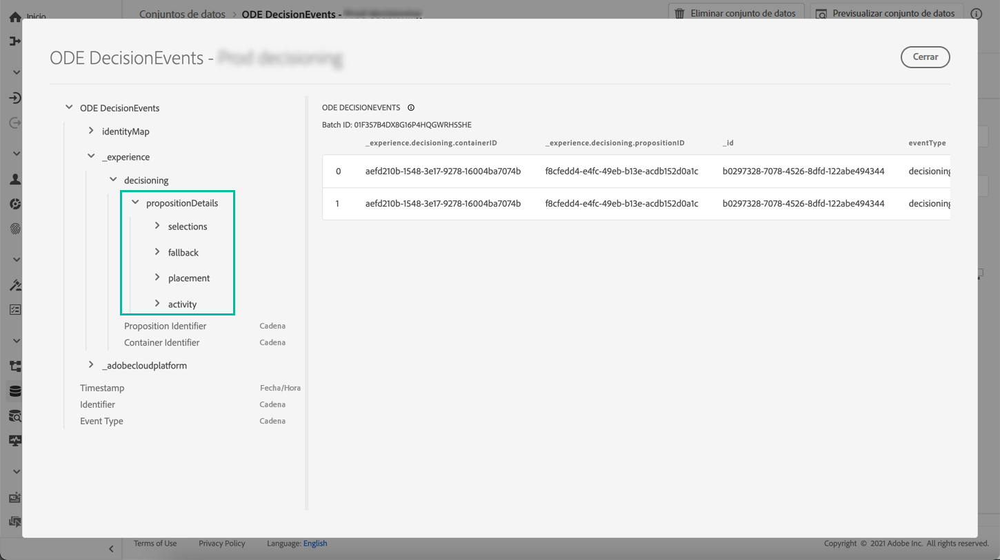
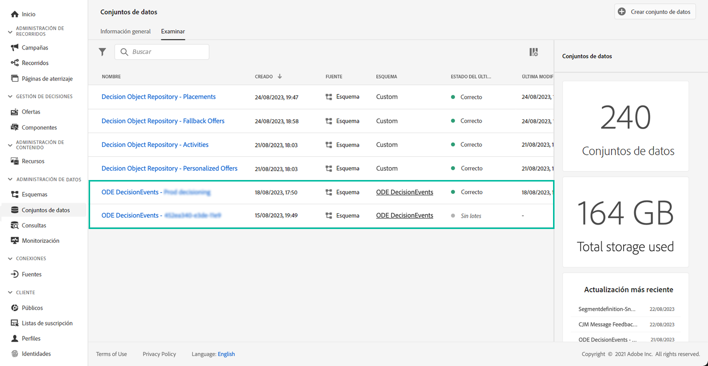

# Introducción a los eventos de Gestión de decisiones {#monitor-offer-events}

Cada vez que Gestión de decisiones toma una decisión sobre un perfil determinado, la información relacionada con estos eventos se envía automáticamente a Adobe Experience Platform.

Esto le permite obtener información sobre sus decisiones, por ejemplo, para saber qué oferta se presentó a un perfil determinado. Puede exportar estos datos para analizarlos en su propio sistema de informes o aprovechar el [Servicio de consultas](https://experienceleague.adobe.com/docs/experience-platform/query/home.html?lang=es) de Adobe Experience Platform en combinación con otras herramientas para mejorar el análisis y la creación de informes.

## Información clave disponible en conjuntos de datos {#key-information}

Cada evento que se envía cuando se toma una decisión contiene cuatro puntos de datos clave que puede aprovechar para realizar análisis e informes:

* **[!UICONTROL Reserva]**: Nombre e ID de la oferta de reserva, si no se ha seleccionado ninguna oferta personalizada,
* **[!UICONTROL Ubicación]**: Nombre, ID y canal de la ubicación utilizada para entregar la oferta,
* **[!UICONTROL Selecciones]**: Nombre e ID de la oferta seleccionada para el perfil,
* **[!UICONTROL Actividad]**: Nombre e ID de la decisión.

Además, también puede aprovechar los campos  **[!UICONTROL identityMap]** y **[!UICONTROL Marca de tiempo]** para recuperar información sobre el perfil y la hora a la que se entregó la oferta.

Para obtener más información sobre todos los campos XDM que se envían con cada decisión, consulte [esta sección](xdm-fields.md).

## Acceso a conjuntos de datos {#access-datasets}

Se puede acceder a los conjuntos de datos que contienen eventos de Gestión de decisiones desde el menú **[!UICONTROL Conjuntos de datos]** de Adobe Experience Platform. Se crea automáticamente un conjunto de datos en el aprovisionamiento para cada una de las instancias.

Estos conjuntos de datos se basan en el esquema **[!UICONTROL ODE DecisionEvents]**, que contiene todos los campos XDM necesarios para enviar información desde Gestión de decisiones a Adobe Experience Platform.

>[!NOTE]
>
>Tenga en cuenta que los conjuntos de datos de ODE DecisionEvents son **conjuntos de datos que no son de perfil**, lo que significa que no se pueden ingerir en Experience Platform para que los use el perfil del cliente en tiempo real.
