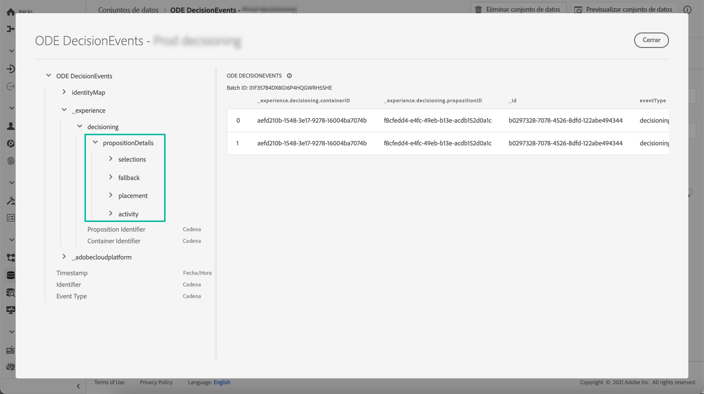

# Información clave sobre eventos de Administración de decisiones {#events-key-information}

Cada evento que se envía cuando se toma una decisión contiene cuatro puntos de datos clave que puede aprovechar para realizar análisis e informes.

* **[!UICONTROL Fallback]**: Nombre e ID de la oferta de reserva si no se ha seleccionado ninguna oferta personalizada,
* **[!UICONTROL Placement]**: Nombre, ID y canal de la ubicación utilizada para entregar la oferta,
* **[!UICONTROL Selections]**: Nombre e ID de la oferta seleccionada para el perfil,
* **[!UICONTROL Activity]**: Nombre e ID de la decisión (anteriormente conocida como actividad de oferta).

Además, también puede aprovechar los campos **[!UICONTROL identityMap]** y **[!UICONTROL Timestamp]** para recuperar información sobre el perfil y la hora a la que se entregó la oferta.

Para obtener más información sobre todos los campos XDM que se envían con cada decisión, consulte [esta sección](xdm-fields.md).
