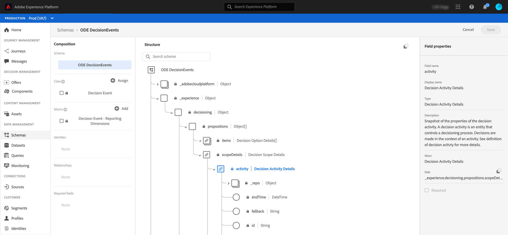

# Campos XDM de eventos de acceso {#decisioningevents-xdm-schema}

>[!TIP]
>
>Decisioning, la nueva funcionalidad de toma de decisiones de [!DNL Adobe Journey Optimizer], ya está disponible a través de los canales de experiencia basada en código y de correo electrónico. [Más información](../../experience-decisioning/gs-experience-decisioning.md)

Puede acceder al esquema XDM DecisioningEvents directamente desde un conjunto de datos que contenga eventos de Gestión de decisiones.

El esquema contiene todos los campos necesarios para enviar información desde Gestión de decisiones a Adobe Experience Platform.

Para obtener más información sobre un campo específico, selecciónelo para mostrar un panel de información con las propiedades del campo.

Encontrará información detallada sobre cómo trabajar con esquemas y campos XDM en la documentación del Modelo de datos de experiencia:

* [Información general del sistema XDM](https://experienceleague.adobe.com/docs/experience-platform/xdm/home.html?lang=es)
* [Exploración de recursos XDM](https://experienceleague.adobe.com/docs/experience-platform/xdm/ui/explore.html?lang=es)
