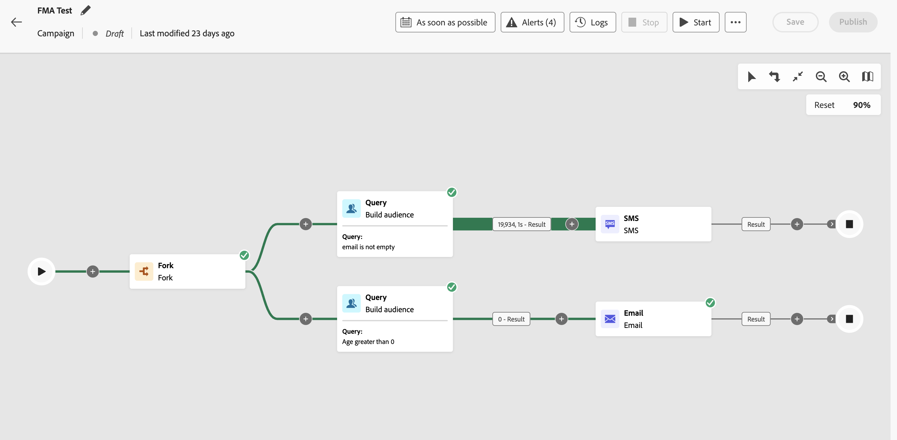

# Acceso y administración de campañas organizadas {#orchestrated-campaign-creation}

>[!CONTEXTUALHELP]
>id="ajo_targeting_workflow_list"
>title="Campaña orquestada"
>abstract="En esta pantalla, puede acceder a la lista completa de campañas orquestadas, comprobar su estado actual, las fechas de la última/próxima ejecución y crear una nueva campaña orquestada."

>[!CONTEXTUALHELP]
>id="ajo_orchestration_campaign_action"
>title="Acción"
>abstract="Esta sección enumera todas las acciones utilizadas dentro de la campaña orquestada."

+++ Índice

| Bienvenido a las campañas organizadas | Inicio de su primera campaña organizada | Consulta de la base de datos | Actividades de las campañas organizadas |
|---|---|---|---|
| [Empiece a usar las campañas orquestadas](gs-orchestrated-campaigns.md)  Cree y administre conjuntos de datos y esquemas relacionales:  <ul><li>[Introducción a esquemas y conjuntos de datos](gs-schemas.md)</li><li>[Esquema manual](manual-schema.md)</li><li>[Esquema de carga de archivos](file-upload-schema.md)</li><li>[Ingesta de datos](ingest-data.md)</li></ul>  <b>[Acceder y administrar campañas orquestadas](access-manage-orchestrated-campaigns.md)</b>  [Pasos clave para crear una campaña orquestada](gs-campaign-creation.md) | [Creación y programación de las campañas](create-orchestrated-campaign.md)  [Organización de actividades](orchestrate-activities.md)  [Inicio y monitorización de las campañas](start-monitor-campaigns.md)  [Creación de informes](reporting-campaigns.md) | [Trabajo con el generador de reglas](orchestrated-rule-builder.md)  [Creación de su primera consulta](build-query.md)  [Edición de expresiones](edit-expressions.md)  [Resegmentación](retarget.md) | [Introducción a las actividades](activities/about-activities.md)  Actividades: [AND-join](activities/and-join.md) - [Generar público](activities/build-audience.md) - [Cambiar dimensión](activities/change-dimension.md) - [Actividades del canal](activities/channels.md) - [Combinar](activities/combine.md) - [Deduplicación](activities/deduplication.md) - [Enriquecimiento](activities/enrichment.md) - [Bifurcación](activities/fork.md) - [Reconciliación](activities/reconciliation.md) - [Guardar público](activities/save-audience.md) - [División](activities/split.md) - [Esperar](activities/wait.md) |

{style="table-layout:fixed"}

+++

 

>[!BEGINSHADEBOX]

 

El contenido de esta página no es definitivo y puede estar sujeto a cambios.

>[!ENDSHADEBOX]

## Acceso a las campañas organizadas

Vaya al menú **[!UICONTROL Campañas]** y seleccione la pestaña **[!UICONTROL Orquestación]** para acceder a la lista completa de campañas organizadas.

{zoomable="yes"}{zoomable="yes"}

Cada campaña organizada de la lista muestra información como el [estado](#status) actual de la campaña, el canal asociado y las etiquetas, o la última vez que se modificó. Puede personalizar las columnas mostradas haciendo clic en el botón .

Además, hay una barra de búsqueda y filtros disponibles para facilitar la búsqueda dentro de la lista. Por ejemplo, puede filtrar las campañas organizadas para mostrar solo las asociadas a un canal o etiqueta determinados, o las creadas durante un intervalo de fechas específico.

El botón  en el inventario de campañas le permite realizar varias operaciones detalladas a continuación.

* **[!UICONTROL Ver el informe de todo el tiempo]**/**[!UICONTROL Ver el informe de las últimas 24 horas]**: acceda a informes para medir y visualizar el impacto y el rendimiento de sus campañas organizadas. [Más información sobre la creación de informes de campañas organizadas](../orchestrated/reporting-campaigns.md)
* **[!UICONTROL Editar etiquetas]**: edite las etiquetas asociadas a la campaña.
* **[!UICONTROL Duplicar]**: en algunos casos, es posible que deba duplicar una campaña organizada, por ejemplo, para ejecutar una campaña que se haya detenido o para cambiar la frecuencia de ejecución de una campaña programada.
* **[!UICONTROL Eliminar]**: elimine la campaña. Estas acciones solo están disponibles para las campañas en **[!UICONTROL Borrador]**.
* **[!UICONTROL Archivar]**: archive la campaña. Todas las campañas archivadas se eliminarán en una reprogramación escalonada 30 días después de la última fecha de modificación. Esta acción está disponible para todas las campañas, excepto para las que están en **[!UICONTROL Borrador]**.

## ¿Qué hay dentro de una campaña organizada? {#gs-ms-campaign-inside}

El lienzo de la campaña organizada es una representación de lo que se supone que debe suceder. Describe las diversas tareas que se realizan y cómo se relacionan entre sí.

Cada campaña organizada contiene:

* **Actividades**: una actividad es una tarea que se va a realizar. Las distintas actividades disponibles se representan en el diagrama mediante iconos. Cada actividad tiene propiedades específicas y otras propiedades que son comunes a todas las actividades.

  En un diagrama de campaña organizada, una actividad determinada puede producir varias tareas, en particular cuando hay un bucle o acciones recurrentes.

* **Transiciones**: las transiciones vinculan una actividad de origen a una actividad de destino y definen su secuencia.

* **Tablas de trabajo**: estas contienen toda la información de la transición. Cada campaña organizada utiliza varias tablas de trabajo. Los datos convertidos en estas tablas se pueden utilizar a lo largo de todo el ciclo de vida de la campaña organizada.

## Estados de las campañas {#status}

Las campañas organizadas pueden tener varios estados:

* **[!UICONTROL Borrador]**: se ha creado la campaña organizada. Aún no se ha publicado.
* **[!UICONTROL Publicación]**: la campaña organizada se está publicando.
* **[!UICONTROL Activo]**: la campaña organizada se ha publicado y se está ejecutando.
* **[!UICONTROL Programado]**: se ha programado la ejecución de la campaña organizada.
* **[!UICONTROL Completado]**: la ejecución de la campaña organizada ha finalizado. El estado Completado se asigna automáticamente hasta tres días después de que una campaña haya completado el envío de mensajes sin errores.
* **[!UICONTROL Cerrado]**: este estado se muestra cuando se ha cerrado una campaña recurrente. La campaña continúa su ejecución hasta que se hayan completado todas sus actividades, pero no pueden entrar más perfiles en la campaña.
* **[!UICONTROL Archivado]**: se ha archivado la campaña organizada. Todas las campañas archivadas se eliminarán en una reprogramación escalonada 30 días después de la última fecha de modificación. Puede duplicar una campaña archivada si es necesario para seguir trabajando en ella.
* **[!UICONTROL Detenido]**: la ejecución de la campaña organizada se ha detenido. Para volver a iniciar la campaña, debe duplicarla.
