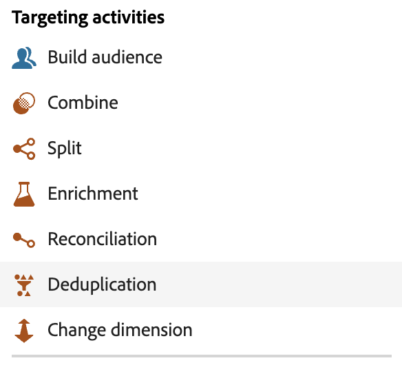

# Acerca de las actividades de campaña organizadas {#orchestrated-campaign-activities}

Las actividades de las campañas organizadas se agrupan en tres categorías. Dependiendo del contexto, las actividades disponibles pueden diferir.

Todas las actividades se detallan en las secciones siguientes:

* [Actividades de segmentación](#targeting)
* [Actividades del canal](#channel)
* [Actividades de control de flujo](#flow-control)

{width="80%" align="left"}

>[!NOTE]
>
>Según el modelo de licencia, los permisos y la implementación, las actividades disponibles pueden diferir.

## Mecanismos de protección y limitaciones {#activity-guardrails}

* **Límite de actividades de canal**: una campaña orquestada admite un máximo de 10 actividades de canal en la publicación (correo electrónico, SMS, push o correo directo). Las actividades de segmentación y control de flujo no se contabilizan en este límite.

* **Límite de actividades de lienzo**: el número de actividades en el lienzo está limitado a 500. Para mantener la capacidad y el rendimiento, mantenga los flujos de trabajo por debajo de 100 actividades en la práctica.

Vea [Protecciones y limitaciones](../guardrails.md) para todas las limitaciones y protecciones de campañas orquestadas.

## Actividades de segmentación {#targeting}

Estas actividades son específicas de la segmentación. Le permiten crear uno o más públicos destinatarios al definir públicos y dividirlos o combinarlos mediante operaciones de intersección, unión o exclusión.

{width="40%" align="left"}

Las actividades de segmentación disponibles son:

* [Generar público](build-audience.md): defina la población de destinatarios. Puede seleccionar un público destinatario existente o utilizar el generador de reglas para definir su propia consulta.
* [Cambiar dimensión](change-dimension.md): cambie la dimensión de segmentación mientras está creando su campaña orquestada.
* [Combinar](combine.md): realice la segmentación en la población entrante. Puede utilizar una unión, una intersección o una exclusión.
* [Deduplicación](deduplication.md): elimine duplicados en los resultados de las actividades entrantes.
* [Enrichment](enrichment.md): defina datos adicionales para procesar en su campaña orquestada. Con esta actividad, puede aprovechar la transición entrante y configurar la actividad para completar la transición saliente con datos adicionales.
* [Reconciliación](reconciliation.md): defina el vínculo entre los datos de Journey Optimizer y los datos de una tabla de trabajo, por ejemplo, los datos cargados desde un archivo externo.
* [División](split.md): segmente la población entrante en varios subconjuntos.

## Actividades del canal {#channel}

Adobe Journey Optimizer le permite automatizar y ejecutar campañas de marketing en múltiples canales. Puede combinar [actividades de canal](channels.md) en el lienzo para crear campañas orquestadas en canales múltiples que puedan almacenar en déclencheur acciones basadas en el comportamiento de los clientes.

Aprenda a [crear una acción de canal en una campaña organizada](channels.md).

## Actividades de control de flujo {#flow-control}

>[!CONTEXTUALHELP]
>id="ajo_orchestration_end"
>title="Actividad Finalizar"
>abstract="La actividad **Finalizar** marca el final de una rama en el lienzo. Opcionalmente, use **Señal externa** para iniciar una campaña orquestada descendente y pasar parámetros cuando finalice la rama. [Más información](../trigger-orchestrated-campaign.md#signal-end)"

>[!CONTEXTUALHELP]
>id="ajo_orchestration_signal"
>title="Señal externa"
>abstract="Seleccione la campaña orquestada descendente para que se inicie cuando termine esta rama y asigne los nombres y valores de los parámetros que se enviarán en la señal. La campaña descendente debe establecerse como **Activada por una señal** y publicarse antes de que esta campaña alcance la actividad de finalización. [Más información](../trigger-orchestrated-campaign.md#signal-end)"

Las siguientes actividades son específicas para organizar y ejecutar campañas orquestadas. Su tarea principal es coordinar las demás actividades.

{width="20%" align="left"}

Las actividades de control de flujo disponibles son:

* [And-join](and-join.md): sincronice varias ramas de ejecución de una campaña orquestada.
* [Bifurcación](fork.md): crear transiciones de salida para iniciar varias actividades al mismo tiempo.
* [Espera](wait.md): Pone en pausa momentáneamente la ejecución de una parte de una campaña orquestada.
  <!--* [Test](test.md): Enable transitions based on specified conditions.-->

* **[!UICONTROL Fin]**: marca el final de una rama en el lienzo. Si lo desea, puede utilizarlo para enviar una señal a otra campaña orquestada que comience con una señal. [Más información](../trigger-orchestrated-campaign.md#signal-end)
