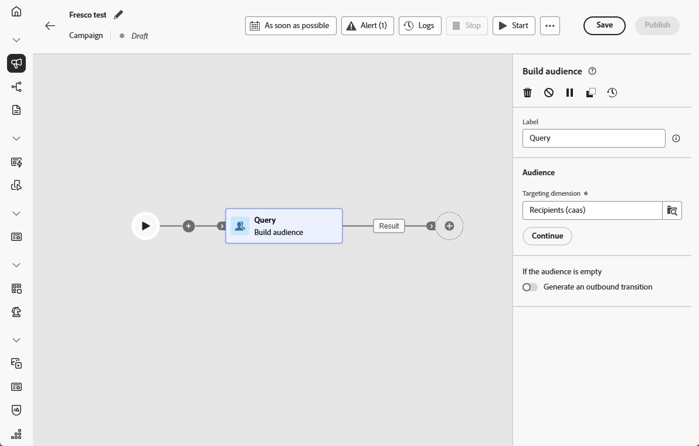

# Generar público {#build-audience}

>[!CONTEXTUALHELP]
>id="ajo_orchestration_build_audience"
>title="Actividad generar público"
>abstract="La actividad **Crear público** le permite definir el público que participará en la campaña orquestada. Cuando se envían mensajes en el contexto de una campaña orquestada, el público del mensaje no se define en la actividad del canal, sino en la actividad **Crear publico**."

+++ Tabla de contenido

| Bienvenido a campañas orquestadas | Inicie su primera campaña orquestada | Consultar la base de datos | Actividades de campañas organizadas |
|---|---|---|---|
| [Introducción a las campañas orquestadas](../gs-orchestrated-campaigns.md)  [Pasos de configuración](../configuration-steps.md)  [Pasos clave para la creación de campañas orquestadas](../gs-campaign-creation.md) | [Crear una campaña orquestada](../create-orchestrated-campaign.md)  [Organizar actividades](../orchestrate-activities.md)  [Enviar mensajes con campañas orquestadas](../send-messages.md)  [Iniciar y supervisar la campaña](../start-monitor-campaigns.md)  [Creación de informes](../reporting-campaigns.md) | [Trabaje con el Modeler de consultas](../orchestrated-query-modeler.md)  [Cree su primera consulta](../build-query.md)  [Editar expresiones](../edit-expressions.md) | [Empiece con las actividades](about-activities.md)  Actividades: [Y únase](and-join.md) - [Generar audiencia](build-audience.md) - [Cambiar dimensión](change-dimension.md) - [Combinar](combine.md) - [Anulación de duplicación](deduplication.md) - [Enriquecimiento](enrichment.md) - [Bifurcación](fork.md) - [Reconciliación](reconciliation.md) - [División](split.md) - [Espera](wait.md) |

{style="table-layout:fixed"}

+++

 

Como especialista en marketing, puede crear fácilmente consultas complejas mediante una interfaz fácil de usar, lo que me permite segmentar la audiencia en función de una amplia gama de criterios y comportamientos para adaptar las campañas de forma más eficaz.

Para ello, use la actividad de segmentación **Generar audiencia**. Esta actividad le permite definir la audiencia que entra en la campaña orquestada. Cuando se envían mensajes en el contexto de una campaña orquestada, el público del mensaje no se define en la actividad del canal, sino en la actividad **Crear publico**.

Para definir la población del público destinatario, puede hacer lo siguiente:

* Seleccione una audiencia existente.
* Seleccione un filtro predefinido.
* Cree una nueva audiencia con el modelador de consultas definiendo y combinando criterios de filtrado.

>[!NOTE]
>
>Las audiencias cargadas desde un archivo no se pueden segmentar con una actividad Generar audiencia. Para ello, necesita usar una actividad **Cargar archivo** seguida de una actividad **Reconciliación**.

## Configuración de la actividad Generar público {#build-audience-configuration}

>[!CONTEXTUALHELP]
>id="ajo_orchestration_build_audience_audienceselector"
>title="Público"
>abstract="Seleccione el público, del mismo modo que utiliza un público a la hora de diseñar un nuevo envío."

Siga estos pasos para configurar la actividad **Generar público destinatario**:

1. Añadir una actividad **Generar público destinatario**.
1. Defina una etiqueta.
1. Defina el tipo de público destinatario: **Crear la suya propia** o **Leer público destinatario**.
1. Configure su audiencia siguiendo los pasos detallados en las pestañas a continuación.

Para crear su propia consulta, siga estos pasos:

1. Seleccione **Crear su propia (consulta)**.
1. Elija la **Dimensión de segmentación**. La dimensión de segmentación permite definir la población a la que se dirige la operación: destinatarios, beneficiarios de contratos, operadores, suscriptores, etc. De forma predeterminada, el público destinatario se selecciona entre los destinatarios.
1. Haga clic en **Continuar**.
1. Utilice el modelador de consultas para definir la consulta. [Obtenga más información acerca del modelador de consultas en esta sección](../orchestrated-query-modeler.md)

## Ejemplos{#build-audience-examples}

Este es un ejemplo de una campaña orquestada con dos actividades **Generar audiencia**. El primero se dirige al público de jugadores de póquer, seguido de un envío por correo electrónico. El segundo se dirige al público de clientes VIP, seguido de un envío por SMS.

