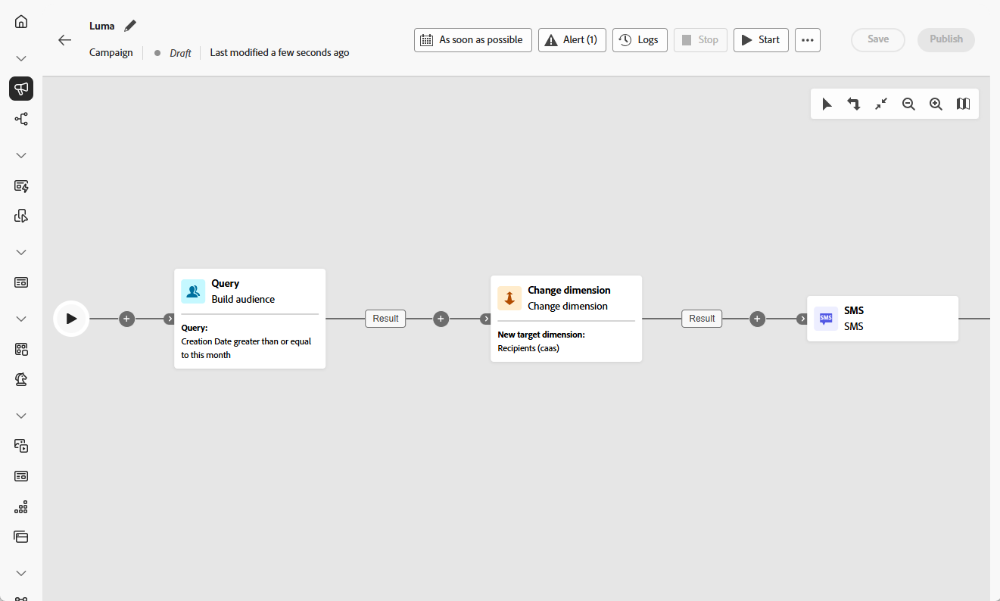

# Cambiar dimensión {#change-dimension}

>[!CONTEXTUALHELP]
>id="ajo_orchestration_dimension_complement"
>title="Generación de un complemento"
>abstract="Puede generar una transición saliente adicional con la población restante, que se excluyó como duplicado. Para ello, active la opción **Generar complemento**"

>[!CONTEXTUALHELP]
>id="ajo_orchestration_change_dimension"
>title="Actividad cambiar dimensión"
>abstract="Esta actividad le permite cambiar la dimensión de segmentación a medida que genera un público. Desplace el eje en función de la plantilla de datos y la dimensión de entrada. Por ejemplo, puede cambiar de la dimensión “contratos” a la dimensión “clientes”."

+++ Tabla de contenido

| Bienvenido a campañas orquestadas | Inicio de su primera campaña organizada | Consultar la base de datos | Actividades de las campañas organizadas |
|---|---|---|---|
| [Introducción a las campañas orquestadas](../gs-orchestrated-campaigns.md)  [Pasos de configuración](../configuration-steps.md)  [Pasos clave para la creación de campañas orquestadas](../gs-campaign-creation.md) | [Crear una campaña orquestada](../create-orchestrated-campaign.md)  [Organizar actividades](../orchestrate-activities.md)   [Iniciar y supervisar la campaña](../start-monitor-campaigns.md)  [Informes](../reporting-campaigns.md) | [Trabaje con el Modeler de consultas](../orchestrated-rule-builder.md)  [Cree su primera consulta](../build-query.md)  [Editar expresiones](../edit-expressions.md) | [Empiece con las actividades](about-activities.md)  Actividades: [Y únase](and-join.md) - [Generar audiencia](build-audience.md) - **[Cambiar dimensión](change-dimension.md)** - [Combinar](combine.md) - [Anulación de duplicación](deduplication.md) - [Enriquecimiento](enrichment.md) - [Bifurcación](fork.md) - [Reconciliación](reconciliation.md) - [División](split.md) - [Espera](wait.md) |

{style="table-layout:fixed"}

+++

 

Como especialista en marketing, puede refinar la segmentación de audiencia cambiando de una entidad de datos a otra entidad vinculada dentro de una campaña organizada. Esto le permite pasar de segmentar perfiles de usuario a centrarse en acciones específicas, como compras, reservas u otras interacciones.

Para ello, use la actividad **[!UICONTROL Cambiar dimensión]**. Permite cambiar la dimensión de segmentación durante la campaña orquestada, según la estructura del modelo de datos y la dimensión de entrada.

<!--
>[!IMPORTANT]
>
>Please note that the **[!UICONTROL Change Dimension]** and **[!UICONTROL Change Data source]** activities should not be added in one row. If you need to use both activities consecutively, make sure you include an **[!UICONTROL Enrichement]** activity in between them. This ensures proper execution and prevents potential conflicts or errors.-->

## Configuración de la actividad Change dimension {#configure}

Siga estos pasos para configurar la actividad **[!UICONTROL Cambiar dimensión]**:

1. Agregue una actividad **[!UICONTROL Change dimension]** a su campaña orquestada.

   

1. Defina **[!UICONTROL Nueva dimensión de destino]**. Durante el cambio de dimensión, se guardan todos los registros.

1. Ejecute la campaña orquestada para ver el resultado. Compare los datos de las tablas antes y después de la actividad de dimensión de cambio y compare la estructura de las tablas de campañas organizadas.

## Ejemplo {#example}

Este caso de uso implica el envío de un SMS a perfiles que han creado una lista de deseos en el último mes.

Comience con una actividad **[!UICONTROL Generar audiencia]** usando la dimensión de segmentación **[!UICONTROL Wishlist]** para seleccionar todas las listas de deseos relevantes.

A continuación, inserte una actividad **[!UICONTROL Change dimension]** para cambiar la dimensión de segmentación de **[!UICONTROL Wishlist]** a ****[!UICONTROL Destinatario]**. Esto permite que la campaña orquestada envíe el SMS a los perfiles asociados con esas listas de deseos.

