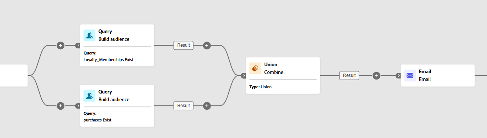

# Combinar {#combine}

>[!CONTEXTUALHELP]
>id="ajo_orchestration_combine"
>title="Actividad de combinación"
>abstract="La actividad **Combinar** permite realizar la segmentación de la población entrante. Por lo tanto, puede combinar varias poblaciones, excluir parte de ellas o solo mantener datos comunes para varias poblaciones destinatarias."

+++ Tabla de contenido

| Bienvenido a campañas orquestadas | Inicio de su primera campaña organizada | Consultar la base de datos | Actividades de las campañas organizadas |
|---|---|---|---|
| [Introducción a las campañas orquestadas](gs-orchestrated-campaigns.md)  [Pasos de configuración](configuration-steps.md)  [Acceso y administración de campañas orquestadas](access-manage-orchestrated-campaigns.md) | [Pasos clave para la creación de campañas orquestadas](gs-campaign-creation.md)  [Cree y programe las actividades de la campaña](create-orchestrated-campaign.md)  [Organice las actividades](orchestrate-activities.md)  <b>[Inicie y supervise la campaña](start-monitor-campaigns.md)</b>  [Creación de informes](reporting-campaigns.md) | [Trabaje con el generador de reglas](orchestrated-rule-builder.md)  [Cree su primera consulta](build-query.md)  [Edite expresiones](edit-expressions.md)  [Redireccionamiento](retarget.md) | [Empiece con las actividades](activities/about-activities.md)  Actividades: [Y únase](activities/and-join.md) - [Generar audiencia](activities/build-audience.md) - [Cambiar dimensión](activities/change-dimension.md) - [Actividades de canal](activities/channels.md) - [Combinar](activities/combine.md) - [Anulación de duplicación](activities/deduplication.md) - [Enriquecimiento](activities/enrichment.md) - [Bifurcación](activities/fork.md) - [Reconciliación](activities/reconciliation.md) - [Guardar](save-audience.md) - [División](activities/split.md) [Espera](activities/wait.md) |

{style="table-layout:fixed"}

+++

 

La actividad **[!UICONTROL Combinar]** es un tipo de actividad de **[!UICONTROL Segmentación]** que le permite segmentar eficazmente la población entrante. Permite combinar varias poblaciones, excluir segmentos específicos o conservar solo los datos compartidos entre varios objetivos.

Estas son las opciones de segmentación disponibles:

* **[!UICONTROL Union]**: combina los resultados de varias actividades en un solo destino unificado.

* **[!UICONTROL Intersección]**: conserva únicamente los elementos que son comunes en todas las poblaciones de entrada.

* **[!UICONTROL Exclusión]**: elimina elementos de una población en función de criterios especificados.

## Configuración de la actividad de combinación {#combine-configuration}

>[!CONTEXTUALHELP]
>id="ajo_orchestration_intersection_merging_options"
>title="Opciones de combinación de intersección"
>abstract="La intersección permite mantener solo los elementos comunes a las diferentes poblaciones entrantes en la actividad. En la sección Conjuntos que unir, compruebe todas las actividades anteriores que desee unir."

>[!CONTEXTUALHELP]
>id="ajo_orchestration_exclusion_merging_options"
>title="Opciones de combinación de exclusión"
>abstract="La exclusión permite excluir elementos de una población según determinados criterios. En la sección Conjuntos que unir, compruebe todas las actividades anteriores que desee unir."

>[!CONTEXTUALHELP]
>id="ajo_orchestration_combine_options"
>title="Selección del tipo de segmentación"
>abstract="Seleccione cómo combinar audiencias. La **Unión** le permite reagrupar el resultado de varias actividades en un solo destinatario. La **Intersección** le permite mantener solo los elementos comunes a las diferentes poblaciones entrantes de la actividad. La **Exclusión** permite excluir elementos de una población según determinados criterios. "

Siga estos pasos comunes para comenzar a configurar la actividad **[!UICONTROL Combinar]**:

1. Añada varias actividades, como actividades **[!UICONTROL Generar público destinatario]** para formar al menos dos ramas de ejecución diferentes.
1. Añada una actividad **[!UICONTROL Combinar]** a cualquiera de las ramas anteriores.
1. Seleccione el tipo de segmentación: [unión](#union), [intersección](#intersection) o [exclusión](#exclusion).
1. Haga clic en **[!UICONTROL Continuar]**.
1. En la sección **[!UICONTROL Conjuntos que unir]**, compruebe todas las actividades anteriores que desee unir.

## Unión {#combine-union}

>[!CONTEXTUALHELP]
>id="ajo_orchestration_combine_reconciliation"
>title="Opciones de reconciliación"
>abstract="Seleccione el **Tipo de reconciliación** para definir cómo gestionar duplicados. De manera predeterminada, la opción **Claves** está activada, lo que significa que la actividad solo mantiene un elemento cuando los elementos de las diferentes transiciones de entrada tienen la misma clave. Utilice la opción **Una selección de columnas** para definir la lista de columnas a las que desea aplicar la reconciliación de datos."

Dentro de la actividad **[!UICONTROL Combinar]**, puede configurar una **[!UICONTROL Unión]** seleccionando un **[!UICONTROL tipo de reconciliación]** para determinar cómo se administran los registros duplicados:

* **[!UICONTROL Solo claves]** (predeterminado): conserva un único registro cuando varias transiciones entrantes comparten la misma clave. Esta opción solo es aplicable cuando las poblaciones entrantes son homogéneas.

* **[!UICONTROL Una selección de columnas]**: le permite especificar qué columnas se utilizan para la reconciliación de datos. Seleccione **[!UICONTROL Agregar atributo]**.

En el ejemplo siguiente, se usa una actividad **[!UICONTROL Combine]** con una **[!UICONTROL Union]** para combinar los resultados de dos consultas, **Miembros socio** y **Compradores**, en una sola audiencia mayor que incluye todos los perfiles de ambos segmentos.

## Intersección {#combine-intersection}

>[!CONTEXTUALHELP]
>id="ajo_orchestration_intersection_reconciliation_options"
>title="Opciones de reconciliación de intersección"
>abstract="Seleccione el **Tipo de reconciliación** para definir cómo gestionar duplicados. De manera predeterminada, la opción **Claves** está activada, lo que significa que la actividad solo mantiene un elemento cuando los elementos de las diferentes transiciones de entrada tienen la misma clave. Utilice la opción **Una selección de columnas** para definir la lista de columnas a las que desea aplicar la reconciliación de datos."

En la actividad **[!UICONTROL Combinar]**, puede configurar una **[!UICONTROL intersección]**. Para ello, debe seguir los pasos adicionales a continuación:

1. Seleccione **[!UICONTROL Tipo de reconciliación]** para definir cómo se gestionan los duplicados:

   * **[!UICONTROL Solo claves]** (predeterminado): conserva un único registro cuando varias transiciones entrantes comparten la misma clave. Esta opción solo es aplicable cuando las poblaciones entrantes son homogéneas.

   * **[!UICONTROL Una selección de columnas]**: le permite especificar qué columnas se utilizan para la reconciliación de datos. Seleccione **[!UICONTROL Agregar atributo]**.

1. Habilite **[!UICONTROL Generar finalización]** si desea procesar la población restante. El complemento contiene la unión de todos los resultados de la actividad entrante, excluida la intersección. Se añade una transición saliente adicional a la actividad.

El siguiente ejemplo ilustra el uso de la **[!UICONTROL intersección]** entre dos actividades de consulta. Se usa para identificar perfiles que son **miembros socio** y que han hecho una compra en el último mes.

## Exclusión {#combine-exclusion}

>[!CONTEXTUALHELP]
>id="ajo_orchestration_exclusion_options"
>title="Reglas de inclusión"
>abstract="Si es necesario, puede manipular las tablas entrantes. De hecho, para excluir un público destinatario de otra dimensión, se debe devolver este público destinatario a la misma dimensión de segmentación que el público destinatario principal. Para ello, haga clic en Añadir una regla en la sección Reglas de exclusión y especifique las condiciones del cambio de dimensión. La reconciliación de datos se lleva a cabo mediante un atributo o una unión."

>[!CONTEXTUALHELP]
>id="ajo_orchestration_combine_sets"
>title="Selección de conjuntos para combinar"
>abstract="En la sección **Conjuntos que unir**, seleccione el **Conjunto principal** de las transiciones entrantes. Es el conjunto desde el que se excluyen los elementos. Los demás conjuntos coinciden con elementos antes de excluirse del conjunto principal."

>[!CONTEXTUALHELP]
>id="ajo_orchestration_combine_exclusion"
>title="Reglas de inclusión"
>abstract="Si es necesario, puede manipular las tablas entrantes. De hecho, para excluir un público destinatario de otra dimensión, se debe devolver este público destinatario a la misma dimensión de segmentación que el público destinatario principal. Para ello, haga clic en Añadir una regla en la sección Reglas de exclusión y especifique las condiciones del cambio de dimensión. La reconciliación de datos se lleva a cabo mediante un atributo o una unión."

>[!CONTEXTUALHELP]
>id="ajo_orchestration_combine_complement"
>title="Complemento de generación de combinación"
>abstract="Active la opción Generar complemento para procesar la población restante en una transición adicional."

En la actividad **[!UICONTROL Combinar]**, puede configurar una **[!UICONTROL Exclusión]**. Para ello, debe seguir los pasos adicionales a continuación:

1. En la sección **[!UICONTROL Conjuntos para unir]**, elija el **[!UICONTROL conjunto principal]**, que representa la población principal. Los registros encontrados en los demás conjuntos se excluyen de este conjunto principal.

1. Si es necesario, se pueden ajustar las tablas entrantes para alinear los destinos de distintas dimensiones. Para excluir un objetivo de otra dimensión, primero debe introducirse en la misma dimensión de objetivo que la población principal. Para ello, haga clic en **[!UICONTROL Agregar una regla]** y defina las condiciones para cambiar la dimensión. La reconciliación se realiza mediante un atributo o una combinación.

1. Habilite **[!UICONTROL Generar finalización]** si desea procesar la población restante. El complemento contiene la unión de todos los resultados de la actividad entrante, excluida la intersección. Se añade una transición saliente adicional a la actividad.

El siguiente ejemplo de **[!UICONTROL exclusión]** muestra dos consultas configuradas para filtrar perfiles que compraron un producto. Los perfiles que no son miembros socio se excluyen del primer conjunto.

