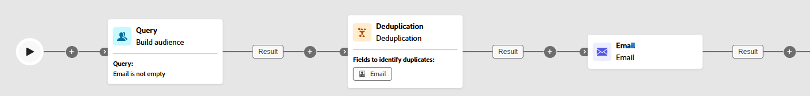

# Deduplicación {#deduplication}

>[!CONTEXTUALHELP]
>id="ajo_orchestration_deduplication_fields"
>title="Campos para identificar duplicados"
>abstract="En la sección **Campos para identificar duplicados**, haga clic en el botón **Añadir atributo** para especificar los campos para los que los valores idénticos permiten identificar los duplicados, tales como: dirección de correo electrónico, nombre, apellidos, etc. El orden de los campos permite especificar los que se procesarán en primer lugar."

>[!CONTEXTUALHELP]
>id="ajo_orchestration_deduplication"
>title="Actividad de deduplicación"
>abstract="La actividad de **deduplicación permite** eliminar duplicados en los resultados de las actividades entrantes. Se utiliza principalmente después de actividades de segmentación y antes de actividades que permiten el uso de datos direccionados."

>[!CONTEXTUALHELP]
>id="ajo_orchestration_deduplication_complement"
>title="Generación de un complemento"
>abstract="Puede generar una transición saliente adicional con la población restante, que se excluyó como duplicado. Para ello, active la opción **Generar complemento**"

>[!CONTEXTUALHELP]
>id="ajo_orchestration_deduplication_settings"
>title="Configuración de la deduplicación"
>abstract="Para eliminar duplicados en los datos entrantes, defina el método de deduplicación en los campos siguientes. De forma predeterminada, solo se guarda un registro. También debe seleccionar el modo de deduplicación en función de una expresión o un atributo. De forma predeterminada, el registro que se va a excluir de los duplicados se selecciona de forma aleatoria."

+++ Índice

| Bienvenido a las campañas organizadas | Inicio de su primera campaña organizada | Consulta de la base de datos | Actividades de las campañas organizadas |
|---|---|---|---|
| [Empiece a usar las campañas orquestadas](../gs-orchestrated-campaigns.md)  Cree y administre conjuntos de datos y esquemas relacionales:  <ul><li>[Introducción a esquemas y conjuntos de datos](../gs-schemas.md)</li><li>[Esquema manual](../manual-schema.md)</li><li>[Esquema de carga de archivos](../file-upload-schema.md)</li><li>[Ingesta de datos](../ingest-data.md)</li></ul>[Acceder y administrar campañas orquestadas](../access-manage-orchestrated-campaigns.md) | [Pasos clave para crear una campaña organizada](../gs-campaign-creation.md)  [Creación y programación de las campañas](../create-orchestrated-campaign.md)  [Organización de actividades](../orchestrate-activities.md)  [Inicio y monitorización de las campañas](../start-monitor-campaigns.md)  [Creación de informes](../reporting-campaigns.md) | [Trabajo con el generador de reglas](../orchestrated-rule-builder.md)  [Creación de su primera consulta](../build-query.md)  [Edición de expresiones](../edit-expressions.md)  [Resegmentación](../retarget.md) | [Introducción a las actividades](about-activities.md)  Actividades: [AND-join](and-join.md) - [Generar público](build-audience.md) - [Cambiar dimensión](change-dimension.md) - [Actividades del canal](channels.md) - [Combinar](combine.md) - <b>[Deduplicación](deduplication.md)</b> - [Enriquecimiento](enrichment.md) - [Bifurcación](fork.md) - [Reconciliación](reconciliation.md) - [Guardar público](save-audience.md) - [División](split.md) - [Esperar](wait.md) |

{style="table-layout:fixed"}

+++

 

>[!BEGINSHADEBOX]

 

El contenido de esta página no es definitivo y puede estar sujeto a cambios.

>[!ENDSHADEBOX]

La actividad **[!UICONTROL deduplicación]** es una actividad de **[!UICONTROL Segmentación]**. Esta actividad le permite eliminar duplicados en los resultados de las actividades entrantes, por ejemplo, perfiles duplicados en la lista de destinatarios. La actividad **[!UICONTROL Deduplicación]** se utiliza principalmente después de las actividades de segmentación y antes de las actividades que permiten el uso de datos segmentados.

## Configuración de la actividad Deduplicación{#deduplication-configuration}

Siga estos pasos para configurar la actividad **[!UICONTROL Deduplicación]**:

1. Añada una actividad **[!UICONTROL Deduplicación]** a su campaña organizada.

1. En la sección **[!UICONTROL Campos para identificar duplicados]**, haga clic en el botón **[!UICONTROL Añadir atributo]** para especificar los campos para los que los valores idénticos permiten identificar los duplicados, tales como: dirección de correo electrónico, nombre, apellidos, etc. El orden de los campos permite especificar los que se procesarán en primer lugar.

   

1. En la sección **[!UICONTROL Configuración de deduplicación]**, elija cuántos registros únicos debe seguir usando el campo Duplicados para mantener el campo. El valor predeterminado es 1, que mantiene un registro por grupo duplicado. Establézcalo en 0 para mantener todos los duplicados.

   Por ejemplo, si los registros A y B se consideran duplicados de Y, y un registro C se considera un duplicado de Z:

   * **Si el valor del campo es 1**: solo se guardan los registros Y y Z.
   * **Si el valor del campo es 0**: se guardan todos los registros (A, B, C, Y, Z).
   * **Si el valor del campo es 2**: se conservan C y Z, además de dos valores de A, B e Y, aleatoriamente o en función del método de deduplicación.

1. Elija un **[!UICONTROL Método de deduplicación]** para definir los registros se deben conservar de cada grupo de duplicados en el sistema:

   * **[!UICONTROL Selección aleatoria]**; selecciona aleatoriamente el registro que se va a excluir de los duplicados.
   * **[!UICONTROL Uso de una expresión]**: mantiene los registros con el valor más alto o más bajo basándose en una expresión definida.
   * **[!UICONTROL Valores no vacíos]**: mantiene los registros donde el campo seleccionado no está vacío, por ejemplo, conserva solo perfiles con un número de teléfono.
   * **[!UICONTROL Siguiendo una lista de valores]**: le permite priorizar valores específicos para uno o más campos, por ejemplo, puede dar prioridad a los registros con “País” establecido en Francia. Haga clic en **[!UICONTROL Atributo]** para elegir un campo o crear una expresión personalizada. Use el **[!UICONTROL botón Añadir]** para escribir los valores preferidos en el orden de prioridad.

   

1. Seleccione la opción **[!UICONTROL Generate complement]** si desea utilizar la población restante. El complemento está formado por todos los duplicados. A continuación, se añadirá una transición adicional a la actividad.

## Ejemplo{#deduplication-example}

En el ejemplo siguiente, se usa una actividad **[!UICONTROL Deduplicación]** para eliminar registros duplicados del público destinatario antes de realizar un envío. El público se filtra primero para incluir solo perfiles con un campo de correo electrónico que no esté vacío. A continuación, la actividad **[!UICONTROL Deduplicación]** utiliza la dirección de correo electrónico para identificar y excluir duplicados.

