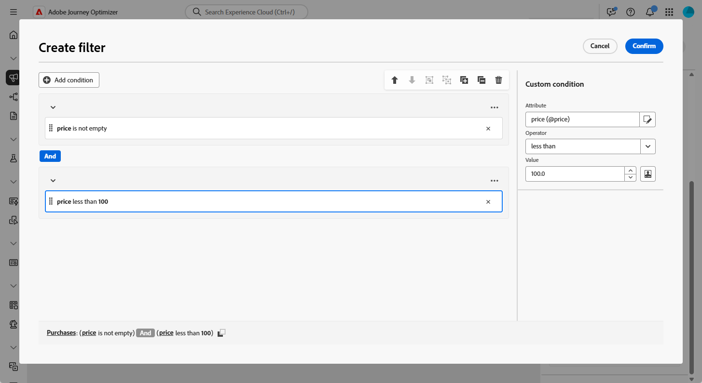
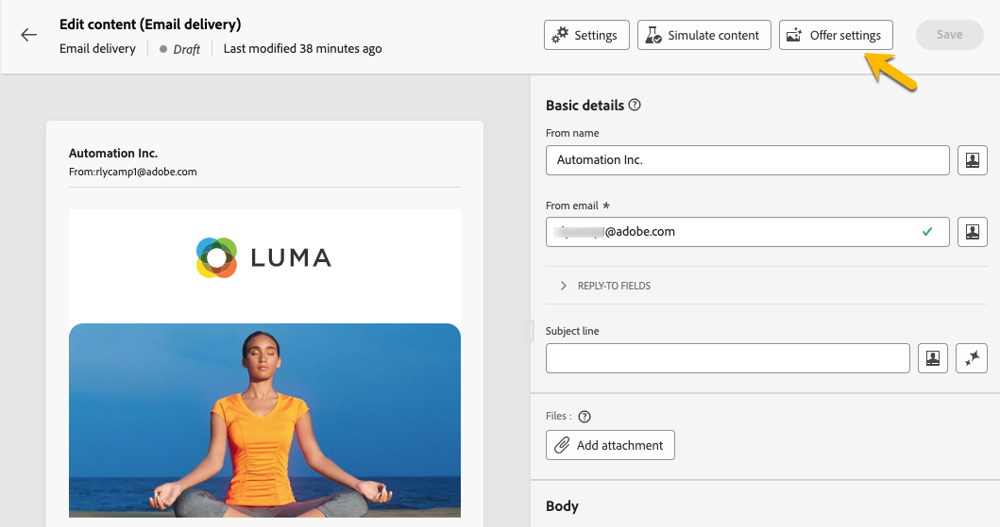

# Enriquecimiento {#enrichment}

>[!CONTEXTUALHELP]
>id="ajo_orchestration_enrichment"
>title="Actividad de enriquecimiento"
>abstract="La actividad de **enriquecimiento** permite mejorar los datos de destino con información adicional de la base de datos. Normalmente, se utiliza en una campaña después de actividades de segmentación."

La actividad **[!UICONTROL Enriquecimiento]** es una actividad de **[!UICONTROL Segmentación]** que le permite mejorar sus datos de público con atributos adicionales.

Puede aprovechar esta información para segmentar el público de forma más precisa, en función de comportamientos, preferencias o necesidades, y para crear mensajes personalizados que se conecten mejor con cada perfil.

## Añadir una actividad Enriquecimiento {#enrichment-configuration}

>[!CONTEXTUALHELP]
>id="ajo_targetdata_personalization_enrichmentdata"
>title="Datos de enriquecimiento"
>abstract="Seleccione los datos que desee utilizar para enriquecer la campaña orquestada. Puede seleccionar dos tipos de datos de enriquecimiento: un único atributo de enriquecimiento de la dimensión de destino o un vínculo de recopilación, que es un vínculo con una cardinalidad 1-N entre las tablas."

>[!CONTEXTUALHELP]
>id="ajo_orchestration_enrichment_data"
>title="Actividad de enriquecimiento"
>abstract="Una vez añadidos los datos de enriquecimiento a la campaña de varios pasos, se pueden utilizar en las actividades añadidas después de la actividad Enriquecimiento para segmentar a los clientes en distintos grupos según sus comportamientos, preferencias y necesidades o bien para crear mensajes y campañas de marketing personalizados que tengan más probabilidades de conectar con el público destinatario."

Siga estos pasos para configurar la actividad **Enriquecimiento**:

1. Añada una actividad **Enriquecimiento**

1. Haga clic en **Añadir datos de enriquecimiento** y seleccione el atributo que utilizará para enriquecer los datos.

   Puede seleccionar dos tipos de datos de enriquecimiento: un atributo de enriquecimiento único desde la dimensión de público destinatario o un vínculo de colección. Cada uno de estos tipos se detalla en los ejemplos siguientes:

   * [Atributo de enriquecimiento único](#single-attribute)
   * [Vínculo de colección](#collection-link)

   

1. Haga clic en **[!UICONTROL Agregar vínculo]** para crear un vínculo entre los datos de la tabla de trabajo y Adobe Journey Optimizer. [Más información](#create-links)

   Por ejemplo, si se cargan datos de un archivo que contiene el nivel de lealtad del cliente y la fecha de la última compra, se debe crear un vínculo a la tabla de perfiles para enriquecer los registros de destinatario con estos atributos y utilizarlos para la personalización o el direccionamiento.

   

## Creación de vínculos entre tablas {#create-links}

>[!CONTEXTUALHELP]
>id="ajo_orchestration_enrichment_simplejoin"
>title="Definición de vínculo"
>abstract="Cree un vínculo entre los datos de la tabla de trabajo y la base de datos de Adobe Journey Optimizer. Por ejemplo, si carga datos de un archivo que contiene el número de cuenta, el país y el correo electrónico de los destinatarios, debe crear un vínculo con la tabla del país para poder actualizar esta información en sus perfiles."

Utilice la sección **[!UICONTROL Link definition]** para definir una relación entre la tabla de trabajo y otro origen de datos. Por ejemplo, si importa un archivo que contiene el nivel de lealtad del cliente y la fecha de la última compra, puede crear un vínculo a la tabla de perfiles para que esos atributos estén disponibles para la personalización y el direccionamiento.

Para crear un vínculo:

1. En la sección **[!UICONTROL Definición de vínculo]**, haga clic en **[!UICONTROL Agregar vínculo]**.

   

1. En el menú desplegable **[!UICONTROL Tipo de relación]**, seleccione el tipo de relación entre el conjunto principal y los datos vinculados:

   * **[!UICONTROL 1 vínculo simple de cardinalidad]**: Cada registro del conjunto principal se asigna exactamente a un registro de los datos vinculados.
   * **[!UICONTROL 0 o 1 vínculo simple de cardinalidad]**: Cada registro del conjunto principal se asigna a cero o a un registro de los datos vinculados.
   * **[!UICONTROL Vínculo de recopilación de cardinalidad N]**: Cada registro del conjunto principal puede asignarse a varios registros de los datos vinculados.

   

1. Seleccione el objetivo al que desea vincular el conjunto principal:

   * **[!UICONTROL Esquema de base de datos]**: vincule a una tabla existente en la base de datos. Seleccione la tabla del campo **[!UICONTROL Esquema de destino]**.
   * **[!UICONTROL Esquema temporal]**: vínculo a los datos que llegan desde una transición de entrada. Seleccione la transición correspondiente en la lista.

1. Defina las condiciones de unión utilizadas para hacer coincidir registros entre el conjunto principal y el esquema vinculado:

   * **[!UICONTROL Unión simple]**: Haga coincidir registros en un par de atributos específico. Haga clic en **[!UICONTROL Agregar unión]** y, a continuación, seleccione los atributos **[!UICONTROL Source]** y **[!UICONTROL Destination]** que se usarán como criterios coincidentes.
   * **[!UICONTROL Unión avanzada]**: cree una lógica de coincidencia personalizada con el generador de reglas. Haga clic en **[!UICONTROL Crear condición]** para comenzar.

## Ejemplos {#example}

### Atributo de enriquecimiento único {#single-attribute}

En este ejemplo, el público se enriquece con un solo atributo, como la fecha de nacimiento, de la dimensión de segmentación actual.

Para ello, haga lo siguiente:

1. Haga clic en **[!UICONTROL Añadir datos de enriquecimiento]**.

1. Seleccione un campo simple, como **[!UICONTROL Fecha de nacimiento]**, de la dimensión actual.

   

1. Haga clic en **[!UICONTROL Confirmar]**.

### Vínculo de colección {#collection-link}

Este caso de uso enriquece el público con datos de una tabla vinculada. Por ejemplo, desea recuperar las tres compras más recientes por debajo de 100 USD.

Para conseguirlo, configure el enriquecimiento de la siguiente manera:

* **Atributo de enriquecimiento**: **[!UICONTROL Precio]**

* **Número de registros que se van a recuperar**: 3

* **Filtro**: solo incluye compras donde el **[!UICONTROL Precio]** sea menor a 100 USD

#### Añadir el atributo {#add-attribute}

En primer lugar, seleccione el vínculo de colección que contiene los datos con los que desea enriquecer.

1. Haga clic en **[!UICONTROL Añadir datos de enriquecimiento]**.

1. En la tabla **[!UICONTROL Compras]**, seleccione el campo **[!UICONTROL Precio]**.

   

#### Definir la configuración de la colección{#collection-settings}

A continuación, configure cómo se deben recopilar los datos y cuántas entradas se deben incluir.

1. En el menú desplegable **[!UICONTROL Seleccionar cómo se recopilan los datos]**, elija **[!UICONTROL Recopilar datos]**.

   

1. En el campo **[!UICONTROL Líneas a recuperar (columnas a crear)]**, escriba `3`.

1. Para realizar una agregación (p. ej., importe promedio de compra), seleccione **[!UICONTROL Datos agregados]** y, a continuación, elija **[!UICONTROL Promedio]** en la lista desplegable **[!UICONTROL Función de agregado]**.

   

1. Utilice los campos **[!UICONTROL Etiqueta]** y **[!UICONTROL Alias]** para que los atributos enriquecidos sean más fáciles de identificar en actividades posteriores.

#### Definición de los filtros{#collection-filters}

Finalmente, aplique filtros para asegurarse de que solo se incluyen los registros relevantes:

1. Haga clic en **[!UICONTROL Crear filtros]**.

1. Añada estas dos condiciones:

   * **[!UICONTROL El precio]** existe (para excluir valores NULL)

   * **[!UICONTROL El precio]** es menor que 100

   

1. Haga clic en **[!UICONTROL Confirmar]**.

<!--
#### Define the sorting{#collection-sorting}

We now need to apply sorting in order to retrieve the three **latest** purchases.

1. Activate the **Enable sorting** option.
1. Click inside the **Attribute** field.
1. Select the **Order date** field.
1. Click **Confirm**. 
1. Select **Descending** from the **Sort** drop-down.

## Data reconciliation {#reconciliation}

>[!CONTEXTUALHELP]
>id="ajo_orchestration_enrichment_reconciliation"
>title="Reconciliation"
>abstract="The **Enrichment** activity can be used to reconcile data from the Journey Optimizer schema with data from another schema, or with data coming from a temporary schema such as data uploaded using a Load file activity. This type of link defines a reconciliation towards a unique record. Journey Optimizer creates a link to a target table by adding a foreign key in it for storing a reference to the unique record."

The **Enrichment** activity can be used to reconcile data from the the Campaign database schema with data from another schema, or with data coming from a temporary schema such as data uploaded using a Load file activity. This type of link defines a reconciliation towards a unique record. Journey Optimizer creates a link to a target table by adding a foreign key in it for storing a reference to the unique record.

For example, you can use this option to reconcile a profile's country, specified in an uploaded file, with one of the countries available in the dedicated table of the Campaign database. 

Follow the steps to configure an **Enrichment** activity with a reconciliation link: 

1. Click the **Add link** button in the **Reconciliation** section.
1. Identify the data you want to create a reconciliation link with.

    * To create a reconciliation link with data from the Campaign database, select **Database schema** and choose the schema where the target is stored. 
    * To create a reconciliation link with data coming from the input transition, select **Temporary schema** and choose the Orchestrated campaign transition where the target data is stored. 

1. The **Label** and **Name** fields are automatically populated based on the selected target schema. You can change their values if necessary.

1. In the **Reconciliation criteria** section, specify how you want to reconcile data from the source and destination tables:

    * **Simple join**: Reconcile a specific field from the source table with another field in the destination table. To do this, click the **Add join** button and specify the **Source** and **Destination** fields to use for the reconciliation.

        >[!NOTE]
        >
        >You can use one or more **Simple join** criteria, in which case they must all be verified so that the data can be linked together.

    * **Advanced join**: Use the rule builder to configure the reconciliation criteria. To do this, click the **Create condition** button then define your reconciliation criteria by building your own rule using AND and OR operations.

The example below shows an Orchestrated campaign configured to create a link between Journey Optimizer profiles table and a temporary table generated a **Load file** activity. In this example, the **Enrichment** activity reconciliates both tables using the email address as reconciliation criteria.

### Enrichment with linked data {#link-example}

The example below shows an Orchestrated campaign configured to create a link between two transitions. The first transitions targets profile data using a **Query** activity, while the second transition includes purchase data stored into a file loaded through a Load file activity.

* The first **Enrichment** activity links the primary set (data from the **Query** activity) with the schema from the **Load file** activity. This allows us to match each profile targeted by the query with the corresponding purchase data.

    

* A second **Enrichment** activity is added in order to enrich data from the Orchestrated campaign table with the purchase data coming from the **Load file** activity. This allows us to use those data in further activities, for example, to personalize messages sent to the customers with information on their purchase.

    

## Add offers {#add-offers}

>[!CONTEXTUALHELP]
>id="ajo_orchestration_enrichment_offer_proposition"
>title="Offer proposition"
>abstract="The Enrichment activity allows you to add offers for each profile."

The **[!UICONTROL Enrichment]** activity allows you to add offers for each profile.

To do so, follow the steps to configure an **[!UICONTROL Enrichment]** activity with an offer: 

1. In the **[!UICONTROL Enrichment]** activity, at the **[!UICONTROL Offer proposition]** section, click on the **[!UICONTROL Add offer]** button

    

1. You have two choices for the offer selection :

    * **[!UICONTROL Search for the best offer in category]** : check this option and specify the offer engine call parameters (offer space, category or theme(s), contact date, number of offers to keep). The engine will calculate the best offer(s) to add according to these parameters. We recommend completing either the Category or the Theme field, rather than both at the same time.

        

    * **[!UICONTROL A predefined offer]** : check this option and specify an offer space, a specific offer, and a contact date to directly configure the offer that you would like to add, without calling the offer engine.

        

1. After selecting your offer, click on **[!UICONTROL Confirm]** button.

You can now use the offer in the delivery activity.

### Using the offers from Enrichment activity

Within an Orchestrated campaign, if you want to use the offers you get from an enrichment activity in your delivery, follow the steps below:

1. Open the delivery activity and go in the content edition. Click on **[!UICONTROL Offers settings]** button and select in the drop-down list the **[!UICONTROL Offers space]** corresponding to your offer. 
If you want to to view only offers from the enrichment activity, set the number of **[!UICONTROL Propositions]** to 0, and save the modifications.

     

1. In the Email Designer, when adding a personalization with offers, click on the **[!UICONTROL Propositions]** icon, it will display the offer(s) you get from the **[!UICONTROL Enrichment]** activity. Open the offer you want to choose by clicking on it.

     

    Go in **[!UICONTROL Rendering functions]** and choose **[!UICONTROL HTML rendering]** or **[!UICONTROL Text rendering]** according to your needs.

     

>[!NOTE]
>
>If you choose to have more than one offer in the **[!UICONTROL Enrichment]** activity at the **[!UICONTROL Number of offers to keep]** option, all the offers are displayed when clicking on the **[!UICONTROL Propositions]** icon.
-->