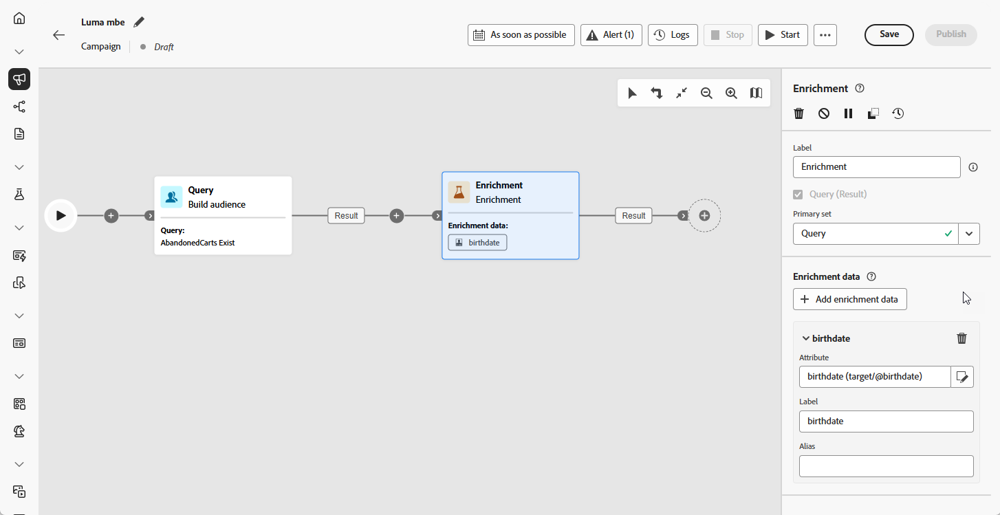

# Enriquecimiento {#enrichment}

>[!CONTEXTUALHELP]
>id="ajo_orchestration_enrichment"
>title="Actividad de enriquecimiento"
>abstract="La actividad de **enriquecimiento** permite mejorar los datos de destino con información adicional de la base de datos. Normalmente, se utiliza en un flujo de trabajo después de actividades de segmentación."

+++ Tabla de contenido

| Bienvenido a campañas orquestadas | Inicio de su primera campaña organizada | Consultar la base de datos | Actividades de las campañas organizadas |
|---|---|---|---|
| [Introducción a las campañas orquestadas](gs-orchestrated-campaigns.md)  [Pasos de configuración](configuration-steps.md)  [Acceso y administración de campañas orquestadas](access-manage-orchestrated-campaigns.md) | [Pasos clave para la creación de campañas orquestadas](gs-campaign-creation.md)  [Cree y programe las actividades de la campaña](create-orchestrated-campaign.md)  [Organice las actividades](orchestrate-activities.md)  <b>[Inicie y supervise la campaña](start-monitor-campaigns.md)</b>  [Creación de informes](reporting-campaigns.md) | [Trabaje con el generador de reglas](orchestrated-rule-builder.md)  [Cree su primera consulta](build-query.md)  [Edite expresiones](edit-expressions.md)  [Redireccionamiento](retarget.md) | [Empiece con las actividades](activities/about-activities.md)  Actividades: [Y únase](activities/and-join.md) - [Generar audiencia](activities/build-audience.md) - [Cambiar dimensión](activities/change-dimension.md) - [Actividades de canal](activities/channels.md) - [Combinar](activities/combine.md) - [Anulación de duplicación](activities/deduplication.md) - [Enriquecimiento](activities/enrichment.md) - [Bifurcación](activities/fork.md) - [Reconciliación](activities/reconciliation.md) - [Guardar](save-audience.md) - [División](activities/split.md) [Espera](activities/wait.md) |

{style="table-layout:fixed"}

+++

 

La actividad **[!UICONTROL Enrichment]** es una actividad **[!UICONTROL Segmentación]** que le permite mejorar sus datos de audiencia con atributos adicionales.

Puede aprovechar esta información para segmentar la audiencia de forma más precisa, en función de comportamientos, preferencias o necesidades, y para crear mensajes personalizados que se conecten mejor con cada perfil.

## Añadir una actividad Enriquecimiento {#enrichment-configuration}

>[!CONTEXTUALHELP]
>id="ajo_targetdata_personalization_enrichmentdata"
>title="Datos de enriquecimiento"
>abstract="Seleccione los datos que desee utilizar para enriquecer la campaña orquestada. Puede seleccionar dos tipos de datos de enriquecimiento: un único atributo de enriquecimiento de la dimensión de destino o un vínculo de recopilación, que es un vínculo con una cardinalidad 1-N entre las tablas."

>[!CONTEXTUALHELP]
>id="ajo_orchestration_enrichment_data"
>title="Actividad de enriquecimiento"
>abstract="Una vez añadidos los datos de enriquecimiento a la campaña orquestada, se pueden utilizar en las actividades añadidas después de la actividad Enriquecimiento para segmentar a los clientes en distintos grupos según sus comportamientos, preferencias y necesidades o bien para crear mensajes y campañas de marketing personalizados que tengan más probabilidades de resonar con el público destinatario."

Siga estos pasos para configurar la actividad **Enriquecimiento**:

1. Añada una actividad **Enriquecimiento**

1. Haga clic en **Agregar datos de enriquecimiento** y seleccione el atributo que se utilizará para enriquecer los datos.

   Puede seleccionar dos tipos de datos de enriquecimiento: un único atributo de enriquecimiento de la dimensión de destino o un vínculo de recopilación. Cada uno de estos tipos se detalla en los ejemplos siguientes:

   * [Atributo de enriquecimiento único](#single-attribute)
   * [Vínculo de colección](#collection-link)

   

## Ejemplos {#example}

### Atributo de enriquecimiento único {#single-attribute}

En este ejemplo, se enriquece la audiencia con un solo atributo, como la fecha de nacimiento, de la dimensión de segmentación actual.

Para ello, haga lo siguiente:

1. Haga clic en **[!UICONTROL Añadir datos de enriquecimiento]**.

1. Seleccione un campo simple, como **[!UICONTROL Fecha de nacimiento]**, de la dimensión actual.

   

1. Haga clic en **[!UICONTROL Confirmar]**.

### Vínculo de colección {#collection-link}

Este caso de uso enriquece la audiencia con datos de una tabla vinculada. Por ejemplo, desea recuperar las tres compras más recientes por debajo de 100 dólares.

Para conseguirlo, configure el enriquecimiento de la siguiente manera:

* **Atributo de enriquecimiento**: **[!UICONTROL Precio]**

* **Número de registros que se van a recuperar**: 3

* **Filtro**: solo incluye compras donde el **[!UICONTROL Precio]** sea menor a $100

#### Añadir el atributo {#add-attribute}

En primer lugar, seleccione el vínculo de recopilación que contiene los datos que desea enriquecer con.

1. Haga clic en **[!UICONTROL Añadir datos de enriquecimiento]**.

1. En la tabla **[!UICONTROL Compras]**, seleccione el campo **[!UICONTROL Precio]**.

   

#### Definir la configuración de la colección{#collection-settings}

A continuación, configure cómo se deben recopilar los datos y cuántas entradas se deben incluir.

1. En el menú desplegable **[!UICONTROL Seleccionar cómo se recopilan los datos]**, elija **[!UICONTROL Recopilar datos]**.

   

1. En el campo **[!UICONTROL Líneas a recuperar (Columnas a crear)]**, escriba `3`.

1. Para realizar una agregación (p. ej., importe promedio de compra), seleccione **[!UICONTROL Datos agregados]** y, a continuación, elija **[!UICONTROL Promedio]** en la lista desplegable **[!UICONTROL Función de agregado]**.

   

1. Utilice los campos **[!UICONTROL Label]** y **[!UICONTROL Alias]** para que los atributos enriquecidos sean más fáciles de identificar en actividades posteriores.

#### Definición de los filtros{#collection-filters}

Finalmente, aplique filtros para asegurarse de que solo se incluyen los registros relevantes:

1. Haga clic en **[!UICONTROL Crear filtros]**.

1. Añada estas dos condiciones:

   * **[!UICONTROL El precio]** existe (para excluir valores NULL)

   * **[!UICONTROL El precio]** es menor que 100

   

1. Haga clic en **[!UICONTROL Confirmar]**.

<!--
#### Define the sorting{#collection-sorting}

We now need to apply sorting in order to retrieve the three **latest** purchases.

1. Activate the **Enable sorting** option.
1. Click inside the **Attribute** field.
1. Select the **Order date** field.
1. Click **Confirm**. 
1. Select **Descending** from the **Sort** drop-down.

## Data reconciliation {#reconciliation}

>[!CONTEXTUALHELP]
>id="ajo_orchestration_enrichment_reconciliation"
>title="Reconciliation"
>abstract="The **Enrichment** activity can be used to reconcile data from the Journey Optimizer schema with data from another schema, or with data coming from a temporary schema such as data uploaded using a Load file activity. This type of link defines a reconciliation towards a unique record. Journey Optimizer creates a link to a target table by adding a foreign key in it for storing a reference to the unique record."

The **Enrichment** activity can be used to reconcile data from the the Campaign database schema with data from another schema, or with data coming from a temporary schema such as data uploaded using a Load file activity. This type of link defines a reconciliation towards a unique record. Journey Optimizer creates a link to a target table by adding a foreign key in it for storing a reference to the unique record.

For example, you can use this option to reconcile a profile's country, specified in an uploaded file, with one of the countries available in the dedicated table of the Campaign database. 

Follow the steps to configure an **Enrichment** activity with a reconciliation link: 

1. Click the **Add link** button in the **Reconciliation** section.
1. Identify the data you want to create a reconciliation link with.

    * To create a reconciliation link with data from the Campaign database, select **Database schema** and choose the schema where the target is stored. 
    * To create a reconciliation link with data coming from the input transition, select **Temporary schema** and choose the orchestrated campaign transition where the target data is stored. 

1. The **Label** and **Name** fields are automatically populated based on the selected target schema. You can change their values if necessary.

1. In the **Reconciliation criteria** section, specify how you want to reconcile data from the source and destination tables:

    * **Simple join**: Reconcile a specific field from the source table with another field in the destination table. To do this, click the **Add join** button and specify the **Source** and **Destination** fields to use for the reconciliation.

        >[!NOTE]
        >
        >You can use one or more **Simple join** criteria, in which case they must all be verified so that the data can be linked together.

    * **Advanced join**: Use the query modeler to configure the reconciliation criteria. To do this, click the **Create condition** button then define your reconciliation criteria by building your own rule using AND and OR operations.

The example below shows an orchestrated campaign configured to create a link between Journey Optimizer profiles table and a temporary table generated a **Load file** activity. In this example, the **Enrichment** activity reconciliates both tables using the email address as reconciliation criteria.

### Enrichment with linked data {#link-example}

The example below shows an orchestrated campaign configured to create a link between two transitions. The first transitions targets profile data using a **Query** activity, while the second transition includes purchase data stored into a file loaded through a Load file activity.

* The first **Enrichment** activity links the primary set (data from the **Query** activity) with the schema from the **Load file** activity. This allows us to match each profile targeted by the query with the corresponding purchase data.

    

* A second **Enrichment** activity is added in order to enrich data from the orchestrated campaign table with the purchase data coming from the **Load file** activity. This allows us to use those data in further activities, for example, to personalize messages sent to the customers with information on their purchase.

    

## Create links between tables {#create-links}

>[!CONTEXTUALHELP]
>id="ajo_orchestration_enrichment_simplejoin"
>title="Link definition"
>abstract="Create a link between the working table data and Adobe Journey Optimizer. For example, if you load data from a file which contains the account number, country and email of recipients, you have to create a link towards the country table in order to update this information in their profiles."

The **[!UICONTROL Link definition]** section allows you to create a link between the working table data and Adobe Journey Optimizer. For example, if you load data from a file which contains the account number, country and email of recipients, you have to create a link towards the country table in order to update this information in their profiles.

There are several types of links available:

* **[!UICONTROL 1 cardinality simple link]**: Each record from the primary set can be associated with one and only one record from the linked data.
* **[!UICONTROL 0 or 1 cardinality simple link]**: Each record from the primary set can be associated with 0 or 1 record from the linked data, but not more than one.
* **[!UICONTROL N cardinality collection link]**: Each record from the primary set can be associated with 0, 1 or more (N) records from the linked data.

To create a link, follow these steps:

1. In the **[!UICONTROL Link definition]** section, click the **[!UICONTROL Add link]** button.

    

1. In the **Relation type** drop-down list, choose the type of link you want to create.

1. Identify the target you want to link the primary set to:

    * To link an existing table in the database, choose **[!UICONTROL Database schema]** and select the desired table from the **[!UICONTROL Target schema]** field.
    * To link with data from the input transition, choose **Temporary schema** and select the transition whose data you want to use.

1. Define the reconciliation criteria to match data from the primary set with the linked schema. There are two types of joins available:

    * **Simple join**: Select a specific attribute to match data from the two schemas. Click **Add join** and select the **Source** and **Destination** attributes to use as reconciliation criteria. 
    * **Advanced join**: Create a join using advanced conditions. Click **Add join** and click the **Create condition** button to open the query modeler.

A workflow example using links is available in the [Examples](#link-example) section.

## Add offers {#add-offers}

>[!CONTEXTUALHELP]
>id="ajo_orchestration_enrichment_offer_proposition"
>title="Offer proposition"
>abstract="The Enrichment activity allows you to add offers for each profile."

The **[!UICONTROL Enrichment]** activity allows you to add offers for each profile.

To do so, follow the steps to configure an **[!UICONTROL Enrichment]** activity with an offer: 

1. In the **[!UICONTROL Enrichment]** activity, at the **[!UICONTROL Offer proposition]** section, click on the **[!UICONTROL Add offer]** button

    

1. You have two choices for the offer selection :

    * **[!UICONTROL Search for the best offer in category]** : check this option and specify the offer engine call parameters (offer space, category or theme(s), contact date, number of offers to keep). The engine will calculate the best offer(s) to add according to these parameters. We recommend completing either the Category or the Theme field, rather than both at the same time.

        

    * **[!UICONTROL A predefined offer]** : check this option and specify an offer space, a specific offer, and a contact date to directly configure the offer that you would like to add, without calling the offer engine.

        

1. After selecting your offer, click on **[!UICONTROL Confirm]** button.

You can now use the offer in the delivery activity.

### Using the offers from Enrichment activity

Within an orchestrated campaign, if you want to use the offers you get from an enrichment activity in your delivery, follow the steps below:

1. Open the delivery activity and go in the content edition. Click on **[!UICONTROL Offers settings]** button and select in the drop-down list the **[!UICONTROL Offers space]** corresponding to your offer. 
If you want to to view only offers from the enrichment activity, set the number of **[!UICONTROL Propositions]** to 0, and save the modifications.

     

1. In the Email Designer, when adding a personalization with offers, click on the **[!UICONTROL Propositions]** icon, it will display the offer(s) you get from the **[!UICONTROL Enrichment]** activity. Open the offer you want to choose by clicking on it.

     

    Go in **[!UICONTROL Rendering functions]** and choose **[!UICONTROL HTML rendering]** or **[!UICONTROL Text rendering]** according to your needs.

     

>[!NOTE]
>
>If you choose to have more than one offer in the **[!UICONTROL Enrichment]** activity at the **[!UICONTROL Number of offers to keep]** option, all the offers are displayed when clicking on the **[!UICONTROL Propositions]** icon.

-->