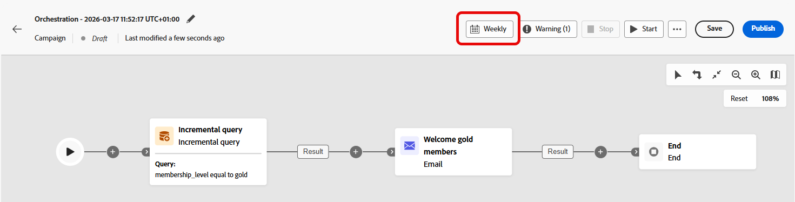

# Consulta incremental {#incremental-query}

>[!CONTEXTUALHELP]
>id="ajo_orchestration_incrementalquery"
>title="Consulta incremental"
>abstract="La consulta incremental es una actividad de segmentación que ejecuta una consulta de base de datos cada vez que se ejecuta la campaña orquestada. Solo devuelve registros nuevos y excluye a cualquier persona que ya se haya incluido en una ejecución anterior, por lo que evita volver a dirigirse a las mismas personas o volver a exportar las mismas filas."

>[!CONTEXTUALHELP]
>id="ajo_orchestration_incrementalquery_processeddata"
>title="Datos procesados"
>abstract="En Datos procesados, elija cómo excluir registros de ejecuciones anteriores. Con la opción Use a date field, la actividad utiliza un campo de fecha seleccionado en lugar de rastrear ID individuales, y cada ejecución devuelve solo filas cuya fecha es posterior a la última ejecución."

>[!CONTEXTUALHELP]
>id="ajo_orchestration_incrementalquery_history"
>title="Historial en días"
>abstract="Esta opción controla cuánto tiempo se retiene esa lista. Un valor de 0 significa retención indefinida, no se eliminan registros."

La actividad **[!UICONTROL Incremental query]** es una actividad **[!UICONTROL de segmentación]** que ejecuta una consulta de base de datos cada vez que se ejecuta la campaña orquestada. Lo importante es que solo genera **nuevos** registros. Se excluye a cualquier usuario que ya haya sido seleccionado en una ejecución anterior, por lo que no debe volver a dirigirse a las mismas personas ni volver a exportar las mismas filas.

Utilícelo cuando la campaña se pueda ejecutar varias veces, por ejemplo, cuando programe la campaña, por ejemplo, semanalmente o cuando se active mediante una señal externa o una API. Cada ejecución se dirige únicamente a los registros que no se devolvieron en una ejecución anterior, por lo que se evitan duplicados.

Usos habituales:

* **Mensajería y audiencias**: Para ir al siguiente paso (por ejemplo, correo electrónico, SMS), solo necesita nuevos registros, nuevos compradores u otros segmentos &quot;nuevos desde la última ejecución&quot;.
* **Exportaciones en curso**: envíe solo filas nuevas o actualizadas a archivos para herramientas de informes o BI, sin duplicar lo que ya exportó.

Cuando una ejecución no devuelve filas, la campaña orquestada se detiene en la **consulta incremental**. Las actividades posteriores a la consulta incremental no se ejecutan hasta que hay datos, cuando la campaña se ejecuta de nuevo.

## Configuración de la actividad Consulta incremental {#incremental-query-configuration}

Establezca la dimensión de segmentación, cree la consulta y elija cómo decide la actividad qué registros se excluirán de las ejecuciones futuras.

1. Coloque una actividad **[!UICONTROL Incremental query]** en su campaña orquestada.

1. En **[!UICONTROL Audiencia]**, elija **[!UICONTROL Dimensión de segmentación]**, por ejemplo: destinatarios, suscriptores, y haga clic en **[!UICONTROL Continuar]**. Más información sobre [Dimensiones de segmentación](../target-dimension.md).

   

1. Haga clic en **[!UICONTROL Agregar condición]** para definir la consulta. [Aprenda a utilizar el generador de reglas](../orchestrated-rule-builder.md).

   

1. En **[!UICONTROL Datos procesados]**, elija la **[!UICONTROL ruta al campo de fecha]**. El atributo debe usar el formato **Fecha y hora**. Cada ejecución devuelve solo filas cuya fecha es posterior a la última ejecución.

   

<!--
   * **[!UICONTROL Exclude results of previous execution]**: The activity maintains a list of records returned in prior runs. Each run excludes those records and returns only new ones. **[!UICONTROL History in days]** controls the retention period for that list. 0 indicates indefinite retention, no records are removed.

   >[!IMPORTANT]
   >
   >This mode stores the primary key of each processed record. Personally identifiable information (PII) must not be used as the primary key.

-->

## Ejemplo {#incremental-query-example}

El siguiente ejemplo envía un correo electrónico de bienvenida a los perfiles que acaban de convertirse en miembros oro. La campaña se puede programar para que se ejecute semanalmente, todos los lunes. Cada ejecución se dirige únicamente a los perfiles que cumplen los requisitos para la suscripción Gold desde la ejecución anterior, por lo que cada destinatario recibe el correo electrónico de bienvenida una vez.

* **[!UICONTROL Consulta incremental]**: selecciona miembros oro. Primera ejecución: todos los miembros oro actuales. Más adelante se ejecuta: solo perfiles que se convirtieron en miembros oro desde la ejecución anterior.
* **[!UICONTROL Envío de correo electrónico]**: envía el correo electrónico de bienvenida a los perfiles generados por la consulta.

