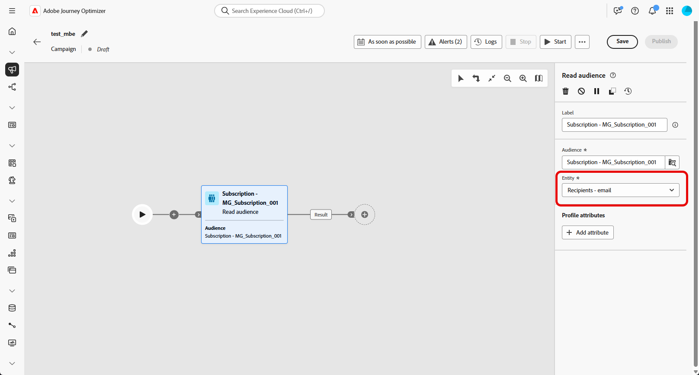
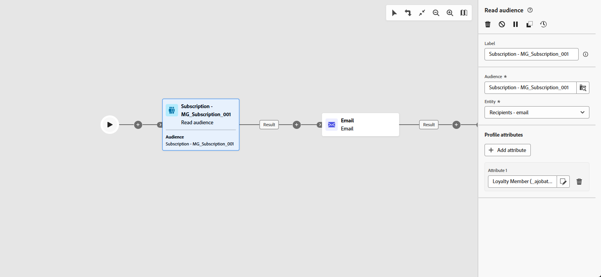

# Leer público {#read-audience}

>[!CONTEXTUALHELP]
>id="ajo_orchestration_read_audience"
>title="Actividad Crear público"
>abstract="La actividad **Leer público** le permite definir el público que participará en la campaña orquestada. Este público puede ser un público existente de Adobe Experience Platform o un público extraído de un archivo CSV. Cuando se envían mensajes en el contexto de una campaña orquestada, el público del mensaje no se define en la actividad del canal, sino en una actividad **Leer público** o **Crear público**."

La actividad **[!UICONTROL Leer audiencia]** le permite recuperar una audiencia existente (previamente guardada o importada) y reutilizarla dentro de una campaña orquestada. Esta actividad es especialmente útil para segmentar un conjunto predefinido de perfiles sin necesidad de ejecutar un nuevo proceso de segmentación.

Una vez cargada la audiencia, puede refinarla seleccionando un campo de identidad único y enriqueciéndola con atributos de perfil adicionales para fines de segmentación, personalización o creación de informes.

## Leer caché de audiencias {#cache}

Al probar una campaña orquestada, la actividad **[!UICONTROL Leer audiencia]** generalmente tarda un poco en obtener datos, lo que puede hacer que las ejecuciones de prueba sean más largas. Para acelerar esto, hay disponible una caché de **[!UICONTROL Leer audiencia]**.

La caché almacena la audiencia junto con los atributos seleccionados por **hasta dos horas**. Durante este tiempo, cualquier ejecución de prueba posterior puede utilizar los resultados almacenados en caché, lo que evita la necesidad de recuperar los datos de nuevo. Una vez transcurrido el **período de dos horas**, los datos deben recuperarse de nuevo.

La caché se guarda para cada campaña orquestada, no para la propia audiencia. Si se usa la misma audiencia en una actividad **[!UICONTROL Leer audiencia]** dentro de otra campaña orquestada, el sistema tendrá que recuperar los datos de nuevo.

La caché no se conserva en los siguientes casos:

* Cuando la actividad **[!UICONTROL Leer audiencia]** se actualiza con nuevos atributos, la caché se actualiza con los nuevos datos de atributos. Por lo tanto, la primera ejecución de prueba después de la actualización tardará más, ya que los datos deben recuperarse de nuevo.

* Cuando se publica la campaña orquestada, se recuperan los datos más recientes al ejecutar la campaña orquestada en directo.

## Configuración de la actividad Leer audiencia {#read-audience-configuration}

Siga estos pasos para configurar la actividad **[!UICONTROL Leer audiencia]**:

1. Antes de añadir tu actividad **[!UICONTROL Leer audiencia]**, asegúrate de seleccionar una **[!UICONTROL política de combinación]** en la configuración de la campaña.

   

1. Agregue una actividad **[!UICONTROL Leer audiencia]** a su campaña orquestada.

   

1. Ingrese una **[!UICONTROL etiqueta]** a su actividad. Esta etiqueta sirve como nombre de la audiencia.

1. Haga clic en  para seleccionar la audiencia a la que desea dirigirse para su campaña orquestada. [Más información acerca de cómo generar y segmentar audiencias en Journey Optimizer](../audience/about-audiences.md).

   

1. Elija una **[!UICONTROL Entidad&#x200B;]** de su dimensión de segmentación de campaña. Esta configuración define la entidad objetivo y el atributo utilizado para reconciliar la audiencia con la dimensión objetivo.

   ➡️ [Siga los pasos detallados en esta página para crear su dimensión de segmentación de campaña](../target-dimension.md)

   

1. Seleccione **[!UICONTROL Agregar atributo]** para enriquecer la audiencia seleccionada con datos adicionales. Este paso permite agregar atributos de perfil a la audiencia, lo que da como resultado una lista de destinatarios mejorados con esos atributos.

1. Elija los **[!UICONTROL atributos]** que desee agregar a su audiencia. El selector de atributos muestra campos del **Esquema de perfil de unión**:

   * Para audiencias basadas en CSV, esto incluye atributos de **Perfil** y atributos personalizados en el nivel de audiencia. Estos atributos se pueden encontrar en la siguiente ruta de esquema:

     `<audienceid> > _ajobatchjourneystage > audienceEnrichment > CustomerAudienceUpload > <audienceid>`

   * Para las audiencias estándar de AEP, solo están disponibles los atributos **Profile**, ya que no llevan campos incrustados específicos de audiencia.

   >[!NOTE]
   >
   > Aunque algunos atributos pueden aparecer en el selector, su disponibilidad en tiempo de ejecución depende de si los datos de audiencia se han cuadrado y combinado correctamente con el **perfil de Adobe Experience Platform**.

   

Una vez creada una audiencia, está disponible en modo de solo lectura y ya no se puede editar. Solo se puede utilizar una vez completado el proceso de creación.

## Ejemplo

En el ejemplo siguiente, la actividad **[!UICONTROL Leer audiencia]** se usa para recuperar una audiencia de perfiles creada y guardada anteriormente que se suscribieron al boletín informativo. A continuación, la audiencia se enriquece con el atributo **Membresía de fidelidad** para habilitar la segmentación de usuarios que sean miembros registrados del programa de fidelidad.

