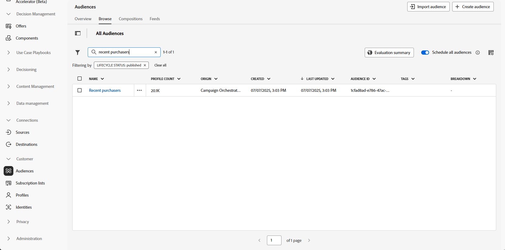

# Guardar público {#save-audience}

>[!BEGINSHADEBOX]

**En esta página:** Aprenda a utilizar la actividad de segmentación Guardar audiencia para crear o sobrescribir una audiencia reutilizable de la población creada anteriormente en una campaña orquestada.

>[!ENDSHADEBOX]

>[!CONTEXTUALHELP]
>id="ajo_orchestration_save_audience"
>title="Actividad Guardar público"
>abstract="La actividad **Guardar público** es una actividad de **Segmentación** que le permite actualizar un público existente o crear uno nuevo a partir de la población generada anteriormente en la campaña organizada. Una vez creados, estos públicos se añaden a la lista de públicos de la aplicación y se puede acceder a ellos desde el menú **Públicos**."

La actividad **[!UICONTROL Guardar audiencia]** es una actividad de **[!UICONTROL Segmentación]** que se usa para crear una audiencia nueva o actualizar una existente en función de la población generada anteriormente en la campaña orquestada. Una vez guardada, la audiencia se agrega a la lista de audiencias de aplicación y se puede acceder a ella desde el menú **[!UICONTROL Audiencias]**.

Normalmente se utiliza para capturar segmentos de audiencia creados dentro del mismo flujo de trabajo de campaña, lo que los hace disponibles para su reutilización en campañas futuras. Normalmente, está conectado a otras actividades de segmentación, como **[!UICONTROL Generar audiencia]** o **[!UICONTROL Combinar]**, para guardar la población de destino final.
Tenga en cuenta que con la actividad **[!UICONTROL Guardar audiencia]** no puede actualizar una audiencia existente. Solo puede crear una audiencia nueva o sobrescribir una existente con una definición nueva.

## Configuración de la actividad Guardar público {#save-audience-configuration}

Siga estos pasos para configurar la actividad **[!UICONTROL Guardar público]**:

1. Agregue una actividad **[!UICONTROL Guardar audiencia]** a su campaña orquestada.

1. Escriba una **[!UICONTROL etiqueta de público]** que identifique el público guardado.

   >[!NOTE]
   >
   >La audiencia **[!UICONTROL Label]** debe ser única en todas las campañas. No puede reutilizar un nombre de audiencia que ya se haya usado en la actividad **[!UICONTROL Guardar audiencia]** de otra campaña.

1. Elija un **[!UICONTROL campo de asignación de perfiles&#x200B;]** de su dimensión de segmentación de campañas. Esta asignación define cómo los perfiles de la **audiencia guardada** están vinculados a la dimensión de destino de la campaña durante la ejecución.

   Solo las asignaciones compatibles con la dimensión de destino actual, es decir, la de la transición entrante, están disponibles en la lista desplegable para garantizar la reconciliación adecuada entre la audiencia y el contexto de la campaña.

   ➡️ [Siga los pasos detallados en esta página para crear su dimensión de segmentación de campaña](../target-dimension.md)

   

1. Haga clic en **[!UICONTROL Agregar asignaciones de audiencia]** para incluir datos adicionales de los atributos de la **[!UICONTROL dimensión de destino]** o de los **[!UICONTROL atributos de perfil]** enriquecidos.

   Esto le permite asociar más información con la actividad **[!UICONTROL Audiencia guardada]** más allá de la asignación de perfil principal, lo que mejora las opciones de segmentación y personalización.

   

1. Finalice la configuración guardando y publicando la campaña orquestada. Así se generará y almacenará su público.

1. Publique la campaña para la audiencia que se va a crear o reemplazar, ya que la actividad **[!UICONTROL Guardar audiencia]** no se ejecuta mientras la campaña esté en **[!UICONTROL modo borrador]**.

>[!NOTE]
>
>En el momento de la publicación, las actividades **[!UICONTROL Guardar audiencia]** siempre se ejecutan antes que cualquier actividad de mensaje en el flujo de trabajo. Se crea el shell de audiencia y los perfiles comienzan a ingerirse en Audience Portal antes de que cualquier actividad de canal comience a procesarse. [Obtenga más información acerca de la secuencia de ejecución en tiempo de publicación](../start-monitor-campaigns.md#publication-sequence)

El contenido de la audiencia guardada está disponible en la vista de detalles de la audiencia, a la que se puede acceder desde el menú **[!UICONTROL Audiencias]**, o se puede seleccionar al segmentar una audiencia, por ejemplo, con una actividad **[!UICONTROL Leer audiencia]**.

>[!NOTE]
>
>Si la definición de la audiencia utiliza atributos de esquema de Experience Platform etiquetados con Data Usage (DULE), la audiencia guardada hereda automáticamente esas etiquetas. No es necesario que vuelva a aplicarlos. [Más información sobre la administración de datos](../../action/action-privacy.md)

## Ejemplo {#save-audience-example}

En el siguiente ejemplo se muestra cómo crear un público simple mediante la segmentación. Una consulta identifica a todos los destinatarios que reservaron un viaje en los últimos 30 días filtrando esta población dentro de la campaña orquestada. Al elegir **Destinatarios - CRMID** como **dimensión de segmentación**, la audiencia se dirige a cada evento de reserva individual en lugar de solo al destinatario en su conjunto. A continuación, la actividad **[!UICONTROL Guardar público]** captura estos perfiles para crear un público reutilizable de compradores recientes.

