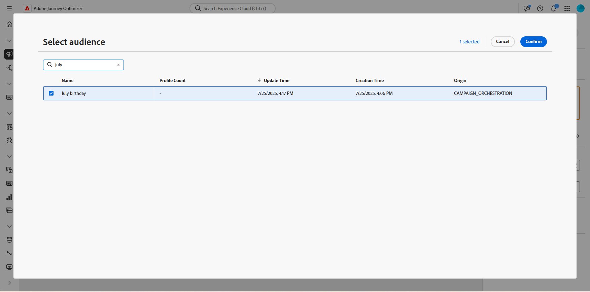

# Guardar público {#save-audience}

>[!CONTEXTUALHELP]
>id="ajo_orchestration_save_audience"
>title="Guardar actividad de audiencia"
>abstract="La actividad **Guardar audiencia** es una actividad de **segmentación** que le permite actualizar una audiencia existente o crear una nueva a partir de la población generada anteriormente en la campaña orquestada. Una vez creadas, estas audiencias se añaden a la lista de audiencias de la aplicación y se puede acceder a ellas desde el menú **Audiencias**."

+++ Tabla de contenido

| Bienvenido a campañas orquestadas | Inicio de su primera campaña organizada | Consultar la base de datos | Actividades de las campañas organizadas |
|---|---|---|---|
| [Empiece a usar las campañas orquestadas](../gs-orchestrated-campaigns.md)  Cree y administre conjuntos de datos y esquemas relacionales:  <ul><li>[Introducción a esquemas y conjuntos de datos](../gs-schemas.md)</li><li>[Esquema manual](../manual-schema.md)</li><li>[Esquema de carga de archivos](../file-upload-schema.md)</li><li>[Ingesta de datos](../ingest-data.md)</li></ul>[Acceder y administrar campañas orquestadas](../access-manage-orchestrated-campaigns.md) | [Pasos clave para crear una campaña orquestada](../gs-campaign-creation.md)  [Cree y programe las actividades de la campaña](../create-orchestrated-campaign.md)  [Organice las actividades](../orchestrate-activities.md)  [Inicie y supervise la campaña](../start-monitor-campaigns.md)  [Creación de informes](../reporting-campaigns.md) | [Trabaje con el generador de reglas](../orchestrated-rule-builder.md)  [Cree su primera consulta](../build-query.md)  [Edite expresiones](../edit-expressions.md)  [Redireccionamiento](../retarget.md) | [Empiece con las actividades](about-activities.md)  Actividades: [Y únase](and-join.md) - [Generar audiencia](build-audience.md) - [Cambiar dimensión](change-dimension.md) - [Actividades de canal](channels.md) - [Combinar](combine.md) - [Anulación de duplicación](deduplication.md) - [Enriquecimiento](enrichment.md) - [Bifurcación](fork.md) - [Reconciliación](reconciliation.md) - <b>[Guardar](save-audience.md)</b> - [División](split.md) [Espera](wait.md) |

{style="table-layout:fixed"}

+++

 

>[!BEGINSHADEBOX]

 

El contenido de esta página no es definitivo y puede estar sujeto a cambios.

>[!ENDSHADEBOX]

La actividad **[!UICONTROL Guardar audiencia]** es una actividad de **[!UICONTROL Segmentación]** que se usa para crear una audiencia nueva o actualizar una existente en función de la población generada anteriormente en la campaña orquestada. Una vez guardada, la audiencia se agrega a la lista de audiencias de aplicación y se puede acceder a ella desde el menú **[!UICONTROL Audiencias]**.

Normalmente se utiliza para capturar segmentos de audiencia creados dentro del mismo flujo de trabajo de campaña, lo que los hace disponibles para su reutilización en campañas futuras. Normalmente, está conectado a otras actividades de segmentación, como **[!UICONTROL Generar audiencia]** o **[!UICONTROL Combinar]**, para guardar la población de destino final.

## Configuración de la actividad Guardar audiencia {#save-audience-configuration}

Siga estos pasos para configurar la actividad **[!UICONTROL Guardar audiencia]**:

1. Agregue una actividad **[!UICONTROL Guardar audiencia]** a su campaña orquestada.

1. Escriba una **[!UICONTROL etiqueta de audiencia]** que identifique la audiencia guardada.

1. Haga clic en **[!UICONTROL Agregar atributo de audiencia]** para definir cómo se estructuran y almacenan los datos de audiencia para su reutilización futura.

   

1. A continuación, seleccione el **[!UICONTROL campo de identidad principal]** &#x200B;y el **[!UICONTROL área de nombres de identidad]** adecuados para garantizar una resolución precisa del perfil.

   

1. Finalice la configuración guardando y publicando la campaña orquestada. Esto generará y almacenará su audiencia.

El contenido de la audiencia guardada está disponible en la vista de detalles de la audiencia, a la que se puede acceder desde el menú **[!UICONTROL Audiencias]**.

## Ejemplo {#save-audience-example}

En el siguiente ejemplo se muestra cómo crear una audiencia simple mediante la segmentación. Una consulta identifica todos los perfiles que realizaron una compra en los últimos 30 días. La actividad **[!UICONTROL Guardar audiencia]** captura estos perfiles para crear una audiencia reutilizable de compradores recientes.

