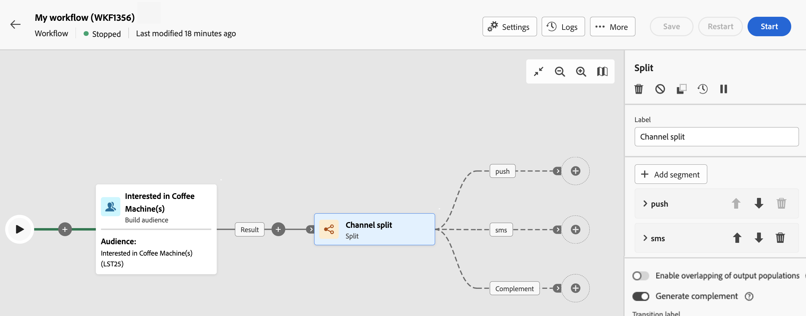

# División {#split}

>[!CONTEXTUALHELP]
>id="ajo_orchestration_split"
>title="Actividad de división"
>abstract="La actividad **División** permite segmentar las poblaciones entrantes en varios subconjuntos en función de diferentes criterios de selección, como las reglas de filtrado o el tamaño de la población."

+++ Tabla de contenido

| Bienvenido a campañas orquestadas | Inicie su primera campaña orquestada | Consultar la base de datos | Actividades de campañas organizadas |
|---|---|---|---|
| [Introducción a las campañas orquestadas](../gs-orchestrated-campaigns.md)  [Pasos de configuración](../configuration-steps.md)  [Pasos clave para la creación de campañas orquestadas](../gs-campaign-creation.md) | [Crear una campaña orquestada](../create-orchestrated-campaign.md)  [Organizar actividades](../orchestrate-activities.md)  [Enviar mensajes con campañas orquestadas](../send-messages.md)  [Iniciar y supervisar la campaña](../start-monitor-campaigns.md)  [Creación de informes](../reporting-campaigns.md) | [Trabaje con el Modeler de consultas](../orchestrated-query-modeler.md)  [Cree su primera consulta](../build-query.md)  [Editar expresiones](../edit-expressions.md) | [Empiece con las actividades](about-activities.md)  Actividades: [Y únase](and-join.md) - [Generar audiencia](build-audience.md) - [Cambiar dimensión](change-dimension.md) - [Combinar](combine.md) - [Anulación de duplicación](/deduplication.md) - [Enriquecimiento](enrichment.md) - [Bifurcación](fork.md) - [Reconciliación](reconciliation.md) - [División](split.md) - [Espera](wait.md) |

{style="table-layout:fixed"}

+++

  

La actividad **División** es una actividad **Segmentación** que permite segmentar las poblaciones entrantes en varios subconjuntos en función de diferentes criterios de selección, como reglas de filtrado o tamaño de población.

## Configuración de la actividad división {#split-configuration}

>[!CONTEXTUALHELP]
>id="ajo_orchestration_split_segments"
>title="Segmentos para la actividad división"
>abstract="Añada todos los subconjuntos que quiera para segmentar la población entrante.  Cuando se ejecuta la actividad **División**, la población se segmenta en los diferentes subconjuntos en el orden en el que se añaden a la actividad. Antes de iniciar la campaña orquestada, asegúrese de haber ordenado los subconjuntos en el orden que mejor se adapte a sus necesidades mediante los botones de flecha."

>[!CONTEXTUALHELP]
>id="ajo_orchestration_split_filter"
>title="Filtro de la actividad de división"
>abstract="Para aplicar una condición de filtrado al subconjunto, haga clic en **[!UICONTROL Crear filtro]** y configure la regla de filtrado que desee mediante el modelador de consultas. Por ejemplo, incluya perfiles de la población entrante cuya dirección de correo electrónico existe en la base de datos."

>[!CONTEXTUALHELP]
>id="ajo_orchestration_split_limit"
>title="Límite de la actividad división"
>abstract="Para limitar el número de perfiles seleccionados por el subconjunto, active la opción **[!UICONTROL Habilitar límite]** y especifique el número o los porcentajes de la población que desea incluir."

>[!CONTEXTUALHELP]
>id="ajo_orchestration_split_sorting"
>title="Ordenación de la actividad división"
>abstract="Al establecer un límite de población para un subconjunto, puede clasificar los perfiles seleccionados en función de un atributo de perfil específico, en orden ascendente o descendente. Para ello, active la opción **Habilitar ordenación**. Por ejemplo, puede restringir un subconjunto para incluir solo los 50 perfiles con la cantidad de compra más alta."

>[!CONTEXTUALHELP]
>id="ajo_orchestration_split_complement"
>title="Complemento de generación de división"
>abstract="Una vez configurados todos los subconjuntos, puede seleccionar la población restante que no coincide con ninguno de los subconjuntos e incluirlos en una transición saliente adicional. Para ello, active la opción **Generar complemento.**"

>[!CONTEXTUALHELP]
>id="ajo_orchestration_split_generatesubsets"
>title="Generar todos los subconjuntos en la misma tabla"
>abstract="Active esta opción para agrupar todos los subconjuntos en una sola transición de salida."

>[!CONTEXTUALHELP]
>id="ajo_orchestration_split_emptytransition"
>title="Omitir transición vacía"
>abstract="Active la opción **[!UICONTROL Omitir transición vacía]** para deshabilitar la transición de salida para este subconjunto si la población entrante está vacía."

>[!CONTEXTUALHELP]
>id="ajo_orchestration_split_enable_overlapping"
>title="Habilitar superposición de poblaciones de salida"
>abstract=" La opción **[!UICONTROL Habilitar superposición de poblaciones de salida]** permite administrar poblaciones que pertenecen a varios subconjuntos. Cuando el cuadro no está marcado, la actividad de división garantiza que los destinatarios no puedan estar presentes en varias transiciones de salida, aunque cumplan los criterios de varios subconjuntos. Los destinatarios se encuentran en el destino de la primera pestaña con criterios coincidentes. Cuando se selecciona el cuadro, los destinatarios se pueden encontrar en varios subconjuntos si cumplen con sus criterios de filtro."

Siga estos pasos para configurar la actividad **División**:

1. Agregue una actividad **Split** a su campaña orquestada.

1. El panel de configuración de actividad se abre con un subconjunto predeterminado. Haga clic en el botón **Añadir segmento** para añadir tantos subconjuntos como desee para segmentar la población entrante.

   

   >[!IMPORTANT]
   >
   >Cuando se ejecuta la actividad **División**, la población se segmenta en los diferentes subconjuntos en el orden en el que se añaden a la actividad. Por ejemplo, si el primer subconjunto recupera el 70 % de la población inicial, el siguiente subconjunto añadido aplicará sus criterios de selección solo al 30 % restante, y así sucesivamente.
   >
   >Antes de iniciar la campaña orquestada, asegúrese de haber encargado los subconjuntos en el orden que se adapte a sus necesidades. Para ello, utilice los botones de flecha para cambiar la posición de un subconjunto.

1. Una vez creados los subconjuntos, la actividad muestra de forma predeterminada tantas transiciones de salida como subconjuntos. Se recomienda encarecidamente cambiar la etiqueta de cada subconjunto para identificarlo fácilmente en el lienzo de campaña orquestado.

1. Configure cómo debe filtrar cada subconjunto la población entrante. Para ello, siga estos pasos:

   1. Abra el subconjunto para mostrar sus propiedades.

   1. Para aplicar una condición de filtrado al subconjunto, haga clic en **[!UICONTROL Crear filtro]** y configure la regla de filtrado que desee mediante el modelador de consultas. Por ejemplo, incluya perfiles de la población entrante cuya dirección de correo electrónico existe en la base de datos.

   1. Para limitar el número de perfiles seleccionados por el subconjunto, active la opción **[!UICONTROL Habilitar límite]** y especifique el número o los porcentajes de la población que desea incluir.

   1. Para deshabilitar una transición si la población entrante está vacía, active la opción **[!UICONTROL Omitir transición vacía]**. Si ningún perfil coincide con el subconjunto, la campaña orquestada no pasará a la siguiente actividad.

      

1. Una vez configurados todos los subconjuntos, puede seleccionar la población restante que no coincide con ninguno de los subconjuntos e incluirlos en una transición saliente adicional. Para ello, active la opción **[!UICONTROL Generar complemento.]**

   

   >[!NOTE]
   >
   >La opción **[!UICONTROL Generate all subsets in the same table]** permite agrupar todos los subconjuntos en una sola transición de salida.

1. La opción **[!UICONTROL Enable overlapping of output populations]** permite administrar poblaciones que pertenecen a varios subconjuntos:

   * Cuando el cuadro no está marcado, la actividad de división garantiza que los destinatarios no puedan estar presentes en varias transiciones de salida, aunque cumplan los criterios de varios subconjuntos. Los destinatarios se encuentran en el destino de la primera pestaña con criterios coincidentes.
   * Cuando se selecciona el cuadro, los destinatarios se pueden encontrar en varios subconjuntos si cumplen con sus criterios de filtro. La práctica recomendada es utilizar criterios exclusivos.

La actividad está configurada. En la ejecución de la campaña orquestada, la población se segmenta en los diferentes subconjuntos, en el orden en que se hayan agregado a la actividad.

## Ejemplo{#split-example}

En el ejemplo siguiente, la actividad **[!UICONTROL División]** se utiliza para segmentar un público en distintos subconjuntos basados en el canal de comunicación que queremos utilizar:

* **Subconjunto 1 &quot;push&quot;**: este subconjunto incluye todos los perfiles que han instalado nuestra aplicación móvil.
* **Subconjunto 2 &quot;sms&quot;**: usuarios de teléfonos móviles: para la población restante que no pertenecía al subconjunto 1, el subconjunto 2 aplica una regla de filtrado para seleccionar perfiles con teléfonos móviles en la base de datos.
* **Transición de complemento**: esta transición captura todos los perfiles restantes que no coinciden con el subconjunto 1 o el subconjunto 2. Específicamente, incluye perfiles que no han instalado la aplicación móvil ni tienen teléfono móvil, como usuarios que no han instalado la aplicación móvil o que carecen de un número de móvil registrado.

