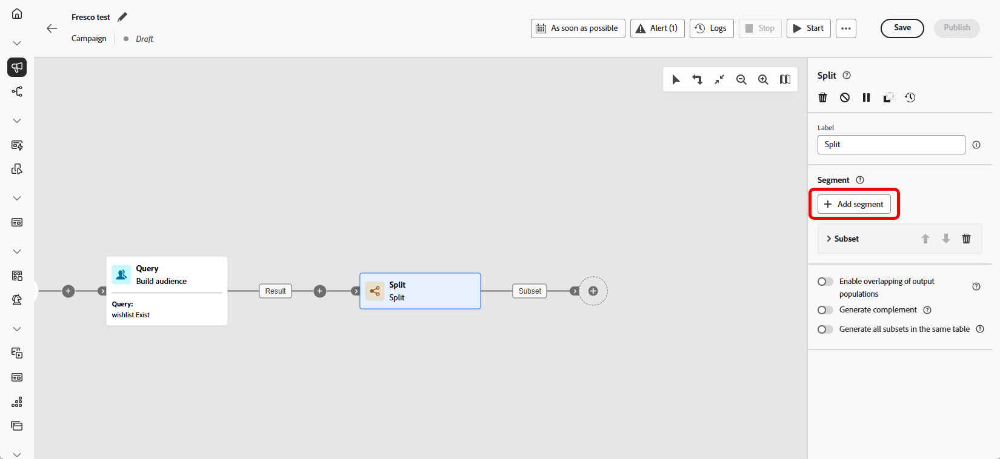
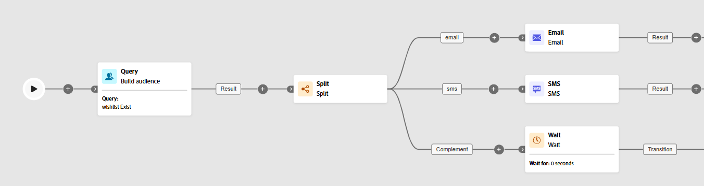

# División {#split}

>[!CONTEXTUALHELP]
>id="ajo_orchestration_split"
>title="Actividad de división"
>abstract="La actividad **División** permite segmentar las poblaciones entrantes en varios subconjuntos en función de diferentes criterios de selección, como las reglas de filtrado o el tamaño de la población."

+++ Tabla de contenido

| Bienvenido a campañas orquestadas | Inicio de su primera campaña organizada | Consultar la base de datos | Actividades de las campañas organizadas |
|---|---|---|---|
| [Empiece a usar las campañas orquestadas](gs-orchestrated-campaigns.md)  Cree y administre conjuntos de datos y esquemas relacionales:  <ul><li>[Esquema manual](manual-schema.md)</li><li>[Esquema de carga de archivos](file-upload-schema.md)</li><li>[Ingesta de datos](ingest-data.md)</li></ul>  [Acceder y administrar campañas orquestadas](../access-manage-orchestrated-campaigns.md) | [Pasos clave para crear una campaña orquestada](../gs-campaign-creation.md)  [Cree y programe las actividades de la campaña](../create-orchestrated-campaign.md)  [Organice las actividades](../orchestrate-activities.md)  [Inicie y supervise la campaña](../start-monitor-campaigns.md)  [Creación de informes](../reporting-campaigns.md) | [Trabaje con el generador de reglas](../orchestrated-rule-builder.md)  [Cree su primera consulta](../build-query.md)  [Edite expresiones](../edit-expressions.md)  [Redireccionamiento](../retarget.md) | [Empiece con las actividades](about-activities.md)  Actividades: [Y únase](and-join.md) - [Generar audiencia](build-audience.md) - [Cambiar dimensión](change-dimension.md) - [Actividades de canal](channels.md) - [Combinar](combine.md) - [Anulación de duplicación](deduplication.md) - [Enriquecimiento](enrichment.md) - [Bifurcación](fork.md) - [Reconciliación](reconciliation.md) - [Guardar](save-audience.md) - <b>[División](split.md)</b> [Espera](wait.md) |

{style="table-layout:fixed"}

+++

 

>[!BEGINSHADEBOX]

El contenido de esta página no es definitivo y puede estar sujeto a cambios.

>[!ENDSHADEBOX]

La actividad **[!UICONTROL Split]** es una actividad **[!UICONTROL Targeting]** que segmenta la población entrante en varios subconjuntos según criterios de selección definidos como reglas de filtrado o tamaño de población.

## Configuración de la actividad división {#split-configuration}

>[!CONTEXTUALHELP]
>id="ajo_orchestration_split_segments"
>title="Segmentos para la actividad división"
>abstract="Añada todos los subconjuntos que quiera para segmentar la población entrante.  Cuando se ejecuta la actividad **División**, la población se segmenta en los diferentes subconjuntos en el orden en el que se añaden a la actividad. Antes de iniciar la campaña orquestada, asegúrese de haber ordenado los subconjuntos en el orden que mejor se adapte a sus necesidades mediante los botones de flecha."

>[!CONTEXTUALHELP]
>id="ajo_orchestration_split_filter"
>title="Filtro de la actividad de división"
>abstract="Para aplicar una condición de filtrado al subconjunto, haga clic en **[!UICONTROL Crear filtro]** y configure la regla de filtrado que desee mediante el modelador de consultas. Por ejemplo, incluya perfiles de la población entrante cuya dirección de correo electrónico existe en la base de datos."

>[!CONTEXTUALHELP]
>id="ajo_orchestration_split_limit"
>title="Límite de la actividad división"
>abstract="Para limitar el número de perfiles seleccionados por el subconjunto, active la opción **[!UICONTROL Habilitar límite]** y especifique el número o los porcentajes de la población que desea incluir."

>[!CONTEXTUALHELP]
>id="ajo_orchestration_split_sorting"
>title="Ordenación de la actividad división"
>abstract="Al establecer un límite de población para un subconjunto, puede clasificar los perfiles seleccionados en función de un atributo de perfil específico, en orden ascendente o descendente. Para ello, active la opción **Habilitar ordenación**. Por ejemplo, puede restringir un subconjunto para incluir solo los 50 perfiles con la cantidad de compra más alta."

>[!CONTEXTUALHELP]
>id="ajo_orchestration_split_complement"
>title="Complemento de generación de división"
>abstract="Una vez configurados todos los subconjuntos, puede seleccionar la población restante que no coincide con ninguno de los subconjuntos e incluirlos en una transición saliente adicional. Para ello, active la opción **Generar complemento.**"

>[!CONTEXTUALHELP]
>id="ajo_orchestration_split_generatesubsets"
>title="Generar todos los subconjuntos en la misma tabla"
>abstract="Active esta opción para agrupar todos los subconjuntos en una sola transición de salida."

>[!CONTEXTUALHELP]
>id="ajo_orchestration_split_emptytransition"
>title="Omitir transición vacía"
>abstract="Active la opción **[!UICONTROL Omitir transición vacía]** para deshabilitar la transición de salida para este subconjunto si la población entrante está vacía."

>[!CONTEXTUALHELP]
>id="ajo_orchestration_split_enable_overlapping"
>title="Habilitar superposición de poblaciones de salida"
>abstract=" La opción **[!UICONTROL Habilitar superposición de poblaciones de salida]** permite administrar poblaciones que pertenecen a varios subconjuntos. Cuando el cuadro no está marcado, la actividad de división garantiza que los destinatarios no puedan estar presentes en varias transiciones de salida, aunque cumplan los criterios de varios subconjuntos. Los destinatarios se encuentran en el destino de la primera pestaña con criterios coincidentes. Cuando se selecciona el cuadro, los destinatarios se pueden encontrar en varios subconjuntos si cumplen con sus criterios de filtro."

Siga estos pasos para configurar la actividad **[!UICONTROL División]**:

1. Agregue una actividad **[!UICONTROL Split]** a su campaña orquestada.

1. El panel de configuración de actividad se abre con un subconjunto predeterminado. Haga clic en el botón **[!UICONTROL Añadir segmento]** para añadir tantos subconjuntos como desee para segmentar la población entrante.

   

   >[!IMPORTANT]
   >
   >La actividad **Split** procesa los subconjuntos en el orden en que se agregan. Por ejemplo, si el primer subconjunto captura el 70 % de la población, el siguiente aplica sus criterios al 30 % restante.
   >
   >Antes de ejecutar la campaña orquestada, asegúrese de que los subconjuntos se ordenan según lo previsto. Utilice los botones de flecha para ajustar su posición.

1. Una vez creados los subconjuntos, la actividad muestra de forma predeterminada tantas transiciones de salida como subconjuntos. Se recomienda encarecidamente cambiar la etiqueta de cada subconjunto para identificarlo fácilmente en el lienzo de campaña orquestado.

1. Configure los filtros para cada subconjunto:

   1. Haga clic en un subconjunto para abrir su configuración.

   1. Haga clic en **[!UICONTROL Crear filtro]** para definir las reglas de filtrado mediante el modelador de consultas; por ejemplo, seleccione perfiles con una dirección de correo electrónico válida.

      

   1. Para limitar el número de perfiles seleccionados, habilite **[!UICONTROL Habilitar límite]** y especifique un número o porcentaje.

   1. Para omitir una transición cuando el subconjunto esté vacío, habilite **[!UICONTROL Omitir transición vacía].**

1. Para incluir perfiles que no coincidan con ningún subconjunto, habilite **[!UICONTROL Generar complemento]**. Esto crea una transición saliente adicional para la población restante.

   >[!NOTE]
   >
   >Habilite **[!UICONTROL Generar todos los subconjuntos de la misma tabla]** para agrupar todos los subconjuntos en una sola transición.

1. Use **[!UICONTROL Habilitar superposición de poblaciones de salida]** para permitir que los perfiles aparezcan en varios subconjuntos:

   * **Si no se selecciona**, cada perfil se asigna a un solo subconjunto, el primero cuyos criterios coinciden aunque cumpla los requisitos de otros subconjuntos.

   * **Si se selecciona**, los perfiles se pueden incluir en varios subconjuntos si cumplen los criterios de cada uno.

La actividad está configurada. En la ejecución de la campaña orquestada, la población se segmenta en los diferentes subconjuntos, en el orden en que se hayan agregado a la actividad.

## Ejemplo{#split-example}

En el ejemplo siguiente, la actividad **[!UICONTROL División]** se utiliza para segmentar un público en distintos subconjuntos basados en el canal de comunicación que queremos utilizar:

* **Subconjunto 1 &quot;correo electrónico&quot;**: incluye perfiles que han proporcionado un número de teléfono.

* **Subconjunto 2 &quot;sms&quot;**: identifica perfiles con un número de teléfono móvil almacenado en la base de datos.

* **Transición de complemento**: captura los perfiles restantes que no cumplen los criterios de ninguno de los subconjuntos.

