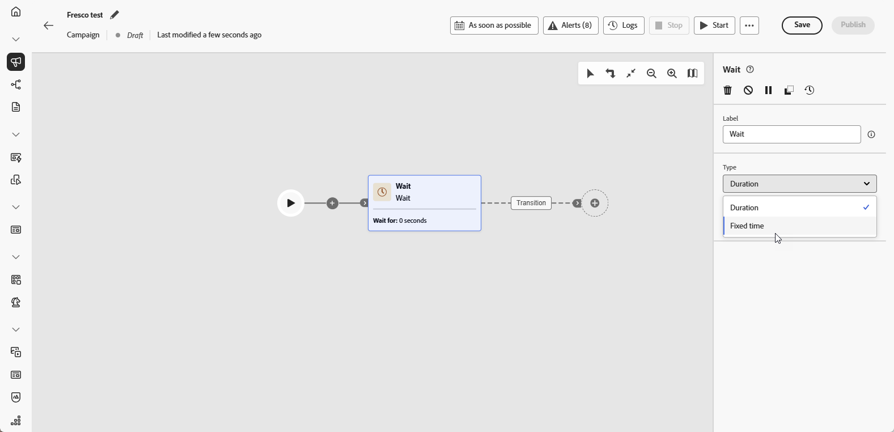
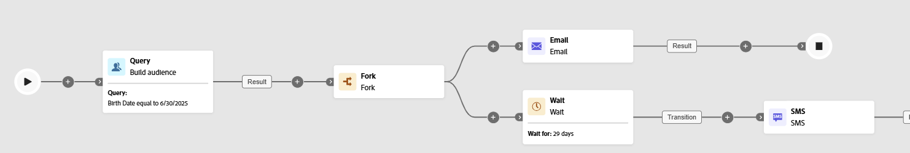

# Espere {#wait}

>[!CONTEXTUALHELP]
>id="ajo_orchestration_wait"
>title="Actividad Esperar"
>abstract="La actividad **Esperar** se utiliza para retrasar la transición de una actividad a otra."

+++ Tabla de contenido

| Bienvenido a campañas orquestadas | Inicio de su primera campaña organizada | Consultar la base de datos | Actividades de las campañas organizadas |
|---|---|---|---|
| [Introducción a las campañas orquestadas](gs-orchestrated-campaigns.md)  [Pasos de configuración](configuration-steps.md)  [Acceso y administración de campañas orquestadas](access-manage-orchestrated-campaigns.md) | [Pasos clave para la creación de campañas orquestadas](gs-campaign-creation.md)  [Cree y programe las actividades de la campaña](create-orchestrated-campaign.md)  [Organice las actividades](orchestrate-activities.md)  <b>[Inicie y supervise la campaña](start-monitor-campaigns.md)</b>  [Creación de informes](reporting-campaigns.md) | [Trabaje con el generador de reglas](orchestrated-rule-builder.md)  [Cree su primera consulta](build-query.md)  [Edite expresiones](edit-expressions.md)  [Redireccionamiento](retarget.md) | [Empiece con las actividades](activities/about-activities.md)  Actividades: [Y únase](activities/and-join.md) - [Generar audiencia](activities/build-audience.md) - [Cambiar dimensión](activities/change-dimension.md) - [Actividades de canal](activities/channels.md) - [Combinar](activities/combine.md) - [Anulación de duplicación](activities/deduplication.md) - [Enriquecimiento](activities/enrichment.md) - [Bifurcación](activities/fork.md) - [Reconciliación](activities/reconciliation.md) - [Guardar](save-audience.md) - [División](activities/split.md) [Espera](activities/wait.md) |

{style="table-layout:fixed"}

+++

 

La actividad **[!UICONTROL Wait]** es un componente **[!UICONTROL Flow control]** que se usa para producir un retraso entre dos actividades en una campaña orquestada. Esto le ayuda a garantizar que las actividades de seguimiento se realicen mejor a tiempo y sean más relevantes para la participación del usuario.

Por ejemplo, puede esperar unos días después de una entrega de correo electrónico para rastrear aperturas y clics antes de enviar un mensaje de seguimiento.

## Configuración{#wait-configuration}

Siga estos pasos para configurar la actividad **[!UICONTROL Esperar]**:

1. Agregue una actividad **[!UICONTROL Wait]** a su campaña orquestada.

1. Seleccione el tipo de espera que mejor se adapte a sus necesidades:

   * **[!UICONTROL Duración]**: especifique un retraso en segundos, minutos, horas o días antes de continuar con la siguiente actividad.

   * **[!UICONTROL Tiempo fijo]**: establezca una fecha y hora específicas después de la cual comienza la siguiente actividad.

   

## Ejemplo{#wait-example}

El siguiente ejemplo ilustra la actividad **[!UICONTROL Wait]** en un caso de uso típico.  Se envía un correo electrónico con un código promocional a los perfiles que celebran su cumpleaños. Después de 29 días, se envía un SMS al mismo grupo como recordatorio de que el código de promoción de cumpleaños está a punto de caducar.

