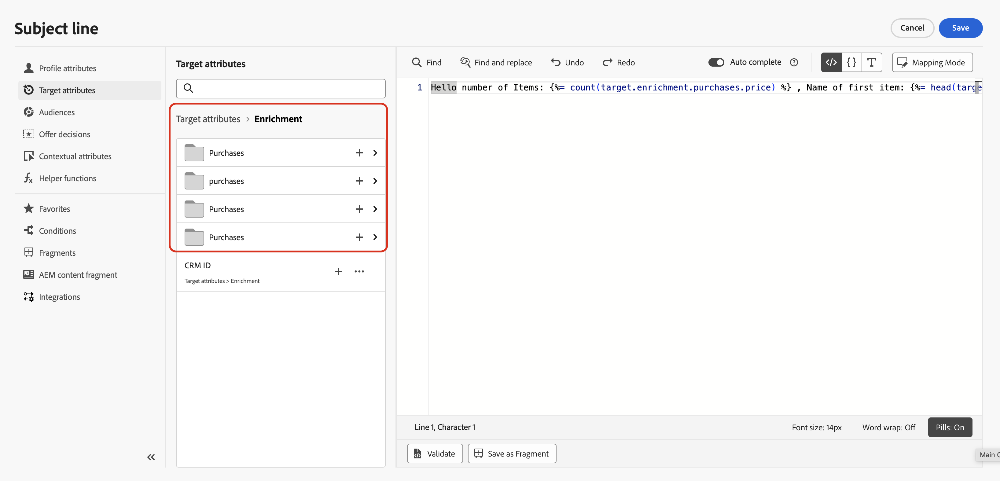

# Añadir personalización en campañas organizadas {#add-personalization}

Después de [organizar actividades](orchestrate-activities.md) en el lienzo y agregar una actividad de canal, personalizas el contenido del mensaje en el correo electrónico, SMS u otro editor de canal.

Personalization en campañas orquestadas funciona de manera similar a otras [!DNL Journey Optimizer] campañas o recorridos, con diferencias vinculadas a la **tabla de trabajo**: atributos calculados por actividades de segmentación y enriquecimiento en el lienzo, no solo datos del almacén de perfiles.

## Acceso al editor de personalización {#access}

1. Abra la campaña orquestada y añada una actividad de canal. [Aprenda a agregar una actividad de canal](activities/channels.md#add)

1. Configure la actividad del canal y, a continuación, abra la pestaña **[!UICONTROL Contenido]** y edite el mensaje.

1. En el editor de mensajes, utilice el editor de personalización para insertar atributos en el contenido.

Para obtener una vista previa y probar el contenido personalizado de la actividad del canal, consulta [Comprobar y probar el contenido](activities/channels.md#simulate-content-test-profiles).

## Atributos de perfil y destino {#attributes}

Al abrir el editor de personalización, dos carpetas principales contienen atributos disponibles para la personalización:

* **[!UICONTROL Atributos de perfil]**

  Datos relacionados con el perfil de [!DNL Adobe Experience Platform]: nombre, dirección de correo electrónico, ubicación y otros rasgos capturados en el perfil del usuario.

* **[!UICONTROL Atributos de destino]** (solo campañas orquestadas)

  Atributos calculados en el lienzo de la campaña desde la tabla de trabajo. Esta carpeta tiene dos subcarpetas:

   * **`<Targeting dimension>`** (por ejemplo, Recipients o Purchases): atributos relacionados con la dimensión de destino en la campaña.

   * **`Enrichment`**: datos agregados a través de **[!UICONTROL actividades de enriquecimiento]** (vínculos relacionales, líneas recopiladas, agregados). Después de un enriquecimiento de **[!UICONTROL Collect data]** de 1:N, obtendrá líneas numeradas y una matriz de colección. [Aprenda a trabajar con datos de colección de enriquecimiento](#enrichment-collections)

Para obtener una descripción detallada del editor de personalización en [!DNL Journey Optimizer], consulte [Introducción a la personalización](../personalization/personalize.md).

## Trabajo con datos de colección de enriquecimiento {#enrichment-collections}

Cuando configura una actividad **[!UICONTROL Enrichment]** con un vínculo 1:N y **[!UICONTROL Collect data]**, los atributos de enriquecimiento están disponibles en **[!UICONTROL Target attributes] > [!UICONTROL Enrichment]** de dos formas:

* **Líneas planas**: un campo por línea recuperada (por ejemplo, **Compra 1**, **Compra 2**, **Compra 3**), cada una con los atributos seleccionados en el vínculo (como precio o producto). Utilícelos cuando necesite espacios fijos separados, por ejemplo `target.enrichment.purchase1.price`.

* **Matriz de colecciones**: una matriz para todas las líneas recopiladas, con el nombre de la etiqueta de vínculo (por ejemplo, **compras**). Use esto cuando necesite trabajar en el conjunto completo de registros, con [funciones de matriz](#array-functions).



Para identificar las líneas planas de la matriz de recopilación, inserte el atributo en el editor de expresiones y lea la ruta generada. La matriz de colección es la entrada cuya ruta de acceso es **plural** (por ejemplo `purchases`) y no tiene **número de línea** (`purchase1`, `purchase2`, etc.).

| Lo que necesita | Ruta en el editor de expresiones |
| --- | --- |
| **Una línea recopilada** | **Numerado** — por ejemplo `target.enrichment.purchase1.price` |
| **La colección completa** | **Plural y sin numerar** — por ejemplo `target.enrichment.purchases.price` |

Puede aplicar las mismas [funciones de matriz y lista](../personalization/functions/arrays-list.md) utilizadas en cualquier otra parte de [!DNL Journey Optimizer] a una colección enriquecida, haciendo referencia a `target.enrichment.<label>`.

Por ejemplo, en una línea de asunto puede mostrar cuántas compras recopiladas existen y el precio del primer artículo:

```sql
Hello number of Items:  , Name of first item: 
```

➡️ [Aprenda a configurar el enriquecimiento de la colección en el lienzo](activities/enrichment.md#collection-personalization)
