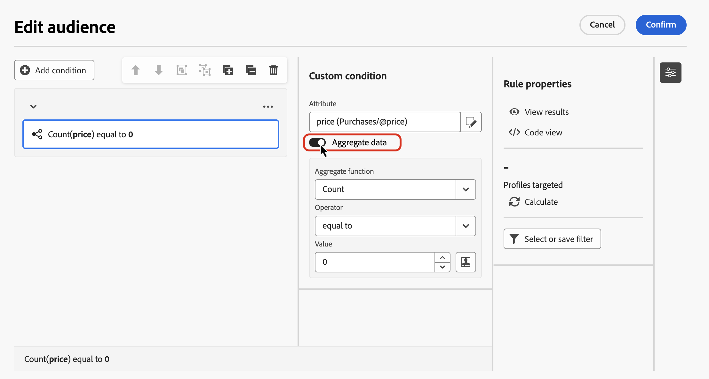

# Cree su primera regla {#build-query}

>[!CONTEXTUALHELP]
>id="ajo_orchestration_querymodeler_selectaudience"
>title="Seleccionar el público"
>abstract="Mediante la opción **Seleccionar público**, puede elegir el público que desea utilizar para filtrar la consulta."

>[!CONTEXTUALHELP]
>id="ajo_orchestration_querymodeler_predefinedfilter"
>title="Filtro predefinido"
>abstract="Mediante la opción **Filtro predefinido**, puede seleccionar un filtro predefinido de la lista de filtros personalizados o de favoritos."

Los pasos principales para crear reglas para las campañas orquestadas son los siguientes:

1. **Añadir condiciones**: cree condiciones personalizadas para filtrar su consulta al generar su propia condición con atributos de la base de datos y expresiones avanzadas.
1. **Combinar condiciones**: organice las condiciones en el lienzo mediante grupos y operadores lógicos.
1. **Comprobar y validar la regla**: compruebe los datos resultantes de la regla antes de guardarla.

## Añada una condición  {#conditions}

>[!CONTEXTUALHELP]
>id="ajo_orchestration_querymodeler_customcondition"
>title="Condición personalizada"
>abstract="Las condiciones personalizadas son componentes de filtrado que le permiten filtrar la consulta creando su propia condición con atributos de la base de datos y expresiones avanzadas."

Para añadir condiciones en la consulta, siga estos pasos:

1. Acceda al generador de reglas desde la actividad **[!UICONTROL Generar público]**.

1. Haga clic en el botón **Añadir condición** para crear una primera condición para la consulta.

   También puede iniciar la consulta utilizando un filtro predefinido. Para ello, haga clic en el botón **[!UICONTROL Seleccionar o guardar filtro]** y elija **[!UICONTROL Seleccionar filtro predefinido]**.

   

1. Identifique el atributo de la base de datos que se utilizará como criterio para la condición. El icono “i” junto a un atributo proporciona información sobre la tabla donde se almacena y su tipo de datos.

   

   >[!NOTE]
   >
   >El botón **Editar expresión** le permite utilizar el editor de expresiones para definir manualmente una expresión con campos de la base de datos y funciones de ayuda. [Más información sobre cómo editar expresiones](../orchestrated/edit-expressions.md)

1. Haga clic en la imagen  situado junto a un atributo para acceder a estas opciones adicionales:

   +++ Distribución de valores

   Analice la distribución de los valores de un atributo determinado dentro de la tabla. Esta función es útil para comprender los valores disponibles, sus recuentos y sus porcentajes. También ayuda a evitar problemas como la incoherencia en las mayúsculas o en la ortografía al crear consultas o expresiones.

   En el caso de los atributos con un gran número de valores, la herramienta solo muestra los veinte primeros. En estos casos, aparece una notificación **[!UICONTROL Carga parcial]** para indicar esta limitación. Puede aplicar filtros avanzados para restringir los resultados mostrados y centrarse en valores específicos o subconjuntos de datos.

   

   +++

   +++ Añadir a favoritos

   Añadir atributos al menú de favoritos le permite acceder rápidamente a los atributos utilizados con más frecuencia. Puede añadir hasta 20 atributos a favoritos. Los atributos favoritos y recientes están asociados con cada usuario dentro de una organización, lo que garantiza la accesibilidad entre diferentes máquinas y proporciona una experiencia perfecta en toda dispositivos.

   Para tener acceso a los atributos que ha marcado como favoritos, use el menú **[!UICONTROL Favoritos y recientes]**. Los atributos favoritos aparecen primero, seguidos por los utilizados recientemente, lo que facilita la localización de los atributos necesarios. Para eliminar un atributo de favoritos, vuelva a seleccionar el icono de estrella.

   

   +++

1. Haga clic en **[!UICONTROL Confirmar]** para añadir el atributo seleccionado a la condición.

1. Se muestra un panel de propiedades, donde puede configurar el valor deseado para el atributo.

   

1. Seleccione de la lista desplegable el **[!UICONTROL operador]** a aplicar. Hay varios operadores disponibles que se pueden utilizar. Los operadores disponibles en la lista desplegable dependen del tipo de datos del atributo.

   +++Lista de operadores disponibles

   | Operador | Objetivo | Ejemplo |
   |---|---|---|
   | Igual a | Devuelve un resultado idéntico a los datos introducidos en la segunda columna Valor. | El apellido (@lastName) equivalente a “Jones” solo devolverá como resultado los destinatarios cuyo apellido sea Jones. |
   | No igual a | Devuelve todos los valores que no son idénticos al valor entrado. | El idioma (@language) no es equivalente a “inglés”. |
   | Mayor que | Devuelve un valor mayor que el valor entrado. | La edad (@age) mayor que 50 devolverá como resultado todos los valores mayores que 50, es decir 51, 52, etc. |
   | Menor que | Devuelve un valor menor que el valor entrado. | La fecha de creación (@created) antes de “DaysAgo(100)” devolverá como resultado todos los destinatarios creados hace menos de 100 días. |
   | Mayor o igual que | Devuelve todos los valores iguales o mayores que el valor entrado. | La edad (@age) mayor o igual que “30” devolverá como resultado todos los destinatarios de 30 años o más. |
   | Menor o igual que | Devuelve todos los valores iguales o inferiores al valor entrado. | La edad (@age) menor o igual que “60” devolverá como resultado todos los destinatarios de 60 años o menos. |
   | Incluido en | Devuelve los resultados incluidos entre los valores indicados. Estos valores deben separarse con una coma. | La fecha de nacimiento (@birthDate) incluida en “10/12/1979,10/12/1984” devolverá como resultado los destinatarios nacidos entre esas fechas. |
   | No en | Funciona como el operador Incluido en. Aquí, los destinatarios se excluyen según los valores introducidos. | La fecha de nacimiento (@birthDate) no está incluida en “10/12/1979,10/12/1984”. No se devolverá como resultado los destinatarios nacidos dentro de estas fechas. |
   | Está vacío | Devuelve los resultados que coinciden con un valor vacío en la segunda columna Valor. | El móvil (@mobilePhone) está vacío y devuelve todos los destinatarios que no tienen un número de móvil. |
   | No está vacío | Funciona de forma inversa al operador Está vacío. No es necesario introducir datos en la segunda columna Valor. | El correo electrónico (@email) no está vacío. |
   | Comienza por | Devuelve los resultados que comienzan con el valor entrado. | El n.º cuenta (@account) comienza con “32010”. |
   | No empieza por | Devuelve los resultados que no empiezan con el valor introducido. | El n.º de cuenta (@account) no comienza con “20”. |
   | Contiene | Devuelve los resultados que contienen al menos el valor entrado. | El dominio de correo electrónico (@domain) que contiene “correo” devuelve todos los nombres de dominio que contengan “correo”, por ejemplo, “gmail.com”. |
   | No contiene | Devuelve los resultados que no contienen el valor entrado. | El dominio de correo electrónico (@domain) no contiene “vo”. Los nombres de dominio que contengan &quot;vo&quot;, como &quot;voila.fr&quot;, no aparecerán en los resultados. |
   | Como | De forma similar al operador Contiene, permite insertar un carácter comodín % en el valor. | Apellido (@lastName) como “Jon%s”. El carácter comodín actúa para encontrar nombres como “Jones”. |
   | No igual | De forma similar al operador Contiene, permite insertar un carácter comodín % en el valor. | Apellido (@lastName) no igual a “Smi%h”. No se devolverán los resultados de los destinatarios cuyo apellido sea “Smith”. |

   +++

1. En el campo **Valor**, defina el valor previsto. También puede utilizar el editor de expresiones para definir manualmente una expresión utilizando los campos de la base de datos y las funciones de ayuda. Para ello, haga clic en el icono . [Más información sobre cómo editar expresiones](../orchestrated/edit-expressions.md)

   Para los atributos de tipo fecha, hay valores predefinidos disponibles mediante la opción **[!UICONTROL Ajustes preestablecidos]**.

   +++Ver ejemplo

   

   +++

### Condiciones personalizadas en las tablas vinculadas (vínculos 1-1 y 1-N){#links}

Las condiciones personalizadas permiten consultar tablas vinculadas a la tabla que utiliza actualmente la regla. Esto incluye tablas con un vínculo de cardinalidad 1-1 o tablas de colección (vínculo 1-N).

Para un **vínculo 1-1**, vaya a la tabla vinculada, seleccione el atributo deseado y defina el valor previsto.

También puede seleccionar directamente un vínculo de tabla en el selector **Valor** y confirmar. En ese caso, los valores disponibles para la tabla seleccionada deben seleccionarse mediante un selector específico, como se muestra en el ejemplo siguiente.

+++Ejemplo de consulta

En este caso, la consulta está segmentada a marcas cuya etiqueta es “en ejecución”.

1. Vaya dentro de la tabla **Marca** y seleccione el atributo **Etiqueta**.

   

1. Defina el valor previsto para el atributo.

   

Este es un ejemplo de consulta en el que se ha seleccionado directamente un vínculo de tabla. Los valores disponibles para esta tabla deben seleccionarse en un selector específico.

+++ 

Para un **vínculo 1-N**, puede definir subcondiciones para restringir la consulta, como se muestra en el ejemplo siguiente.

+++Ejemplo de consulta

En este caso, la consulta está segmentada a los destinatarios que han realizado compras relacionadas con el producto Brewmsaster, por más de 100 USD.

1. Seleccione la tabla **Compras** y confirme.

1. Haga clic en **[!UICONTROL Añadir condición]** para definir las subcondiciones que se aplicarán a la tabla seleccionada.

   

1. Añada subcondiciones para adaptarlas a sus necesidades.

   

+++ 

### Condiciones personalizadas con Agregar datos {#aggregate}

Las condiciones personalizadas le permiten realizar operaciones de agregado. Para ello, debe seleccionar directamente un atributo de una tabla de colección:

1. Desplácese por la tabla de colección deseada y seleccione el atributo en el que desea realizar una operación de agregado.

1. En el panel de propiedades, active la opción **Agregar datos** y seleccione la función de agregado que desee.

   

## Combinación de condiciones mediante operadores {#operators}

>[!CONTEXTUALHELP]
>id="ajo_orchestration_querymodeler_group"
>title="Grupo"
>abstract="En este panel, puede cambiar el operador que se utiliza para vincular las condiciones de filtrado."

Cada vez que añade una nueva condición a la regla, un operador **AND** la vincula automáticamente a la condición existente. Esto significa que los resultados de las dos condiciones se combinan.

Para cambiar el operador entre condiciones, haga clic en él y seleccione el operador deseado.

Los operadores disponibles son los siguientes:

* **AND (intersección)**: combina los resultados que coinciden con todos los componentes de filtrado en las transiciones de salida.
* **OR (unión)**: incluye resultados que coinciden con al menos uno de los componentes de filtrado en las transiciones de salida.
* **EXCEPT (exclusión)**: excluye los resultados que coinciden con todos los componentes de filtrado en la transición de salida.

## Manipulación de condiciones {#manipulate}

La barra de herramientas del lienzo del generador de reglas proporciona opciones para manipular fácilmente las condiciones dentro de la regla:

| Icono Barra de herramientas | Descripción |
|--- |--- |
|  | Mueve el componente una fila hacia arriba. |
|  | Mueve el componente una fila hacia abajo. |
|  | Coloca dos componentes en un grupo. |
|  | Separa los componentes de un solo grupo. |
|  | Expande todos los grupos. |
|  | Contrae todos los grupos. |
|  | Quita todos los grupos y componentes. |

Según sus necesidades, es posible que tenga que crear grupos intermedios de componentes agrupándolos en un mismo grupo y vinculándolos juntos.

* Para agrupar dos condiciones existentes, seleccione una de las dos condiciones y haga clic en el botón  o  para agruparla con la condición por encima o por debajo.

* Para agrupar una condición existente por una nueva, seleccione la condición, haga clic en el botón  y seleccione **[!UICONTROL Añadir grupo]**. Seleccione el nuevo atributo que desea añadir al grupo y confirme.

  

En el siguiente ejemplo, hemos creado un grupo intermedio para clientes de destinatario que compraron el producto BrewMaster o VanillaVelvet.

## Compruebe y valide la consulta

>[!CONTEXTUALHELP]
>id="ajo_orchestration_querymodeler_ruleproperties"
>title="Propiedades de la regla"
>abstract="Una vez que haya creado la consulta en el lienzo, puede comprobarla con el panel **Propiedades de regla** situado en el lado derecho. Este panel permite mostrar los datos resultantes, recuperar una versión de código SQL de la consulta y comprobar el número de registros de destino. Utilice el botón **Seleccionar o guardar filtro** para guardar la consulta como un filtro predefinido o reemplazar el contenido del lienzo con un filtro existente."

Una vez que haya creado la consulta en el lienzo, puede comprobarla con el panel **Propiedades de la regla**. Las operaciones disponibles son las siguientes:

* **Ver resultados:** muestra los datos resultantes de la consulta.
* **Vista de código**: muestra una versión basada en código de la consulta en SQL.
* **Calcular**: actualiza y muestra el número de registros a los que se destina la regla.
* **Seleccionar o guardar filtro**: elija un filtro predefinido existente para utilizarlo en el lienzo o guarde la consulta como un filtro predefinido para reutilizarlo en el futuro.

 

Cuando la regla esté lista, haga clic en el botón **[!UICONTROL Confirmar]** para guardarla.

>[!IMPORTANT]
>
>Al seleccionar un filtro predefinido en el panel de propiedades de la regla, se sustituye la regla que se ha creado en el lienzo por el filtro seleccionado.

