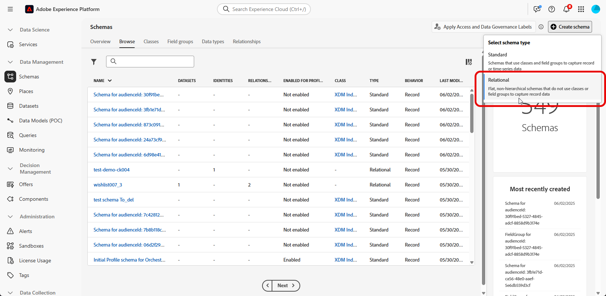
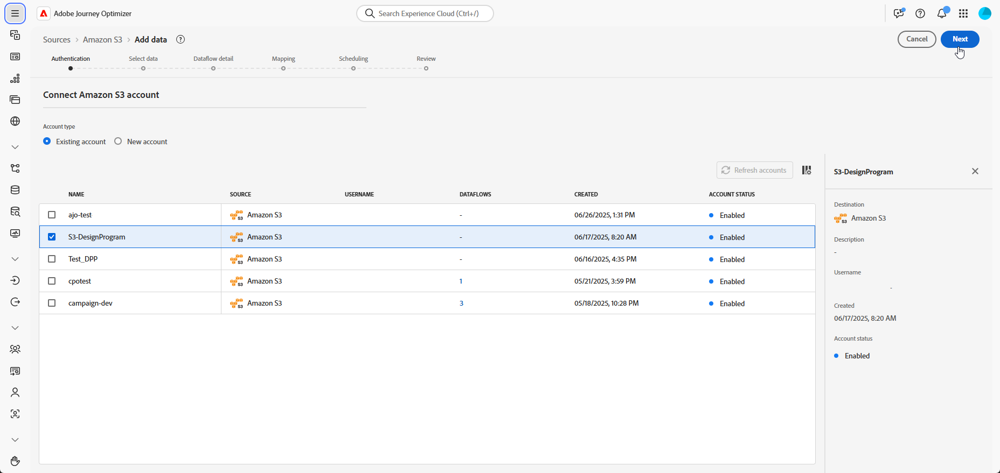

# Pasos de configuración {#configuration-steps}

+++ Tabla de contenido

| Bienvenido a campañas orquestadas | Inicio de su primera campaña organizada | Consultar la base de datos | Actividades de las campañas organizadas |
|---|---|---|---|
| [Introducción a las campañas orquestadas](gs-orchestrated-campaigns.md)<br/><br/><b>[Pasos de configuración](configuration-steps.md)</b><br/><br/>[Acceso y administración de campañas orquestadas](access-manage-orchestrated-campaigns.md) | [Pasos clave para la creación de campañas orquestadas](gs-campaign-creation.md)<br/><br/>[Cree y programe las actividades de la campaña](create-orchestrated-campaign.md)<br/><br/>[Organice las actividades](orchestrate-activities.md)<br/><br/>[Inicie y supervise la campaña](start-monitor-campaigns.md)<br/><br/>[Creación de informes](reporting-campaigns.md) | [Trabaje con el generador de reglas](orchestrated-rule-builder.md)<br/><br/>[Cree su primera consulta](build-query.md)<br/><br/>[Edite expresiones](edit-expressions.md) | [Empiece con las actividades](activities/about-activities.md)<br/><br/>Actividades:<br/>[Y únase](activities/and-join.md) - [Generar audiencia](activities/build-audience.md) - [Cambiar dimensión](activities/change-dimension.md) - [Actividades de canal](activities/channels.md) - [Combinar](activities/combine.md) - [Anulación de duplicación](activities/deduplication.md) - [Enriquecimiento](activities/enrichment.md) - [Bifurcación](activities/fork.md) - [Reconciliación](activities/reconciliation.md) - [División](activities/split.md) - [Espera](activities/wait.md) |

{style="table-layout:fixed"}

+++

</br>

>[!BEGINSHADEBOX]

Documentación en curso

>[!ENDSHADEBOX]

Esta guía muestra el proceso de creación de un esquema relacional, configuración de un conjunto de datos para campañas orquestadas, ingesta de datos a través de una fuente S3 y consulta de los datos ingeridos en la plataforma AP.

En este ejemplo, la configuración incluye la integración de dos entidades clave, **Transacciones de fidelidad** y **Recompensas de fidelidad**, y su vinculación a entidades principales existentes **Destinatarios** y **Marcas**.


1. [Cargar archivo DDL](#upload-ddl)

   Defina el modelo de datos relacional para las campañas orquestadas, incluidas las entidades **Transacciones de fidelidad** y **Recompensas de fidelidad**, junto con las claves y los atributos de versiones necesarios.

1. [Seleccionar entidades](#entities)

   Establezca relaciones significativas entre las tablas del esquema para crear un modelo de datos coherente e interconectado.

1. [Esquema de vínculo](#link-schema)

   Vincule la entidad **Transacciones de fidelización** a **Destinatarios**, y **Recompensas de fidelidad** a **Marcas**, para crear un modelo de datos conectado que admita recorridos de cliente personalizados.

1. [Ingesta de datos](#ingest)

   Incluya datos en Adobe Experience Platform desde fuentes compatibles como SFTP, almacenamiento en la nube o bases de datos.

## Cargar archivo DDL {#upload-ddl}

En esta sección se proporciona una guía paso a paso sobre cómo crear un esquema relacional en Adobe Experience Platform cargando un archivo DDL (lenguaje de definición de datos). El uso de un archivo DDL permite definir la estructura del modelo de datos por adelantado, incluidas tablas, atributos, claves y relaciones.

1. Inicie sesión en la plataforma AP.

1. Vaya a **Administración de datos** > **Esquema**.

1. Haz clic en **Crear esquema**.

1. Se le pedirá que seleccione entre dos tipos de esquema:

   * **Standard**
   * **Relacional**, se usa específicamente para campañas orquestadas

   

1. Seleccione **Cargar archivo DDL** para definir un diagrama de relación de entidad y crear esquemas.

   La estructura de la tabla debe contener:
   * Al menos una clave principal
   * Un identificador de versión, como un campo `lastmodified` de tipo `datetime` o `number`.

1. Arrastre y suelte su archivo DDL y haga clic en **[!UICONTROL Siguiente]**.

1. Escriba su **[!UICONTROL nombre de esquema]**.

1. Configure cada esquema y sus columnas, asegurándose de que se especifica una clave principal.

   Un atributo, como `lastmodified`, debe designarse como descriptor de versión. Este atributo, normalmente de tipo `datetime`, `long` o `int`, es esencial para los procesos de ingesta a fin de garantizar que el conjunto de datos se actualice con la última versión de datos.

   

1. Haga clic en **[!UICONTROL Listo]** una vez finalizado.

Ahora puede comprobar las definiciones de tabla y campo dentro del lienzo. [Obtenga más información en la sección siguiente](#entities)

## Seleccionar entidades {#entities}

Para definir conexiones lógicas entre tablas dentro del esquema, siga los pasos a continuación.

1. Acceda a la vista de lienzo del modelo de datos y elija las dos tablas que desea vincular

1. Haga clic en el botón  junto a Source Join y, a continuación, arrastre y guíe la flecha hacia Target Join para establecer la conexión.

   

1. Complete el formulario proporcionado para definir el vínculo y haga clic en **Aplicar** una vez configurado.

   

   **Cardinalidad**:

   * **1-N**: una incidencia de la tabla de origen puede tener varias incidencias correspondientes de la tabla de destino, pero una incidencia de la tabla de destino puede tener como máximo una incidencia correspondiente de la tabla de origen.

   * **N-1**: una incidencia de la tabla de destino puede tener varias incidencias correspondientes de la tabla de origen, pero una incidencia de la tabla de origen puede tener como máximo una incidencia correspondiente de la tabla de destino.

   * **1-1**: una incidencia de la tabla de origen puede tener como máximo una incidencia correspondiente de la tabla de destino.

1. Todos los vínculos definidos en el modelo de datos se representan como flechas en la vista de lienzo. Haga clic en una flecha entre dos tablas para ver los detalles, realizar ediciones o quitar el vínculo según sea necesario.

   

1. Utilice la barra de herramientas para personalizar y ajustar el lienzo.

   

   * **Acercar**: amplíe el lienzo para ver los detalles del modelo de datos con mayor claridad.

   * **Alejar**: reduzca el tamaño del lienzo para obtener una vista más amplia del modelo de datos.

   * **Ajustar vista**: ajuste el zoom para ajustar todos los esquemas dentro del área visible.

   * **Filtro**: elija qué esquema mostrar en el lienzo.

   * **Forzar diseño automático**: organiza automáticamente los esquemas para mejorar la organización.

   * **Mostrar mapa**: cambie una superposición de mapa mínimo para que sea más fácil navegar por diseños de esquema grandes o complejos.

1. Haga clic en **Guardar** una vez finalizado. Esta acción crea los esquemas y los conjuntos de datos asociados y habilita el conjunto de datos para su uso en campañas orquestadas.

1. Haga clic en **[!UICONTROL Abrir trabajos]** para supervisar el progreso del trabajo de creación. Este proceso puede tardar un par de minutos, según el número de tablas definidas en el archivo DDL.

   

## Esquema de vínculo {#link-schema}

Establezca una relación entre el esquema **transacciones de fidelidad** y el esquema **Destinatarios** para asociar cada transacción con el registro de cliente correcto.

1. Vaya a **[!UICONTROL Esquemas]** y abra las **transacciones de fidelización** que creó anteriormente.

1. Haga clic en **[!UICONTROL Agregar relación]** desde las **[!UICONTROL propiedades de campo]** del cliente.

   

1. Seleccione **[!UICONTROL Varios a uno]** como la relación **[!UICONTROL Tipo]**.

1. Vínculo al esquema **Recipients** existente.

   

1. Escriba un **[!UICONTROL nombre de relación del esquema actual]** y **[!UICONTROL nombre de relación del esquema de referencia]**.

1. Haga clic en **[!UICONTROL Aplicar]** para guardar los cambios.

Continúe creando una relación entre el esquema **recompensas por fidelidad** y el esquema **Marcas** para asociar cada entrada de recompensa con la marca adecuada.


## Ingesta de datos {#ingest}

Adobe Experience Platform permite la ingesta de datos desde fuentes externas, al tiempo que le ofrece la capacidad de estructurar, etiquetar y mejorar los datos entrantes mediante los servicios de Experience Platform. Puede ingerir datos de una variedad de fuentes, como aplicaciones de Adobe, almacenamiento basado en la nube, bases de datos y muchas otras.

1. Desde el menú **[!UICONTROL Conexiones]**, acceda al menú **[!UICONTROL Fuentes]**.

1. Seleccione la categoría **[!UICONTROL Cloud Storage]**, luego Amazon S3 y haga clic en **[!UICONTROL Agregar datos]**.

   

1. Conecte su cuenta S3:

   * Con una cuenta existente

   * Con una cuenta nueva

   [Obtenga más información en la documentación de Adobe Experience Platform](https://experienceleague.adobe.com/en/docs/experience-platform/destinations/catalog/cloud-storage/amazon-s3#connect)

   

1. Elija su carpeta **[!UICONTROL Formato de datos]**, **[!UICONTROL Delimitador]** y **[!UICONTROL Tipo de compresión]**.

1. Navegue por el origen de S3 conectado hasta que encuentre las dos carpetas creadas anteriormente, es decir, **recompensas de fidelidad** y **transacciones de fidelidad**.

1. Seleccione la carpeta que contiene los datos.

   Al seleccionar una carpeta, se garantiza que todos los archivos actuales y futuros con la misma estructura se procesen automáticamente. Sin embargo, para seleccionar un solo archivo es necesario cargar manualmente cada incremento de datos nuevo.

   

1. Elija su carpeta **[!UICONTROL Formato de datos]**, **[!UICONTROL Delimitador]** y **[!UICONTROL Tipo de compresión]**. Revise los datos de ejemplo para comprobar su precisión y, a continuación, haga clic en **[!UICONTROL Siguiente]**.

   

1. Marque **[!UICONTROL Habilitar la captura de datos modificados]** para seleccionar entre conjuntos de datos asignados a esquemas relacionales que tienen una clave principal y un descriptor de versión definidos.

1. Seleccione su [conjunto de datos](#entities) creado anteriormente y haga clic en **[!UICONTROL Siguiente]**.

   

1. En la ventana **[!UICONTROL Mapping]**, compruebe que cada atributo del archivo de origen esté asignado correctamente con los campos correspondientes del esquema de destino.

   Haga clic en **[!UICONTROL Siguiente]** una vez finalizado.

   

1. Configure el flujo de datos **[!UICONTROL Programar]** según la frecuencia que desee.

1. Haga clic en **[!UICONTROL Finalizar]** para crear el flujo de datos. Se ejecutará automáticamente según la programación definida.

1. En el menú **[!UICONTROL Conexiones]**, seleccione **[!UICONTROL Fuentes]** y acceda a la pestaña **[!UICONTROL Flujos de datos]** para rastrear la ejecución del flujo, revisar los registros ingeridos y solucionar cualquier error.

   

<!--manual
## Create a relational schema manual


1. Log in to the AP Platform.
1. Navigate to the **Schema Management** section.
1. Click on **Create Schema**.

1. You will be prompted to select between two schema types:
    * **Standard**
    * **Relational** (used specifically for AGO campaigns)

1. Click on **Create Manual**.
1. Provide a **Schema Name** (e.g., `test_demo_ck001`).
1. Choose **Schema Type**:
    - **Record Type** (required for AGO campaigns)
    - **Time Series** (not applicable here)
1. Click **Finish** to proceed to the schema design canvas.

## Select entities and fields to import

1. In the canvas, add attributes (fields) to your schema.
1. Add a **Primary Key** (mandatory).
1. Add a **Version Descriptor** attribute (for CDC support):
    - This must be of type **DateTime** or **Numeric** (Integer, Long, Short, Byte).
    - Common example: `last_modified`

> **Why?** The **Primary Key** uniquely identifies each record, and the **Version Descriptor** tracks changes, supporting CDC (Change Data Capture) and data mirroring.

1. Mark the appropriate fields as **Primary Key** and **Version Descriptor**.
1. Click **Save**.

---


## 5. Creating a Dataset

1. Navigate to **Datasets**.
1. Click on **Create Dataset**.
1. Select the schema you just created.
1. Assign a **Dataset Name** (same as schema is fine).
1. Optionally, add tags (e.g., `AGO_campaigns`).
6. Ensure the checkbox **"Relational Schema"** is checked.
7. Click **Finish**.

> **Note:** Only one dataset can be created per relational schema.


## 6. Enabling the Dataset

1. Click **Enable** for the dataset.
1. Wait a few moments for the status to show **Enabled**.

> **Why?** Without enabling, the dataset cannot be used in orchestrated campaigns or ingest data.

## 7. Creating a Data Source (S3)

1. Navigate to **Sources**.
1. Click **Create Source**.
1. Choose the source type (e.g., **S3 Bucket**).
1. Provide connection details:
    - Bucket Path (optionally include subfolder path)
1. Save the source.

## 8. Preparing and Uploading Data

1. Prepare your CSV file with:
    - Column headers matching your schema attributes
    - `last_modified` column
    - `change_type` column (`U`/`DU` for upsert, `D` for delete)

> **Important:** `change_type` is required but does not need to be defined in the schema.

1. Save the file as `.csv`.

1. Upload the file to the specified folder in your S3 bucket.


## 9. Ingesting Data from S3

1. Go to **Sources** and find your S3 source.
1. Click **Add Data**.
1. Select the uploaded file.
1. Specify the file format as **CSV** and any compression type if applicable.
1. Review the data preview (ensure `change_type`, `last_modified`, and primary key are visible).
1. Click **Next**.

### Enable Change Data Capture (CDC)

- Check **Enable Change Data Capture**.
- Select the dataset enabled for AGO campaigns.

### Field Mapping

- Fields are auto-mapped (note that `change_type` is not mapped and that's expected).
- Click **Next**.

### Scheduling

- Schedule ingestion frequency (minute, hour, day, week).
- Set start time (immediate or future).
- Click **Finish** to create the data flow.

## 10. Monitoring Data Flow

1. Navigate back to **Sources > Data Flows**.
1. Wait 4–5 minutes for the first run (initial overhead).
1. Monitor:
    - Status (Started, Completed)
    - Number of records ingested
    - Errors (if any)

> **Tip:** Ingested data first lands in the **Data Lake**.

## 11. Data Replication to Data Store

The **Data Store** is updated:

- Every **15 minutes**, or

- If **Data Lake size exceeds 5MB**

This is a background replication process.


## 12. Querying the Dataset

1. Navigate to **Query Services**.
1. Click **Create Query**.
1. Example query:

   ```sql
   SELECT * FROM test_demo_ck001;
   ```

1. Run the query.

> **Note:** If ingestion is incomplete, query will return an error. Check data flow status.

-->