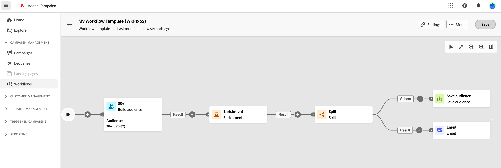

# Creación y programación de una campaña organizada {#create-first-campaign}

>[!CONTEXTUALHELP]
>id="ajo_campaign_creation_workflow"
>title="Lista de campañas de orquestadas"
>abstract="La pestaña **Orchestration** enumera todas las campañas orquestadas. Haga clic en el nombre de una campaña orquestada para editarla. Utilice el botón **Crear campaña orquestada** para añadir una nueva campaña orquestada."

+++ Tabla de contenido

| Bienvenido a campañas orquestadas | Inicio de su primera campaña organizada | Consultar la base de datos | Actividades de las campañas organizadas |
|---|---|---|---|
| [Introducción a las campañas orquestadas](gs-orchestrated-campaigns.md)  [Pasos de configuración](configuration-steps.md)  [Acceso y administración de campañas orquestadas](access-manage-orchestrated-campaigns.md) | [Pasos clave para la creación de campañas orquestadas](gs-campaign-creation.md)  <b>[Cree y programe las actividades de la campaña](create-orchestrated-campaign.md)</b>  [Orqueste actividades](orchestrate-activities.md)  [Envíe mensajes con campañas orquestadas](send-messages.md)  [Inicie y supervise la campaña](start-monitor-campaigns.md)  [Creación de informes](reporting-campaigns.md) | [Trabaje con el generador de reglas](orchestrated-rule-builder.md)  [Cree su primera consulta](build-query.md)  [Edite expresiones](edit-expressions.md) | [Empiece con las actividades](activities/about-activities.md)  Actividades: [Y únase](activities/and-join.md) - [Generar audiencia](activities/build-audience.md) - [Cambiar dimensión](activities/change-dimension.md) - [Combinar](activities/combine.md) - [Anulación de duplicación](activities/deduplication.md) - [Enriquecimiento](activities/enrichment.md) - [Bifurcación](activities/fork.md) - [Reconciliación](activities/reconciliation.md) - [División](activities/split.md) - [Espera](activities/wait.md) |

{style="table-layout:fixed"}

+++

 

>[!BEGINSHADEBOX]

Documentación en curso

>[!ENDSHADEBOX]

## Creación de la campaña {#create}

Para crear una campaña orquestada, siga estos pasos:

1. Vaya al menú **[!UICONTROL Campañas]**, seleccione la pestaña **[!UICONTROL Orquestación]** y seleccione **[!UICONTROL Crear campaña]**.

   

1. Introduzca un nombre para la campaña orquestada. Además, le recomendamos encarecidamente que añada una descripción en el campo dedicado.

1. (opcional) Utilice el campo **Etiquetas** para asignar etiquetas unificadas de Adobe Experience Platform a la campaña orquestada. Esto le permite clasificarlos fácilmente y mejorar la búsqueda desde la lista de campañas. [Aprenda a trabajar con etiquetas](../start/search-filter-categorize.md#tags).

1. Haga clic en el botón **[!UICONTROL Crear]** para confirmar.

La campaña orquestada se habrá creado y estará disponible en la lista de campañas. Puede cambiar estas propiedades en cualquier momento haciendo clic en el icono  en el lienzo de la campaña.

## Programación de la campaña {#schedule}

De forma predeterminada, las campañas orquestadas se inician una vez que se activan manualmente y finalizan en cuanto se ejecutan sus actividades.

Si no desea ejecutar una campaña orquestada justo después de su activación, puede especificar una fecha y una hora a las que debe ejecutarse. También puede ejecutar la campaña a frecuencias regulares según varios criterios.

Para configurar la programación de la campaña, abra la campaña orquestada y haga clic en el botón **[!UICONTROL Lo antes posible]**.

<!--In the Execution frequency field, select 

time zone

daily, weekly, monthly
several times a day based on specific hours or periodically

recurring frequencies (all except as soon and once)
preview launch times
validity period

>[!NOTE]
>
>When scheduling campaigns in [!DNL Adobe Journey Optimizer], ensure your start date/time aligns with the desired first delivery. For recurring campaigns, if the initial scheduled time has already passed, the campaigns will roll over to the next available time slot according to their recurrence rules.

## Work with orchestrated campaign templates {#campaign-templates}

>[!CONTEXTUALHELP]
>id="ajo_workflow_template_for_campaign"
>title="Orchestrated campaign templates"
>abstract="Orchestrated campaign templates contain pre-configured settings and activities which can be reused for creating new orchestrated campaign."

>[!CONTEXTUALHELP]
>id="ajo_workflow_template_creation_properties"
>title="Orchestrated campaign properties"
>abstract="Orchestrated campaign templates contain pre-configured settings and activities which can be reused for creating new orchestrated campaigns. In this screen, enter the label of the orchestrated campaign template and configure its settings such as its internal name, folder and execution folders, timezone, and supervisor group."

Orchestrated campaign templates contain pre-configured settings and activities which can be reused for creating new orchestrated campaigns. You can select the template of your orchestrated campaign from the orchestrated campaign properties, when creating an orchestrated campaign. An empty template is provided by default.

You can create a template from an existing orchestrated campaign, or create a new template from scratch. Both methods are detailed below.

>[!BEGINTABS]

>[!TAB Create a template from an existing orchestrated campaign]

To create an orchestrated campaign template from an existing orchestrated campaign, follow these steps:

1. Open to the **Campaign** menu and browse to the orchestrated campaign to save as a template.
1. Click the three dots on the right of the name of the orchestrated campaign, and choose **Copy as template**.
1. In the popup window, confirm the template creation.
1. In the orchestrated campaign template canvas, check, add, and configure the activities as needed.
1. Browse to the settings, from the **Settings** button, to change the name of the orchestrated campaign template, and enter a description.
1. Select the **folder** and **execution folder** of the template. The folder is the location where the orchestrated campaign template is saved. The execution folder is the folder where orchestrated campaigns created based on this template are saved.
1. Save your changes. 

The orchestrated campaign template is now available in the template list. You can create an orchestrated campaign based on this template. This orchestrated campaign will be pre-configured with the settings and activities defined in the template.

>[!TAB Create a template from scratch]

To create an orchestrated campaign template from scratch, follow these steps:

1. Open to the **Campaign** menu and browse to the **Templates** tab. You can see the list of available orchestrated campaign templates.
1. Click the **[!UICONTROL Create template]** button in the upper-right corner of the screen.
1. Enter the label and open the additional options to enter a description of your orchestrated campaign template.
1. Select the folder and execution folder of the template. The folder is the location where the orchestrated campaign template is saved. The execution folder is the folder where orchestrated campaigns created based on this template are saved.
1. Click the **Create** button to confirm your settings.
1. In the orchestrated campaign template canvas, add and configure the activities as needed.

     {zoomable="yes"}

1. Save your changes. 

The orchestrated campaign template is now available in the template list. You can create an orchestrated campaign based on this template. This orchestrated campaign will be pre-configured with the settings and activities defined in the template.

>[!ENDTABS]

## Next steps {#next}

Once your campaign configuration and content are ready, you can review and activate it. [Learn more](review-activate-campaign.md)

-->