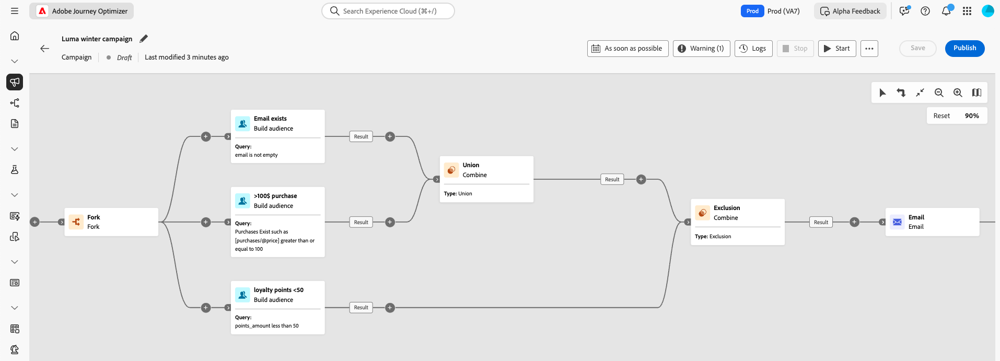

# Introducción a las campañas organizadas {#orchestrated-camp}

>[!CONTEXTUALHELP]
>id="campaigns_overview_orchestrated"
>title="campaigns_overview_orchestrated"
>abstract="<b>Organización de campaña</b> Divida, combine, enriquezca y manipule conjuntos de datos relacionales para definir su audiencia  "

<b>Aproveche los datos de varias entidades</b> Descubra cómo las campañas orquestadas pueden aprovechar los conjuntos de datos relacionales para enriquecer los datos para la segmentación y personalización  <b>Segmentación ad hoc y recuentos exactos</b> Cree su segmento paso a paso con recuentos exactos  <b>Canales disponibles</b> Correo electrónico, SMS, notificaciones push, Correo directo&quot;

+++ Índice

| Bienvenido a las campañas organizadas | Inicio de su primera campaña organizada | Consulta de la base de datos | Actividades de las campañas organizadas |
|---|---|---|---|
| <b>[Empiece a usar las campañas orquestadas](gs-orchestrated-campaigns.md)</b>  Cree y administre conjuntos de datos y esquemas relacionales:  <ul><li>[Introducción a esquemas y conjuntos de datos](gs-schemas.md)</li><li>[Esquema manual](manual-schema.md)</li><li>[Esquema de carga de archivos](file-upload-schema.md)</li><li>[Ingesta de datos](ingest-data.md)</li></ul>[Acceder y administrar campañas orquestadas](access-manage-orchestrated-campaigns.md)  [Pasos clave para crear una campaña orquestada](gs-campaign-creation.md) | [Creación y programación de las campañas](create-orchestrated-campaign.md)  [Organización de actividades](orchestrate-activities.md)  [Inicio y monitorización de las campañas](start-monitor-campaigns.md)  [Creación de informes](reporting-campaigns.md) | [Trabajo con el generador de reglas](orchestrated-rule-builder.md)  [Creación de su primera consulta](build-query.md)  [Edición de expresiones](edit-expressions.md)  [Resegmentación](retarget.md) | [Introducción a las actividades](activities/about-activities.md)  Actividades: [AND-join](activities/and-join.md) - [Generar público](activities/build-audience.md) - [Cambiar dimensión](activities/change-dimension.md) - [Actividades del canal](activities/channels.md) - [Combinar](activities/combine.md) - [Deduplicación](activities/deduplication.md) - [Enriquecimiento](activities/enrichment.md) - [Bifurcación](activities/fork.md) - [Reconciliación](activities/reconciliation.md) - [Guardar público](activities/save-audience.md) - [División](activities/split.md) - [Esperar](activities/wait.md) |

{style="table-layout:fixed"}

+++

 

>[!BEGINSHADEBOX]

 

El contenido de esta página no es definitivo y puede estar sujeto a cambios.

>[!ENDSHADEBOX]

La organización de campañas en [!DNL Adobe Journey Optimizer] potencia campañas de marketing sofisticadas iniciadas por la marca en todos los canales, lo que le ayuda a aumentar la participación, los ingresos y la lealtad de los clientes a escala.

Aunque el marketing multicanal es esencial, las campañas orquestadas lo hacen fluido. Con una interfaz visual de arrastrar y soltar, puede diseñar y automatizar flujos de trabajo de marketing complejos, desde la segmentación hasta la entrega de mensajes, en varios canales. Todo sucede en un entorno intuitivo, creado para la velocidad, el control y la eficacia.

{zoomable="yes"}

## Funcionalidades principales

La organización de campañas se basa en cuatro pilares clave:

<table style="table-layout:auto">
<tr style="border: 0;">
<td></a></td><td><b>Las audiencias a petición</b> consultan instantáneamente entre conjuntos de datos para crear segmentos de audiencia usando cualquier combinación de tipos de datos y dimensiones.</td></tr>
<tr style="border: 0;">
<td></a></td><td><b>Segmentación y envío de varias entidades</b> Vaya más allá de las campañas basadas en personas: use entidades como catálogos de productos, ubicaciones de tiendas o datos de servicio para segmentar con precisión.</td></tr>
<tr style="border: 0;">
<td></a></td><td><b>Visibilidad y precisión previas al envío</b> Obtenga recuentos de segmentación exactos y un ámbito de campaña completo antes del lanzamiento, lo que garantiza precisión y confianza.</td></tr>
<tr style="border: 0;">
<td></a></td><td><b>Flujos de trabajo de campañas de varios pasos</b> Diseña campañas de varios pasos, desde mensajes diarios hasta campañas complejas como promociones de temporada o lanzamientos de productos importantes.</td></tr>
</table>

## Campañas y recorridos organizados

Aunque la visualización de campañas orquestadas tiene similitudes con los recorridos, resuelve diferentes propósitos y casos de uso:

* **Recorridos**: lienzo de 1 a 1 en el que cada perfil viaja por los diferentes pasos a su propio ritmo. El estado de cada cliente se mantiene dentro de su contexto para almacenar en déclencheur las acciones en tiempo real.

* **Campañas orquestadas**: a diferencia de los recorridos, las campañas orquestadas funcionan con un lienzo por lotes que calcula los segmentos. Todos los perfiles se procesan juntos al mismo tiempo.

## Requisitos previos

Antes de trabajar con campañas orquestadas, es esencial asegurarse de que tiene los permisos adecuados. El acceso a las campañas orquestadas está restringido a los usuarios asignados a un **[!UICONTROL perfil de producto]** relevante, como administrador de campañas orquestadas, aprobador de campañas orquestadas, administrador de campañas orquestadas o visor de campañas orquestadas.

Si no puede acceder a las funcionalidades de la campaña orquestada, póngase en contacto con el administrador para solicitar los permisos necesarios.

➡️ [Más información acerca de perfiles de producto relacionados con Campañas orquestadas](../administration/ootb-product-profiles.md)

## Vamos a profundizar

Ahora que comprende lo que son las campañas orquestadas, es hora de profundizar en estas secciones de documentación para empezar a trabajar con la función.

<table><tr style="border: 0; text-align: center;">
<td>

<a href="gs-campaign-creation.md"><strong>Pasos de configuración</strong></a>

</td>
<td>

<a href="create-orchestrated-campaign.md"><strong>Creación de una campaña organizada</strong>

</td>
<td>

<a href="activities/about-activities.md"><strong>Trabajo con actividades</strong></a>

</td>
</tr></table>
