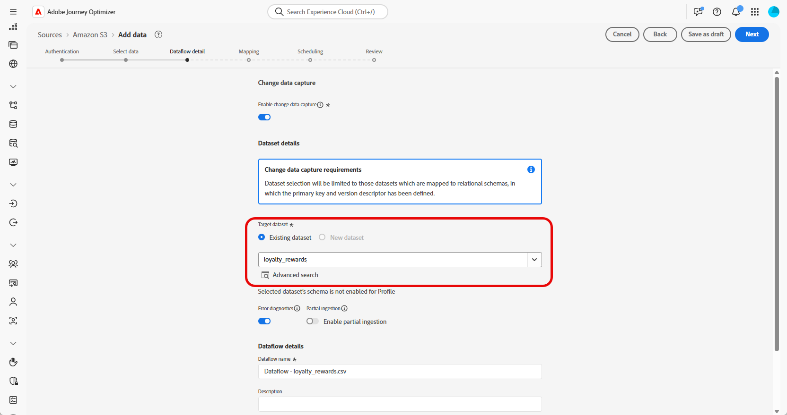

# Ingesta de datos {#ingest-data}

>[!IMPORTANT]
>
>Para cambiar el origen de datos de un conjunto de datos, primero debe eliminar el flujo de datos existente antes de crear uno nuevo que haga referencia al mismo conjunto de datos y al nuevo origen.
>
>Adobe Experience Platform aplica una estricta relación uno a uno entre flujos y conjuntos de datos. Esto le permite mantener la sincronización entre el origen y el conjunto de datos para una ingesta incremental precisa.

Adobe Experience Platform permite la ingesta de datos desde fuentes externas, al tiempo que ofrece la posibilidad de estructurar, etiquetar y mejorar los datos entrantes mediante los servicios de Experience Platform. Puede ingerir datos de una variedad de fuentes, como aplicaciones de Adobe, almacenamiento basado en la nube, bases de datos y muchas otras.

Un conjunto de datos es una construcción de almacenamiento y administración para una colección de datos, normalmente una tabla, que contiene un esquema (columnas) y campos (filas). Los datos que se incorporan correctamente a Experience Platform se almacenan dentro del lago de datos como conjuntos de datos.

## Fuentes compatibles con campañas organizadas {#supported}

Los siguientes recursos son compatibles con las campañas orquestadas:

<table>
  <thead>
    <tr>
      <th>Tipo</th>
      <th>Fuente</th>
    </tr>
  </thead>
  <tbody>
    <tr>
      <td rowspan="3">Almacenamiento en la nube</td>
      <td><a href="https://experienceleague.adobe.com/es/docs/experience-platform/sources/ui-tutorials/create/cloud-storage/s3">Amazon S3</a></td>
    </tr>
    <tr>
      <td><a href="https://experienceleague.adobe.com/es/docs/experience-platform/sources/ui-tutorials/create/cloud-storage/google-cloud-storage">Almacenamiento en la nube de Google</a></td>
    </tr>
    <tr>
      <td><a href="https://experienceleague.adobe.com/es/docs/experience-platform/sources/ui-tutorials/create/cloud-storage/sftp">SFTP</a></td>
    </tr>
      <td rowspan="4">Almacenes de datos en la nube</td>
      <td><a href="https://experienceleague.adobe.com/es/docs/experience-platform/sources/ui-tutorials/create/databases/snowflake">Snowflake</a></td>
    </tr>
    <tr>
      <td><a href="https://experienceleague.adobe.com/es/docs/experience-platform/sources/ui-tutorials/create/databases/bigquery">Google BigQuery</a></td>
    </tr>
    <tr>
      <td><a href="https://experienceleague.adobe.com/es/docs/experience-platform/sources/ui-tutorials/create/cloud-storage/data-landing-zone">Zona de aterrizaje de datos<a></td>
    </tr>
    <tr>
      <td><a href="https://experienceleague.adobe.com/es/docs/experience-platform/sources/ui-tutorials/create/databases/databricks">Azure Databricks</a></td>
    </tr>
    <tr>
      <td rowspan="3">Cargas basadas en archivos</td>
      <td><a href="https://experienceleague.adobe.com/es/docs/experience-platform/sources/ui-tutorials/create/local-system/local-file-upload">Carga de archivo local<a></td>
    </tr>

</tbody>
</table>

## Directrices para la higiene de los datos de esquemas basados en modelos {#cdc}

Para los conjuntos de datos habilitados con **[!UICONTROL Cambiar captura de datos]**, todos los cambios de datos, incluidas las eliminaciones, se reflejarán automáticamente desde el sistema de origen a Adobe Experience Platform.

Dado que Adobe Journey Optimizer Campaign requiere que todos los conjuntos de datos incorporados estén habilitados con **[!UICONTROL Cambiar captura de datos]**, es responsabilidad del cliente administrar las eliminaciones en el origen. Cualquier registro eliminado del sistema de origen se eliminará automáticamente del conjunto de datos correspondiente en Adobe Experience Platform.

Para eliminar registros mediante la ingesta basada en archivos, el archivo de datos del cliente debe marcar el registro con un valor `D` en el campo `Change Request Type`. Esto indica que el registro debe eliminarse en Adobe Experience Platform, reflejando el sistema de origen.

Si el cliente desea eliminar registros solo de Adobe Experience Platform sin afectar a los datos de origen originales, están disponibles las siguientes opciones:

* **Replicación de captura de datos proxy o saneada para cambio**

  El cliente puede crear una tabla de origen proxy o saneada para controlar qué registros se replican en Adobe Experience Platform. Las eliminaciones se pueden administrar de forma selectiva desde esta tabla intermedia.

* **Eliminación mediante Data Distiller**

  Si tiene licencia, **Data Distiller** se puede usar para admitir operaciones de eliminación directamente en Adobe Experience Platform, independientemente del sistema de origen.

  [Más información sobre Data Distiller](https://experienceleague.adobe.com/es/docs/experience-platform/query/data-distiller/overview)

## Configuración de un flujo de datos

En este ejemplo se muestra cómo configurar un flujo de datos que ingiere datos estructurados en Adobe Experience Platform. El flujo de datos configurado admite la ingesta automatizada y programada y permite realizar actualizaciones en tiempo real.

1. Desde el menú **[!UICONTROL Conexiones]**, acceda al menú **[!UICONTROL Fuentes]**.

1. Elija su fuente según las [Fuentes compatibles con las campañas orquestadas](#supported).

   

1. Conecte su cuenta de Cloud Storage o Google Cloud Storage si elige fuentes basadas en la nube.

   

1. Elija los datos que desea introducir en Adobe Experience Platform.

   

1. En la página **[!UICONTROL Detalles del conjunto de datos]**, marque **[!UICONTROL Habilitar la captura de datos de cambio]** para mostrar solo los conjuntos de datos asignados a esquemas basados en modelos e incluir una clave principal y un descriptor de versión.

[Obtenga más información sobre las directrices para la higiene de los datos de esquemas basados en modelos](#cdc)

   >[!IMPORTANT]
   >
   > Solo para **orígenes basados en archivos**, cada fila del archivo de datos debe incluir una columna `_change_request_type` con los valores `U` (actualización) o `D` (eliminación). Sin esta columna, el sistema no reconocerá los datos como compatibles con el seguimiento de cambios y no aparecerá la opción Campaña orquestada, lo que impedirá que se seleccione el conjunto de datos para el direccionamiento.

   

1. Seleccione el conjunto de datos creado anteriormente y haga clic en **[!UICONTROL Siguiente]**.

   

1. Si solo usa orígenes basados en archivos, en la ventana **[!UICONTROL Seleccionar datos]**, cargue los archivos locales y obtenga una vista previa de su estructura y contenido.

   Tenga en cuenta que el tamaño máximo admitido es de 100 MB.

1. En la ventana **[!UICONTROL Mapping]**, compruebe que cada atributo del archivo de origen esté asignado correctamente con los campos correspondientes del esquema de destino. [Más información sobre las dimensiones de segmentación](target-dimension.md).

   Haga clic en **[!UICONTROL Siguiente]** cuando haya terminado.

   

1. Configure el flujo de datos **[!UICONTROL Programar]** según la frecuencia que desee.

1. Haga clic en **[!UICONTROL Finalizar]** para crear el flujo de datos. Se ejecuta automáticamente según la programación definida.

1. En el menú **[!UICONTROL Conexiones]**, seleccione **[!UICONTROL Fuentes]** y acceda a la pestaña **[!UICONTROL Flujos de datos]** para rastrear la ejecución del flujo, revisar los registros ingeridos y solucionar cualquier error.

   

