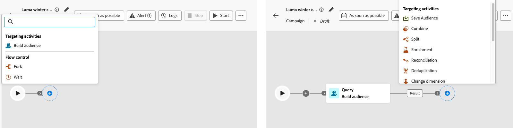
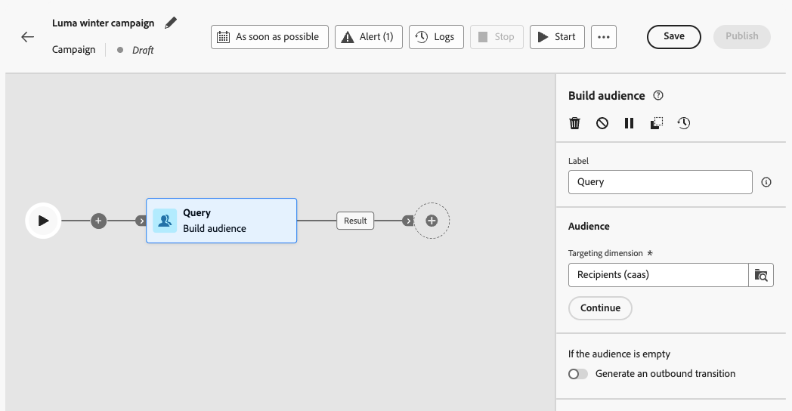
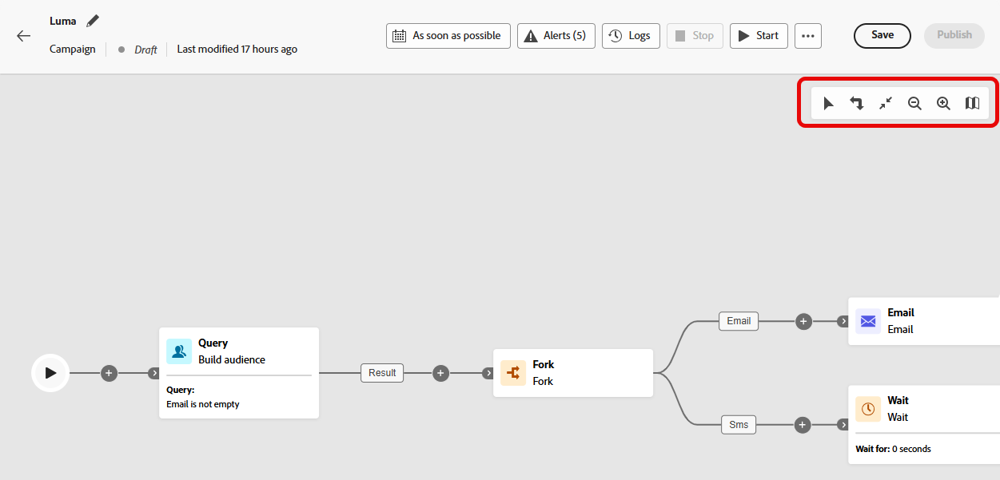
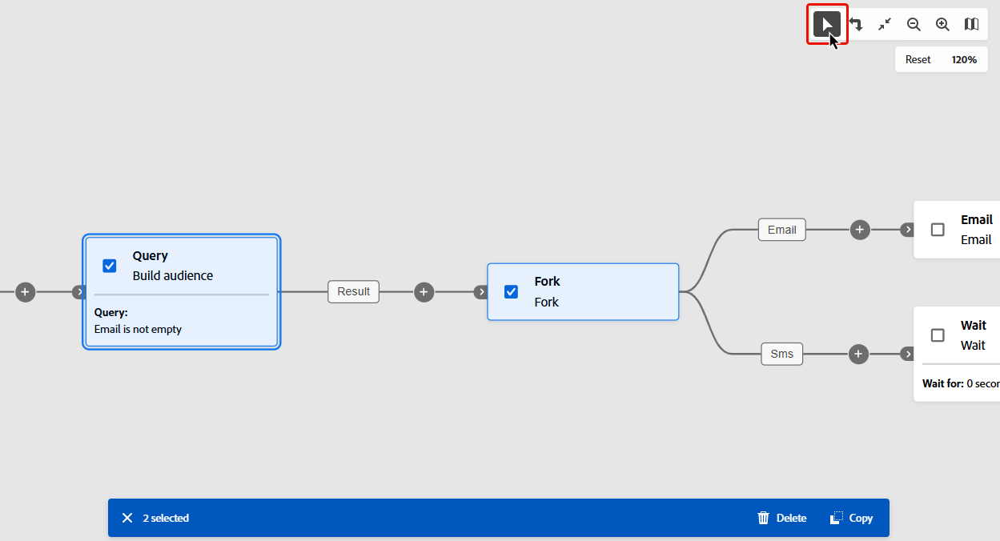

# Organización de actividades de campaña {#orchestrate}

+++ Tabla de contenido

| Bienvenido a campañas orquestadas | Inicio de su primera campaña organizada | Consultar la base de datos | Actividades de las campañas organizadas |
|---|---|---|---|
| [Introducción a las campañas orquestadas](gs-orchestrated-campaigns.md)  [Pasos de configuración](configuration-steps.md)  [Acceso y administración de campañas orquestadas](access-manage-orchestrated-campaigns.md) | [Pasos clave para la creación de campañas orquestadas](gs-campaign-creation.md)  [Cree y programe las actividades de la campaña](create-orchestrated-campaign.md)  [Organice las actividades](orchestrate-activities.md)  <b>[Inicie y supervise la campaña](start-monitor-campaigns.md)</b>  [Creación de informes](reporting-campaigns.md) | [Trabaje con el generador de reglas](orchestrated-rule-builder.md)  [Cree su primera consulta](build-query.md)  [Edite expresiones](edit-expressions.md)  [Redireccionamiento](retarget.md) | [Empiece con las actividades](activities/about-activities.md)  Actividades: [Y únase](activities/and-join.md) - [Generar audiencia](activities/build-audience.md) - [Cambiar dimensión](activities/change-dimension.md) - [Actividades de canal](activities/channels.md) - [Combinar](activities/combine.md) - [Anulación de duplicación](activities/deduplication.md) - [Enriquecimiento](activities/enrichment.md) - [Bifurcación](activities/fork.md) - [Reconciliación](activities/reconciliation.md) - [Guardar](save-audience.md) - [División](activities/split.md) [Espera](activities/wait.md) |

{style="table-layout:fixed"}

+++

 

Una vez que haya [creado una campaña orquestada](gs-campaign-creation.md), puede empezar a orquestar las diferentes tareas que realizará. Para ello, se proporciona un lienzo visual, que le permite construir un diagrama de campaña orquestado. Dentro de este diagrama, puede añadir varias actividades y conectarlas en un orden secuencial.

## Añadir actividades {#add}

En esta fase de la configuración, el diagrama se muestra con un icono de inicio que representa el principio de la campaña orquestada. Para agregar su primera actividad, haga clic en el botón **+** conectado al icono de inicio.

Aparecerá una lista de actividades que se pueden agregar al diagrama. Las actividades disponibles dependen de su posición dentro del diagrama de campaña orquestada. Por ejemplo, al agregar la primera actividad, puede iniciar la campaña orquestada segmentando una audiencia, dividiendo la ruta de la campaña orquestada o estableciendo una actividad **Wait** para retrasar la ejecución de la campaña orquestada. Por otro lado, después de una actividad **Generar audiencia**, puede refinar el segmento con actividades de segmentación, enviar una entrega a la audiencia con actividades de canal u organizar el proceso de campaña orquestado con actividades de control de flujo.

{zoomable="yes"}

Una vez agregada una actividad al diagrama, aparece un panel derecho que le permite configurarla con ajustes específicos. Encontrará información detallada sobre cómo configurar cada actividad en [esta sección](activities/about-activities.md).

{zoomable="yes"}

Repita este proceso para agregar tantas actividades como desee según las tareas que desee que realice la campaña orquestada. Tenga en cuenta que también puede insertar una nueva actividad entre dos actividades. Para ello, haga clic en el botón **+** en la transición entre las actividades, seleccione la actividad deseada y configúrela en el panel derecho.

Tiene la opción de personalizar el nombre de las transiciones entre cada actividad. Para ello, seleccione la transición y cambie su etiqueta en el panel derecho.

### La barra de herramientas de lienzo {#toolbar}

La barra de herramientas de lienzo proporciona opciones para manipular fácilmente las actividades y navegar en el lienzo:

 Seleccione varias actividades para eliminarlas todas a la vez o cópielas y péguelas. [Aprenda a copiar y pegar actividades](#copy)

 Cambia el lienzo verticalmente.

 Adapte el nivel de zoom del lienzo a su pantalla.

  Aleja o en el lienzo.

 Abre una instantánea del lienzo en el que se muestra que se encuentra.

### Administrar actividades {#manage}

Al agregar actividades, los botones de acción están disponibles en el panel de propiedades, lo que le permite realizar varias operaciones.

 Elimine la actividad del lienzo.

  Deshabilitar/Habilitar la actividad. Cuando se ejecuta la campaña orquestada, las actividades deshabilitadas y las siguientes actividades en la misma ruta no se ejecutan y la campaña orquestada se detiene.

  Pause/Reanude la actividad. Cuando se ejecuta la campaña orquestada, se pausa en la actividad pausada. No se ejecutan la tarea correspondiente ni todas las que la siguen en la misma ruta.

 Copie la actividad. [Aprenda a copiar y pegar actividades](#copy)

 Acceda a los registros y tareas de la actividad.

Varias actividades **Targeting**, como **Combine** o **Deduplication**, le permiten procesar la población restante e incluirla en una transición saliente adicional. Por ejemplo, si está usando una actividad **Split**, el complemento consiste en la población que no coincide con ninguno de los subconjuntos definidos anteriormente. Para usar esta capacidad, active la opción **[!UICONTROL Generar complemento]**.

### Copiar y pegar actividades {#copy}

Puede copiar actividades y pegarlas en cualquier lienzo de campaña organizado. La campaña de destino puede estar en una pestaña diferente del explorador.

* Para copiar una actividad, haga clic en el botón  del panel de propiedades de la actividad.
* Para copiar varias actividades, haga clic en el icono  en la barra de herramientas del lienzo.

| Copiar una actividad | Copiar varias actividades |
|  ---  |  ---  |
| {width="200" align="center" zoomable="yes"} | {width="200" align="center" zoomable="yes"} |

Para pegar las actividades, haga clic en el botón **+** de una transición y seleccione &quot;Pegar actividad x&quot;.

{zoomable="yes"}{width="50%"}

## Ejemplo de diagrama {#example}

Este es un ejemplo de campaña orquestada diseñada para enviar un correo electrónico a todos los clientes que han realizado una compra de al menos 100 $, excluyendo a todos los clientes que tienen menos de 50 puntos de lealtad.

{zoomable="yes"}

Para ello, se han añadido las actividades siguientes:

* Una actividad **[!UICONTROL Fork]** divide la campaña orquestada en tres rutas.
* Las actividades de **[!UICONTROL Generar audiencia]** se dirigen a los tres grupos de clientes:

   * Clientes con un correo electrónico,
   * Clientes que hayan realizado una compra de al menos 100 $,
   * Clientes que tengan menos de 50 puntos fieles.

* Una actividad **[!UICONTROL Combinar]** agrupa a clientes con un correo electrónico y a aquellos que hayan realizado una compra de al menos 100$,
* Una actividad **[!UICONTROL Combinar]** excluye clientes con menos de 50 puntos de lealtad,
* Una actividad **[!UICONTROL Email delivery]** envía un mensaje de correo electrónico a los clientes resultantes.

## Pasos siguientes {#next}

Después de diseñar correctamente el diagrama de campaña orquestada, puede ejecutar la campaña orquestada y realizar un seguimiento del progreso de sus distintas tareas. [Aprenda a iniciar una campaña orquestada y a supervisar su ejecución](start-monitor-campaigns.md)
