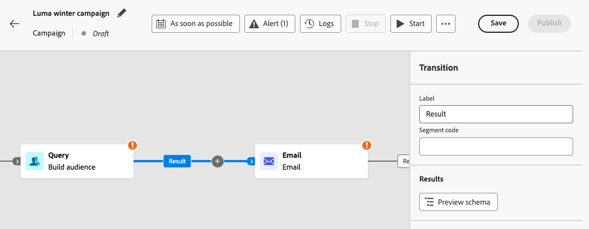

# Actividades de la campaña organizada {#orchestrate}

Una vez que haya [creado una campaña orquestada](gs-campaign-creation.md), puede empezar a orquestar las diferentes tareas que realizará. Para ello, se proporciona un lienzo visual, que le permite construir un lienzo de campaña orquestado. Dentro de este lienzo, puede agregar varias actividades y conectarlas en un orden secuencial.

## Añadir actividades {#add}

En esta fase de la configuración, el lienzo de la campaña orquestada se muestra con un icono de inicio que representa el principio de la campaña orquestada. Para añadir su primera actividad, haga clic en el botón **+** conectado al icono de inicio.

Aparece una lista de actividades que se pueden agregar al lienzo de campaña orquestada. Las actividades disponibles dependen de su posición dentro del lienzo de la campaña orquestada. Por ejemplo, al agregar la primera actividad, puede iniciar la campaña orquestada segmentando una audiencia, dividiendo la ruta de la campaña orquestada o estableciendo una actividad **Wait** para retrasar la ejecución de la campaña orquestada. Por otro lado, después de una actividad **Generar audiencia**, puede refinar el segmento con actividades de segmentación, enviar una entrega a la audiencia con actividades de canal u organizar el proceso de campaña orquestado con actividades de control de flujo.

{zoomable="yes"}

Una vez añadida una actividad al lienzo, aparece un panel derecho que le permite configurarla con ajustes específicos. En [esta sección](activities/about-activities.md) encontrará información detallada sobre cómo configurar cada actividad.

{zoomable="yes"}

Repita este proceso para agregar tantas actividades como desee según las tareas que desee que realice la campaña orquestada. Tenga en cuenta que también puede insertar una nueva actividad entre dos actividades. Para ello, haga clic en el botón **+** en la transición entre las actividades, seleccione la actividad deseada y configúrela en el panel derecho.

Tiene la opción de personalizar el nombre de las transiciones entre cada actividad. Para ello, seleccione la transición y cambie su etiqueta en el panel derecho.

### Barra de herramientas de lienzo {#toolbar}

La barra de herramientas de lienzo proporciona opciones para manipular fácilmente las actividades y navegar en el lienzo:

 Seleccione varias actividades para eliminarlas todas a la vez o copiarlas y pegarlas. [Aprenda a copiar y pegar actividades](#copy)

 Cambie el lienzo verticalmente.

 Adapte el nivel de zoom del lienzo a su pantalla.

  Reduzca o aumente el lienzo.

 Abre una instantánea del lienzo en el que se muestra su ubicación.

### Administrar actividades {#manage}

Al añadir actividades, los botones de acción están disponibles en el panel de propiedades, lo que le permite realizar múltiiples operaciones.

 Elimine la actividad del lienzo.

  Deshabilite/Habilite la actividad. Cuando se ejecuta la campaña orquestada, las actividades deshabilitadas y las siguientes actividades en la misma ruta no se ejecutan y la campaña orquestada se detiene.

  Ponga en pausa/reanude la actividad. Cuando se ejecuta la campaña orquestada, se pausa en la actividad pausada. No se ejecutará la tarea correspondiente ni las que la siguen en la misma ruta.

Puede utilizar cualquier actividad en el lienzo como punto de interrupción para pausar la ejecución de la campaña. Esto significa que la campaña se ejecutará solamente hasta esta actividad y luego pausará la ejecución. Al pausar la ejecución, el motor de segmentación mantiene los datos temporales disponibles para que los previsualice. Puede seleccionar la transición entrante justo antes de la actividad pausada para ver los datos transportados. Obtenga más información sobre esta sección: [Supervisión del flujo visual](../orchestrated/start-monitor-campaigns.md#flow)

 Copie la actividad. [Aprenda a copiar y pegar actividades](#copy)

 Acceda a los registros y tareas de la actividad.

Varias actividades de **Segmentación**, como **Combinar** o **Deduplicación**, le permiten procesar la población restante e incluirla en una transición de salida adicional. Por ejemplo, si está usando la actividad **División**, el complemento consiste en la población que no coincidía con ninguno de los subconjuntos definidos anteriormente. Para usar esta funcionalidad, active la opción **[!UICONTROL Generar complemento]**.

### Copiar y pegar actividades {#copy}

Puede copiar actividades y pegarlas en cualquier lienzo de campaña orquestado. La campaña de destino puede estar en una pestaña diferente del explorador.

* Para copiar una actividad, haga clic en el botón  en el panel de propiedades de la actividad.
* Para copiar varias actividades, haga clic en el icono  en la barra de herramientas de lienzo.

| Copiar una actividad | Copiar varias actividades |
|  ---  |  ---  |
| {width="200" align="center" zoomable="yes"} | {width="200" align="center" zoomable="yes"} |

Para pegar las actividades, haga clic en el botón **+** de una transición y seleccione “Pegar actividad x”.

{zoomable="yes"}{width="50%"}

## Ejemplo de lienzo {#example}

Este es un ejemplo de campaña orquestada diseñada para enviar un correo electrónico a todos los clientes que han realizado una compra de al menos 100 $, excluyendo a todos los clientes que tienen menos de 50 puntos de lealtad.

{zoomable="yes"}

Para ello, se han añadido las actividades siguientes:

* Una actividad **[!UICONTROL Fork]** divide la campaña orquestada en tres rutas.
* Las actividades de **[!UICONTROL Generar público]** se dirigen a los tres grupos de clientes siguientes:

   * Clientes con un correo electrónico,
   * Clientes que han realizado una compra de al menos 100 USD,
   * Clientes que tienen menos de 50 puntos de lealtad.

* La actividad **[!UICONTROL Combinar]** agrupa a los clientes con un correo electrónico y a aquellos que han realizado una compra de al menos 100 USD,
* Una actividad **[!UICONTROL Combinar]** excluye clientes con menos de 50 puntos de lealtad,
* La actividad **[!UICONTROL Envío de correo electrónico]** envía un mensaje de correo electrónico a los clientes resultantes.

## Próximos pasos {#next}

Después de diseñar correctamente el lienzo de campaña orquestada, puede ejecutar la campaña orquestada y realizar un seguimiento del progreso de sus distintas tareas. [Aprenda a iniciar una campaña orquestada y a supervisar su ejecución](start-monitor-campaigns.md)
