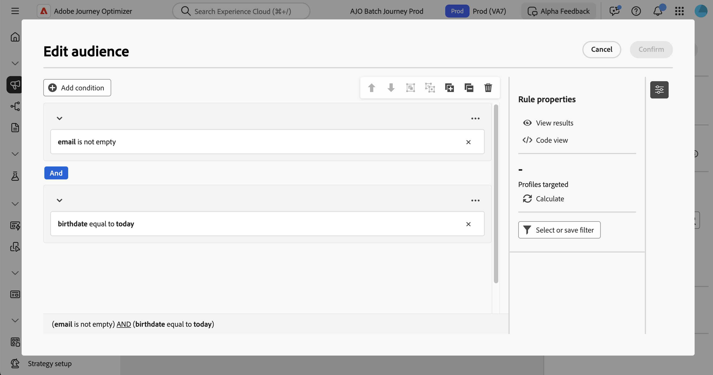

# Trabajar con el generador de reglas {#orchestrated-rule-builder}

+++ Tabla de contenido

| Bienvenido a campañas orquestadas | Inicie su primera campaña orquestada | Consultar la base de datos | Actividades de campañas organizadas |
|---|---|---|---|
| [Introducción a las campañas orquestadas](gs-orchestrated-campaigns.md)  [Pasos de configuración](configuration-steps.md)  [Acceso y administración de campañas orquestadas](access-manage-orchestrated-campaigns.md) | [Pasos clave para la creación de campañas orquestadas](gs-campaign-creation.md)  [Cree y programe las actividades de la campaña](create-orchestrated-campaign.md)  [Orqueste actividades](orchestrate-activities.md)  [Envíe mensajes con campañas orquestadas](send-messages.md)  [Inicie y supervise la campaña](start-monitor-campaigns.md)  [Creación de informes](reporting-campaigns.md) | <b>[Trabaje con el generador de reglas](orchestrated-rule-builder.md)</b>  [Cree su primera consulta](build-query.md)  [Edite expresiones](edit-expressions.md) | [Empiece con las actividades](activities/about-activities.md)  Actividades: [Y únase](activities/and-join.md) - [Generar audiencia](activities/build-audience.md) - [Cambiar dimensión](activities/change-dimension.md) - [Combinar](activities/combine.md) - [Anulación de duplicación](activities/deduplication.md) - [Enriquecimiento](activities/enrichment.md) - [Bifurcación](activities/fork.md) - [Reconciliación](activities/reconciliation.md) - [División](activities/split.md) - [Espera](activities/wait.md) |

{style="table-layout:fixed"}

+++

 

Las campañas organizadas incluyen un generador de reglas que simplifica el proceso de filtrado de la base de datos en función de varios criterios. El generador de reglas administra consultas muy complejas y largas de forma eficaz, lo que ofrece una mayor flexibilidad y precisión.

También admite filtros predefinidos dentro de las condiciones, lo que permite a los usuarios refinar las consultas con facilidad mientras utiliza expresiones avanzadas y operadores para estrategias completas de segmentación y segmentación de audiencia.

## Acceso al generador de reglas

El generador de reglas está disponible cuando se crea una consulta en una actividad **[!UICONTROL Generar audiencia]** para segmentar una audiencia. Permite especificar la población a la que desea dirigirse y crear sin esfuerzo nuevas audiencias adaptadas a sus necesidades.

## Interfaz del generador de reglas {#interface}

El generador de reglas proporciona un lienzo central en el que generar la consulta y un panel de propiedades que proporciona información sobre la regla.

* En el **lienzo central** es donde se agregan y combinan los diferentes componentes para generar la regla. [Más información sobre cómo generar una regla](../orchestrated/build-query.md)

* El panel **[!UICONTROL Propiedades de regla]** proporciona información sobre la regla. Le permite realizar varias operaciones para comprobar la regla y asegurarse de que se adapta a sus necesidades.

  Este panel se muestra al crear una consulta para crear una audiencia. [Aprenda a comprobar y validar su consulta](build-query.md#check-and-validate-your-query)
