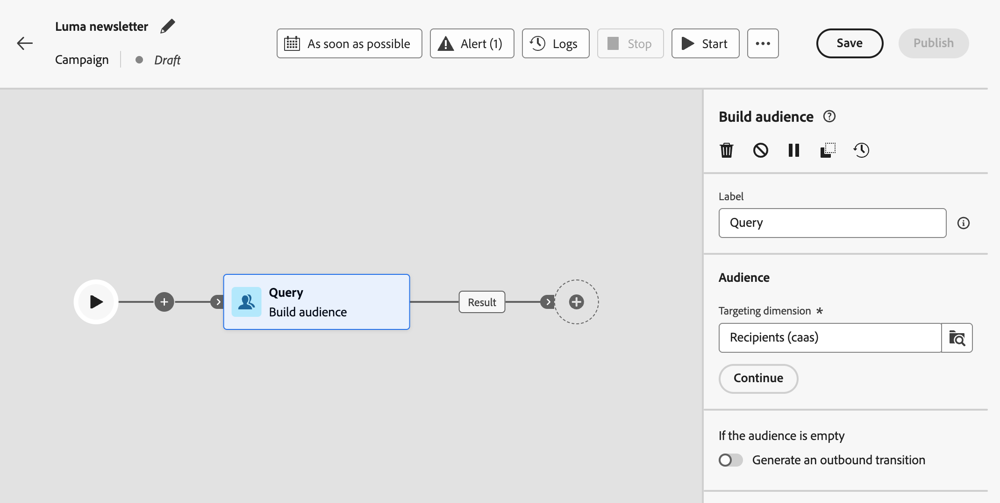

# Trabajo con el generador de reglas {#orchestrated-rule-builder}

+++ Índice

| Bienvenido a las campañas organizadas | Inicio de su primera campaña organizada | Consulta de la base de datos | Actividades de las campañas organizadas |
|---|---|---|---|
| [Empiece a usar las campañas orquestadas](gs-orchestrated-campaigns.md)  Cree y administre conjuntos de datos y esquemas relacionales:  <ul><li>[Introducción a esquemas y conjuntos de datos](gs-schemas.md)</li><li>[Esquema manual](manual-schema.md)</li><li>[Esquema de carga de archivos](file-upload-schema.md)</li><li>[Ingesta de datos](ingest-data.md)</li></ul>[Acceder y administrar campañas orquestadas](access-manage-orchestrated-campaigns.md)  [Pasos clave para crear una campaña orquestada](gs-campaign-creation.md) | [Creación y programación de las campañas](create-orchestrated-campaign.md)  [Organización de actividades](orchestrate-activities.md)  [Inicio y monitorización de las campañas](start-monitor-campaigns.md)  [Creación de informes](reporting-campaigns.md) | <b>[Trabajo con el generador de reglas](orchestrated-rule-builder.md)</b>  [Creación de su primera consulta](build-query.md)  [Edición de expresiones](edit-expressions.md)  [Resegmentación](retarget.md) | [Introducción a las actividades](activities/about-activities.md)  Actividades: [AND-join](activities/and-join.md) - [Generar público](activities/build-audience.md) - [Cambiar dimensión](activities/change-dimension.md) - [Actividades del canal](activities/channels.md) - [Combinar](activities/combine.md) - [Deduplicación](activities/deduplication.md) - [Enriquecimiento](activities/enrichment.md) - [Bifurcación](activities/fork.md) - [Reconciliación](activities/reconciliation.md) - [Guardar público](activities/save-audience.md) - [División](activities/split.md) - [Esperar](activities/wait.md) |

{style="table-layout:fixed"}

+++

 

>[!BEGINSHADEBOX]

 

El contenido de esta página no es definitivo y puede estar sujeto a cambios.

>[!ENDSHADEBOX]

Las campañas organizadas incluyen un generador de reglas que simplifica el proceso de filtrado de la base de datos en función de varios criterios. El generador de reglas administra consultas muy complejas y largas de forma eficaz, lo que ofrece una mayor flexibilidad y precisión.

También admite filtros predefinidos dentro de las condiciones, lo que le permite detallar las consultas con facilidad mientras utiliza expresiones avanzadas y operadores para estrategias completas de segmentación de público y segmentación.

## Acceso al generador de reglas

El modelador de consultas está disponible en todos los contextos en los que necesite definir reglas para filtrar datos.

| Uso | Ejemplo |
|  ---  |  ---  |
| **Generar públicos**: especifique la población a la que quiera dirigirse en sus campañas organizadas mediante la actividad **[!UICONTROL Generar público]** y genere sin esfuerzo nuevos públicos adaptados a sus necesidades. [Aprenda sobre la generación de público](../orchestrated/activities/build-audience.md). | {width="200" align="center" zoomable="yes"} |
| **Crear condición en el lienzo de campaña**: aplique reglas dentro del lienzo de campaña usando una actividad **[!UICONTROL División]** para alinearse con los requisitos específicos. [Aprenda a utilizar una actividad División](../orchestrated/activities/split.md) | {width="200" align="center" zoomable="yes"} |
| **Crear filtros avanzados**: genere reglas para filtrar los datos mostrados en listas como los registros de flujo de trabajo o las dimensiones de segmentación. | {width="200" align="center" zoomable="yes"} |

## Interfaz del generador de reglas {#interface}

El generador de reglas proporciona un lienzo central en el que se genera la consulta y un panel de propiedades que proporciona información sobre la regla.

* En el **lienzo central** es donde se añaden y combinan los diferentes componentes para generar la regla. [Descubra cómo generar una regla](../orchestrated/build-query.md)

* El panel **[!UICONTROL Propiedades de regla]** proporciona información sobre la regla. Le permite realizar varias operaciones para comprobar la regla y asegurarse de que se adapta a sus necesidades.

  Este panel se muestra al armar una consulta para crear un público. [Aprenda a comprobar y validar su consulta](build-query.md#check-and-validate-your-query)
