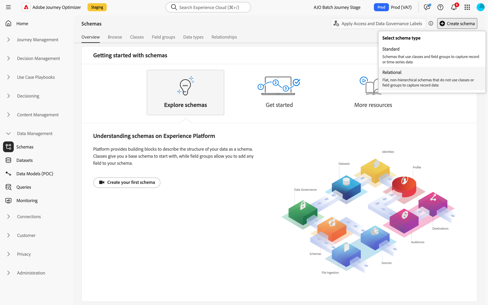

# Creación de esquemas relacionales {#orchestrated-schemas}

Un esquema representa y valida la estructura y el formato de los datos. Proporciona una definición abstracta de un objeto del mundo real (como, por ejemplo, una persona) y describe qué datos deben incluirse en cada instancia de ese objeto (como, por ejemplo, nombre, cumpleaños, etc.).

