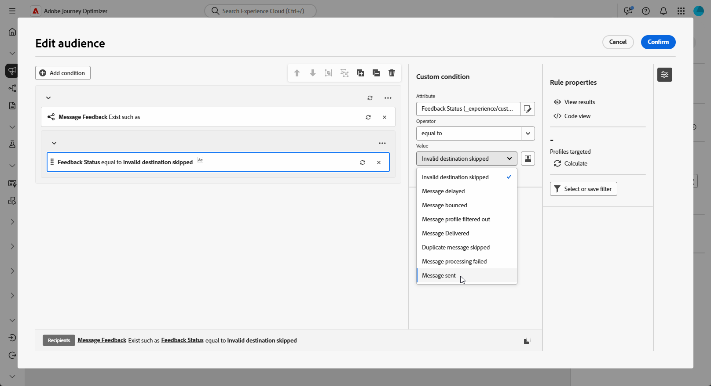

# Creación de consultas de retargeting {#retarget}

+++ Tabla de contenido

| Bienvenido a campañas orquestadas | Inicio de su primera campaña organizada | Consultar la base de datos | Actividades de las campañas organizadas |
|---|---|---|---|
| [Introducción a las campañas orquestadas](gs-orchestrated-campaigns.md)  [Pasos de configuración](configuration-steps.md)  [Acceso y administración de campañas orquestadas](access-manage-orchestrated-campaigns.md)  [Pasos clave para crear una campaña orquestada](gs-campaign-creation.md) | [Cree y programe las actividades de la campaña](create-orchestrated-campaign.md)  [Organizar actividades](orchestrate-activities.md)  [Inicie y supervise la campaña](start-monitor-campaigns.md)  [Creación de informes](reporting-campaigns.md) | [Trabaje con el generador de reglas](orchestrated-rule-builder.md)  [Cree su primera consulta](build-query.md)  [Edite expresiones](edit-expressions.md)  <b>[Redireccionamiento](retarget.md)</b> | [Empiece con las actividades](activities/about-activities.md)  Actividades: [Y únase](activities/and-join.md) - [Generar audiencia](activities/build-audience.md) - [Cambiar dimensión](activities/change-dimension.md) - [Actividades de canal](activities/channels.md) - [Combinar](activities/combine.md) - [Anulación de duplicación](activities/deduplication.md) - [Enriquecimiento](activities/enrichment.md) - [Bifurcación](activities/fork.md) - [Reconciliación](activities/reconciliation.md) - [Guardar](activities/save-audience.md) - [División](activities/split.md) [Espera](activities/wait.md) |

{style="table-layout:fixed"}

+++

 

>[!BEGINSHADEBOX]

Documentación en curso

>[!ENDSHADEBOX]

La reorientación le permite hacer un seguimiento de los destinatarios según su respuesta a una campaña orquestada anteriormente. Por ejemplo, puede enviar un segundo correo electrónico a los perfiles que recibieron pero no hicieron clic en el primero.

**[!UICONTROL La campaña orquestada]** proporciona dos fuentes de datos principales para esto:

* **[!UICONTROL Comentarios del mensaje]**: captura eventos relacionados con la entrega, por ejemplo: mensajes enviados, abiertos, rechazados, etc.
* **[!UICONTROL Seguimiento de correo electrónico]**: captura las acciones del usuario, por ejemplo, clics y aperturas.

## Crear una regla de redireccionamiento basada en comentarios {#feedback-retarget}

La regla de redireccionamiento basada en comentarios permite redireccionar los destinatarios según los eventos de envío de mensajes capturados en el conjunto de datos **Comentarios del mensaje**. Estos eventos incluyen resultados como mensajes enviados, abiertos, rechazados o marcados como correo no deseado.

Con estos datos, se pueden definir reglas para identificar a los destinatarios que recibieron un mensaje anterior, lo que permite una comunicación de seguimiento basada en estados de entrega específicos.

1. Crear una nueva **[!UICONTROL campaña orquestada]**.

1. Agregue una actividad **[!UICONTROL Generar audiencia]** y establezca la dimensión de segmentación en **[!UICONTROL Destinatario (caas)]**.

1. En el **[!UICONTROL Generador de reglas]**, haga clic en **[!UICONTROL Agregar condición]** y seleccione **[!UICONTROL Comentarios sobre mensajes]** del **[!UICONTROL Selector de atributos]**. Haga clic en **[!UICONTROL Confirmar]** para crear un **mensaje de comentarios ya existe como** condición.

   

1. Elija el atributo **[!UICONTROL Estado de comentarios]** para segmentar los eventos de envío de mensajes.

+++ Detallado paso a paso

   1. Agregue otra condición vinculada al atributo **[!UICONTROL Message feedback]**.

   1. Busque el atributo **[!UICONTROL Estado de comentarios]** y haga clic en **[!UICONTROL Confirmar]**.

      

   1. En el menú **[!UICONTROL Condición personalizada]**, elija qué estado de entrega rastrear en la lista desplegable **[!UICONTROL Valor]**.

      

+++

1. Elija el atributo **[!UICONTROL Nombre de campaña orquestada]** para segmentar una campaña orquestada específica.

+++ Detallado paso a paso

   1. Agregue otra condición vinculada al atributo **[!UICONTROL Message feedback]**, busque **[!UICONTROL entity]** y navegue hasta:

      `_experience > CustomerJourneyManagement > Entities > AJO Orchestrated Campaign entity`.

   1. Seleccione **[!UICONTROL Nombre de campaña orquestada]**.

      

   1. En el menú **[!UICONTROL Condición personalizada]**, especifique el nombre de la campaña en el campo **[!UICONTROL Valor]**.

+++

1. Elija el atributo **[!UICONTROL Nombre de acción de campaña orquestada]** para dirigir un mensaje o una actividad específicos dentro de una campaña orquestada.

+++ Detallado paso a paso

   1. Agregue otra condición vinculada al atributo **[!UICONTROL Message feedback]**, busque **[!UICONTROL entity]** y navegue hasta:

      `_experience > CustomerJourneyManagement > Entities > AJO Orchestrated Campaign entity`.

   1. Seleccione **[!UICONTROL Nombre de acción de campaña orquestada]**.

      

   1. En el menú **[!UICONTROL Custom condition]**, especifique el nombre de la acción de campaña en el campo **[!UICONTROL Value]**.

      Para encontrar los nombres de las acciones, haga clic en el  junto a una actividad en el lienzo.

+++

1. Como alternativa, también puede filtrar por **[!UICONTROL ID de campaña]** (UUID), que se encuentra en las propiedades de Campaign.

## Creación de una regla de retargeting basada en seguimiento

La regla de retargeting basada en el seguimiento identifica a los destinatarios según sus interacciones con un mensaje mediante los datos del conjunto de datos **[!UICONTROL Seguimiento de correo electrónico]**. Registra acciones del usuario como aperturas de correo electrónico y clics en vínculos.

Para redirigir a los destinatarios en función de las interacciones de mensajes (p. ej., abrir o hacer clic), use la entidad **[!UICONTROL Seguimiento de correo electrónico]** de la siguiente manera:

1. Crear una nueva **[!UICONTROL campaña orquestada]**.

1. Agregue una actividad **[!UICONTROL Generar audiencia]** y establezca la dimensión de segmentación en **[!UICONTROL Destinatario (caas)]** para que se centre en destinatarios de campañas orquestadas anteriores.

1. En el **[!UICONTROL Generador de reglas]**, haga clic en **[!UICONTROL Agregar condición]** y seleccione **[!UICONTROL Seguimiento de correo electrónico]** del **[!UICONTROL Selector de atributos]**.

   Haga clic en **[!UICONTROL Confirmar]** para crear una condición **Existe seguimiento de correo electrónico como**.

   

1. Para segmentar las interacciones de los perfiles con un mensaje, agregue otra condición vinculada al atributo **[!UICONTROL Email tracking]** y busque el atributo **[!UICONTROL Interaction Type]**.

   

1. En las opciones de condición personalizadas, usa **[!UICONTROL Incluido en]** como operador y selecciona uno o más valores según tu caso de uso, por ejemplo **[!UICONTROL Mensaje abierto]** o **[!UICONTROL Se hizo clic en el vínculo del mensaje]**.

   

1. Para asociar los datos de seguimiento a una campaña específica, agrega una nueva condición **[!UICONTROL Message feedback]** y sigue los pasos detallados [en esta sección](#feedback-retarget).
