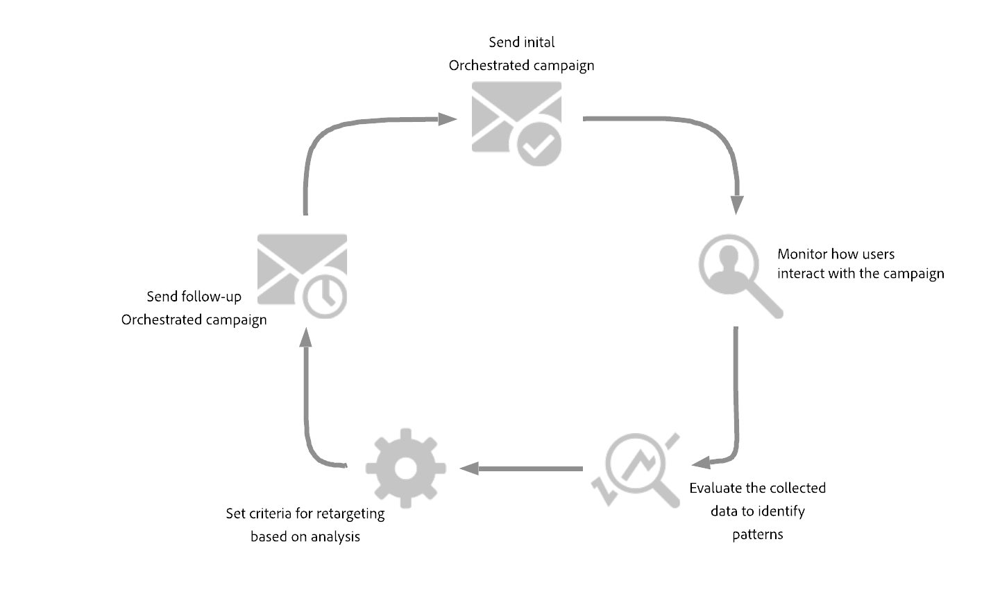

# Creación de consultas de retargeting {#retarget}

La reorientación le permite hacer un seguimiento de los destinatarios según su respuesta a una campaña orquestada anterior. Por ejemplo, puede enviar un segundo correo electrónico a los destinatarios que recibieron pero no hicieron clic en el primero.

**[!UICONTROL La campaña orquestada]** proporciona dos esquemas principales para esto:

* **[!UICONTROL Comentarios del mensaje]**: captura eventos relacionados con la entrega, por ejemplo: mensajes enviados, abiertos, rechazados, etc.
* **[!UICONTROL Seguimiento de correo electrónico]**: captura las acciones del usuario, por ejemplo, clics y aperturas.

{zoomable="yes"}

## Crear una regla de redireccionamiento basada en comentarios {#feedback-retarget}

La regla de redireccionamiento basada en comentarios permite redireccionar los destinatarios según los eventos de envío de mensajes capturados en el esquema **[!UICONTROL Comentarios del mensaje]**. Estos eventos incluyen resultados como mensajes enviados, abiertos, rechazados o marcados como correo no deseado.

Con estos datos, se pueden definir reglas para identificar a los destinatarios que recibieron un mensaje anterior, lo que permite una comunicación de seguimiento basada en estados de entrega específicos.

1. Crear una nueva **[!UICONTROL campaña orquestada]**.

1. Agregue una actividad **[!UICONTROL Generar audiencia]** y establezca la dimensión de segmentación en **[!UICONTROL Destinatario (caas)]**. Haga clic en **[!UICONTROL Continuar]**.

1. Para empezar rápidamente, puede usar un filtro integrado de **[!UICONTROL Comentarios de campaña]** para segmentar destinatarios según los eventos de envío de mensajes.

   +++ Detallado paso a paso

   1. En el **[!UICONTROL Generador de reglas]**, haga clic en **[!UICONTROL Seleccione o guarde un filtro]** y elija **[!UICONTROL comentarios de campaña]** en la lista.

   1. Seleccione la regla de filtro y elija el **[!UICONTROL Comportamiento]** al que desee dirigirse, como **[!UICONTROL Mensaje enviado]**.

   1. Haga clic en  para seleccionar la campaña específica que desea redireccionar. Tiene dos opciones:

      * **[!UICONTROL Seleccione una campaña específica]**: Elija una campaña en particular de su lista para redirigirse a los destinatarios que interactuaron con esa campaña.

      * **[!UICONTROL Campaña de transición]**: Haga referencia a una campaña de una actividad anterior en su campaña orquestada.

   +++

1. Como alternativa, puede crear manualmente reglas personalizadas. En el **[!UICONTROL Generador de reglas]**, haga clic en **[!UICONTROL Agregar condición]** y seleccione **[!UICONTROL Comentarios sobre mensajes]** del **[!UICONTROL Selector de atributos]**. Haga clic en **[!UICONTROL Confirmar]** para crear un **mensaje de comentarios ya existe como** condición.

   {zoomable="yes"}

1. Elija el atributo **[!UICONTROL Estado de comentarios]** para segmentar los eventos de envío de mensajes.

   +++ Detallado paso a paso

   1. Agregue otra condición vinculada al atributo **[!UICONTROL Message feedback]**.

   1. Busque el atributo **[!UICONTROL Estado de comentarios]** y haga clic en **[!UICONTROL Confirmar]**.

      {zoomable="yes"}

   1. En el menú **[!UICONTROL Condición personalizada]**, elija qué estado de entrega rastrear en la lista desplegable **[!UICONTROL Valor]**.

      {zoomable="yes"}

   +++

1. Elija el atributo **[!UICONTROL Nombre de campaña orquestada]** para segmentar una campaña orquestada específica.

   +++ Detallado paso a paso

   1. Agregue otra condición vinculada al atributo **[!UICONTROL Message feedback]**, busque **[!UICONTROL entity]** y navegue hasta:

      `_experience > CustomerJourneyManagement > Entities > AJO Orchestrated Campaign entity`.

   1. Seleccione **[!UICONTROL Nombre de campaña orquestada]**.

      {zoomable="yes"}

   1. En el menú **[!UICONTROL Condición personalizada]**, especifique el nombre de la campaña en el campo **[!UICONTROL Valor]**.

   +++

1. Elija el atributo **[!UICONTROL Nombre de acción de campaña orquestada]** para segmentar un mensaje o una actividad específicos dentro de una campaña orquestada.

   +++ Detallado paso a paso

   1. Agregue otra condición vinculada al atributo **[!UICONTROL Message feedback]**, busque **[!UICONTROL entity]** y navegue hasta:

      `_experience > CustomerJourneyManagement > Entities > AJO Orchestrated Campaign entity`.

   1. Seleccione **[!UICONTROL Nombre de acción de campaña orquestada]**.

      {zoomable="yes"}

   1. En el menú **[!UICONTROL Custom condition]**, especifique el nombre de la acción de campaña en el campo **[!UICONTROL Value]**.

      Para encontrar los nombres de las acciones, haga clic en el  junto al campo Etiqueta de su actividad.

   +++

1. También puede filtrar por **[!UICONTROL ID de campaña]** (UUID), que se encuentra en las propiedades de Campaign.

Ahora ha configurado una regla de redireccionamiento basada en los comentarios para identificar a los destinatarios en función del estado de entrega de un mensaje anterior, como enviado, abierto, devuelto o marcado como correo no deseado. Con esta audiencia definida, puede agregar un correo electrónico de seguimiento o refinar aún más su segmentación si [configura una regla de retargeting basada en seguimiento](#tracking-based), que usa datos de interacción del usuario.

{zoomable="yes"}

## Creación de una regla de retargeting basada en seguimiento {#tracking-based}

La regla de retargeting basada en el seguimiento identifica destinatarios según sus interacciones con un mensaje mediante los datos del esquema **[!UICONTROL Email Tracking]**. Registra acciones del usuario como aperturas de correo electrónico y clics en vínculos.

Para redirigir a los destinatarios en función de las interacciones de mensajes (p. ej., abrir o hacer clic), use la entidad **[!UICONTROL Seguimiento de correo electrónico]** de la siguiente manera:

1. Crear una nueva **[!UICONTROL campaña orquestada]**.

1. Agregue una actividad **[!UICONTROL Generar audiencia]** y establezca la dimensión de segmentación en **[!UICONTROL Destinatario (caas)]** para que se centre en destinatarios de campañas orquestadas anteriores.

1. Para empezar rápidamente, puede usar un filtro integrado de **[!UICONTROL Comentarios de campaña]** para segmentar destinatarios según los eventos de envío de mensajes.

   +++ Detallado paso a paso

   1. En el **[!UICONTROL Generador de reglas]**, haga clic en **[!UICONTROL Seleccione o guarde un filtro]** y elija **[!UICONTROL comentarios de campaña]** en la lista.

      {zoomable="yes"}

   1. Seleccione la regla de filtro y elija el **[!UICONTROL Comportamiento]** al que desee dirigirse, como **[!UICONTROL Mensaje abierto]** o **[!UICONTROL Mensaje en el que se hizo clic]**.

      {zoomable="yes"}

   1. Haga clic en  para seleccionar la campaña específica que desea redireccionar. Tiene dos opciones:

      * **[!UICONTROL Seleccione una campaña específica]**: Elija una campaña en particular de su lista para redirigirse a los destinatarios que interactuaron con esa campaña.

      * **[!UICONTROL Campaña de transición]**: Haga referencia a una campaña de una actividad anterior en su campaña orquestada.

   +++

1. Como alternativa, puede crear manualmente reglas personalizadas. En el **[!UICONTROL Generador de reglas]**, haga clic en **[!UICONTROL Agregar condición]** y seleccione **[!UICONTROL Seguimiento de correo electrónico]** del **[!UICONTROL Selector de atributos]**.

   Haga clic en **[!UICONTROL Confirmar]** para crear una condición **Existe seguimiento de correo electrónico como**.

   {zoomable="yes"}

1. Para segmentar las interacciones de los destinatarios con un mensaje, agregue otra condición vinculada al atributo **[!UICONTROL Email tracking]** y busque el atributo **[!UICONTROL Interaction Type]**.

   {zoomable="yes"}

1. En las opciones de condición personalizadas, usa **[!UICONTROL Incluido en]** como operador y selecciona uno o más valores según tu caso de uso, por ejemplo **[!UICONTROL Mensaje abierto]** o **[!UICONTROL Se hizo clic en el vínculo del mensaje]**.

   {zoomable="yes"}

Ahora ha configurado una regla de retargeting basada en el seguimiento para segmentar destinatarios según sus interacciones con un mensaje anterior, como aperturas de correo electrónico o clics en vínculos, con datos del atributo **[!UICONTROL Email Tracking]**. Con esta audiencia definida, puede agregar una acción de seguimiento o refinar aún más su segmentación combinándola con una [regla de retargeting basada en comentarios](#feedback-retarget) para incluir resultados de mensajes como enviados, rechazados o marcados como correo no deseado.

{zoomable="yes"}
