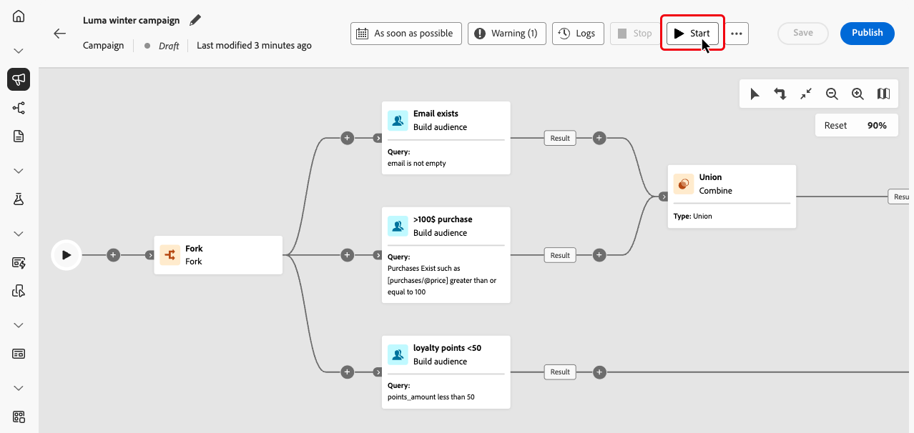

# Inicio y monitorización de las campañas orquestadas {#start-monitor}

>[!CONTEXTUALHELP]
>id="ajo_campaign_publication"
>title="Publicación de la campaña orquestada"
>abstract="Para iniciar su campaña, debe publicarla. Asegúrese de que se borran todos los errores antes de la publicación."

Una vez creada la campaña organizada y tras haber diseñado las tareas que se realizarán en el lienzo, puede publicarla y monitorizar cómo se ejecuta.

También puede ejecutar la campaña en modo de prueba para comprobar su ejecución y el resultado de las diferentes actividades.

## Prueba de la campaña antes de publicarla {#test}

[!DNL Journey Optimizer] le permite probar campañas orquestadas antes de lanzarse. Cuando se crea una campaña, entra al estado **Borrador** de forma predeterminada. En este estado, puede ejecutar la campaña manualmente para probar el flujo.

>[!IMPORTANT]
>
>Todas las actividades del lienzo se ejecutan excepto las actividades de **[!UICONTROL Guardar audiencia]** y las actividades del canal. No hay ningún impacto funcional en los datos o en el público.

Para probar una campaña orquestada, abra la campaña y seleccione **[!UICONTROL Start]**.

{zoomable="yes"}

Cada actividad de la campaña se ejecuta secuencialmente hasta que se llega al final del lienzo. Durante la prueba, puede controlar la ejecución de la campaña mediante la barra de acciones del lienzo. A partir de ahí, puede realizar lo siguiente:

* **Detenga** la ejecución en cualquier momento.
* **Inicie** la ejecución de nuevo.
* **Reanudar** la ejecución si se había pausado anteriormente.

El icono **[!UICONTROL Alertas]** / **[!UICONTROL Advertencia]** de la barra de herramientas de lienzo le notifica de los problemas, incluidas las advertencias que pueden aparecer de forma proactiva antes de la ejecución y los errores que se producen durante o después de la ejecución.

{zoomable="yes"}

También puede identificar rápidamente las actividades fallidas mediante los [indicadores visuales de estado](#activities) que se muestran directamente en cada actividad. Para obtener información detallada sobre la resolución de problemas, abra los [registros de la campaña](#logs-tasks), que proporcionan información detallada sobre el error y su contexto.

Si ha agregado actividades de canal en el lienzo, puede obtener una vista previa y probar el contenido de sus mensajes con el botón **[!UICONTROL Simular contenido]**. [Aprenda a trabajar con actividades de canal](activities/channels.md)

Una vez validada, la campaña se puede publicar.

## Publicación de la campaña {#publish}

Una vez que la campaña se haya probado y esté lista, haga clic en **[!UICONTROL Publicar]** para activarla.

{zoomable="yes"}

>[!NOTE]
>
>Si el botón **[!UICONTROL Publicar]** está deshabilitado (atenuado), acceda a los registros de la barra de acciones y compruebe los mensajes de error. Todos los errores deben corregirse antes de poder publicar una campaña.

El flujo visual se reinicia y los perfiles reales comienzan a fluir a través del recorrido en tiempo real.

Si la acción de publicación falla (por ejemplo, debido a la falta de contenido de mensaje), se le alerta y debe corregir el problema antes de volver a intentarlo. Si la publicación se realiza correctamente, la campaña comenzará a ejecutarse (inmediatamente o según lo programado), pasará del estado **Borrador** al estado **Activo** y pasará a ser de &quot;Solo lectura&quot;.

## Monitorización de la ejecución de campañas {#monitor}

### Monitorización del flujo visual {#flow}

Mientras se ejecuta (en modo de prueba o activo), el flujo visual muestra cómo se mueven los perfiles a través del recorrido en tiempo real. Se muestra el número de perfiles que pasan de una tarea a otra.

{zoomable="yes"}

Los datos que pasan de una actividad a otra se almacenan en una tabla de trabajo temporal. Estos datos se pueden mostrar para cada transición. Para inspeccionar los datos transferidos entre actividades:

1. Seleccione una transición.
1. En el panel de propiedades, haga clic en **[!UICONTROL Esquema de vista previa]** para ver el esquema de la tabla de trabajo. Seleccione **[!UICONTROL Vista previa de resultados]** para ver los datos transportados.

   {zoomable="yes"}

### Indicadores de ejecución de la actividad {#activities}

Los indicadores visuales de estado le ayudan a comprender el rendimiento de cada actividad:

| Indicador visual | Descripción |
|-----|------------|
| {zoomable="yes"}{width="70%"} | La actividad se está ejecutando actualmente. |
| {zoomable="yes"}{width="70%"} | La actividad requiere su atención. Esto puede implicar confirmar el envío de una entrega o tomar las medidas necesarias. |
| {zoomable="yes"}{width="70%"} | La actividad ha encontrado un error. Para resolver el problema, abra los registros de la campaña orquestada para obtener más información. |
| {zoomable="yes"}{width="70%"} | La actividad se ha ejecutado correctamente. |

### Registros y tareas {#logs-tasks}

>[!CONTEXTUALHELP]
>id="ajo_campaign_logs"
>title="Registros y tareas"
>abstract="La pantalla **Registros y tareas** proporciona un historial de la ejecución de la campaña orquestada y registran todas las acciones del usuario y los errores encontrados."

La monitorización de registros y tareas es un paso clave para analizar las campañas orquestadas y asegurarse de que se ejecutan correctamente. Se puede acceder a los registros y tareas desde el botón **[!UICONTROL Registros]**, que está disponible en los modos de prueba y en directo en la barra de herramientas del lienzo.

{zoomable="yes"}

La pantalla **[!UICONTROL Registros y tareas]** proporciona un historial de la ejecución de la campaña organizada, registrando todas las acciones del usuario y los errores encontrados.

{zoomable="yes"}

Hay dos tipos de información disponibles:

* La pestaña **[!UICONTROL Registro]** contiene el historial cronológico de todas las operaciones y errores.
* La pestaña **[!UICONTROL Tareas]** detalla la secuencia de ejecución paso a paso de las actividades.

En ambas pestañas, puede elegir las columnas mostradas y su orden, aplicar filtros y utilizar el campo de búsqueda para encontrar rápidamente la información deseada.

## Próximos pasos {#next}

Después de iniciar el lienzo de la campaña orquestada, puede utilizar las funcionalidades de creación de informes de Journey Optimizer para obtener perspectivas, como comprender el comportamiento de la audiencia y medir el rendimiento de cada paso en el recorrido del cliente. [Más información sobre los informes de campañas organizadas](../orchestrated/reporting-campaigns.md)
