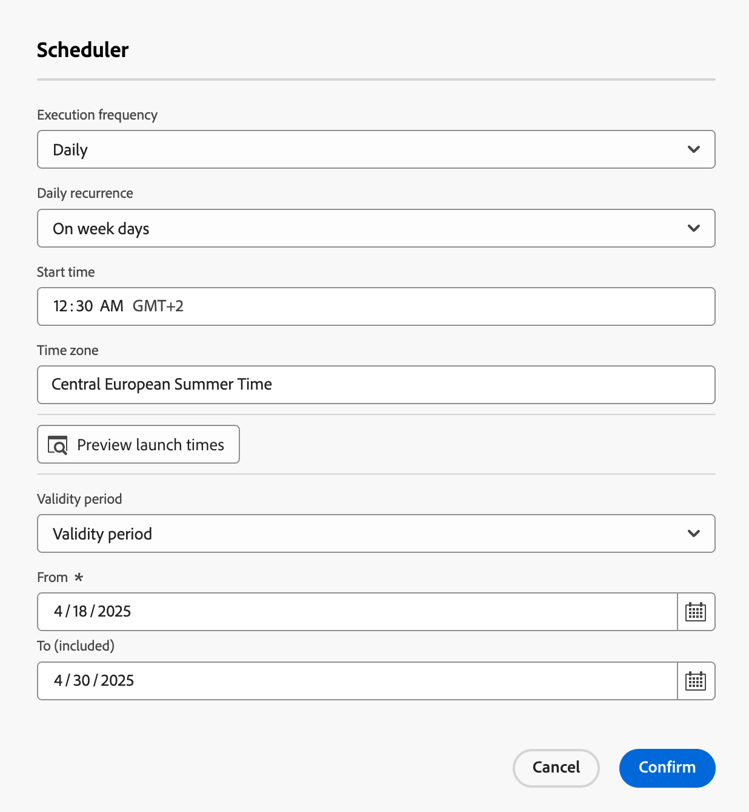
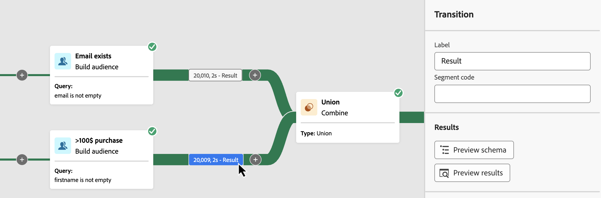
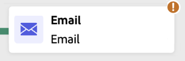

# Planificación e inicio de las campañas orquestadas {#start-monitor}

>[!CONTEXTUALHELP]
>id="ajo_campaign_publication"
>title="Publicación de la campaña orquestada"
>abstract="Para iniciar su campaña, debe publicarla. Asegúrese de que todas las advertencias se borran antes de la publicación."

+++ Tabla de contenido

| Bienvenido a campañas orquestadas | Inicie su primera campaña orquestada | Consultar la base de datos | Actividades de campañas organizadas |
|---|---|---|---|
| [Introducción a las campañas orquestadas](gs-orchestrated-campaigns.md)  [Pasos de configuración](configuration-steps.md)  [Pasos clave para la creación de campañas orquestadas](gs-campaign-creation.md) | [Crear una campaña orquestada](create-orchestrated-campaign.md)  [Organizar actividades](orchestrate-activities.md)  [Enviar mensajes con campañas orquestadas](send-messages.md)  <b>[Iniciar y supervisar la campaña](start-monitor-campaigns.md)</b>  [Creación de informes](reporting-campaigns.md) | [Trabaje con el generador de reglas](orchestrated-rule-builder.md)  [Cree su primera consulta](build-query.md)  [Edite expresiones](edit-expressions.md) | [Empiece con las actividades](activities/about-activities.md)  Actividades: [Y únase](activities/and-join.md) - [Generar audiencia](activities/build-audience.md) - [Cambiar dimensión](activities/change-dimension.md) - [Combinar](activities/combine.md) - [Anulación de duplicación](activities/deduplication.md) - [Enriquecimiento](activities/enrichment.md) - [Bifurcación](activities/fork.md) - [Reconciliación](activities/reconciliation.md) - [División](activities/split.md) - [Espera](activities/wait.md) |

{style="table-layout:fixed"}

+++

 

Una vez que haya creado las tareas orquestadas y diseñadas para realizarlas en el lienzo, puede publicarlas y monitorizar cómo se ejecutan.

## Programación de campañas orquestadas {#schedule}

>[!CONTEXTUALHELP]
>id="ajo_orchestration_scheduler"
>title="Actividad planificador"
>abstract="La campaña **Planificador** le permite programar cuándo se inicia una campaña orquestada. Esta actividad debe considerarse como un inicio programado. Solo se puede utilizar como la primera actividad de la campaña orquestada."

Como administrador de campañas, puede programar campañas para que se inicien automáticamente en momentos específicos, lo que permite un tiempo preciso y datos de segmentación precisos para las comunicaciones de marketing.

### Prácticas recomendadas {#scheduler-best-practices}

* No programe una campaña orquestada para que se ejecute durante más de 15 minutos, ya que podría limitar el rendimiento general del sistema y crear bloques en la base de datos.
* Si desea enviar un mensaje de una sola vez en la campaña orquestada, puede configurarlo para que se ejecute **Una vez**.
* Si desea enviar un mensaje recurrente en la campaña orquestada, debe utilizar una opción **Scheduling** y establecer la frecuencia de ejecución. La actividad de entrega recurrente no permite definir una programación.

### Configuración de la programación de la campaña {#scheduler-configuration}

>[!CONTEXTUALHELP]
>id="ajo_orchestration_schedule_validity"
>title="Validez del planificador"
>abstract="Puede definir un período de validez para el planificador. Puede ser permanente (predeterminado) o válido hasta una fecha específica."

>[!CONTEXTUALHELP]
>id="ajo_orchestration_schedule_options"
>title="Opciones del planificador"
>abstract="Defina la frecuencia del planificador. Se puede ejecutar en un momento específico, una o varias veces al día, a la semana o al mes."

Siga estos pasos para configurar la **programación de campaña orquestada**:

1. Seleccione el botón **Lo antes posible** en la parte superior del lienzo de la campaña orquestada.

1. Configure **Frecuencia de ejecución**:

   * **Una vez**: la campaña orquestada se ejecuta una sola vez.

   * **Diario**: la campaña orquestada se ejecuta a una hora específica una vez al día.

   * **Varias veces al día:** la campaña orquestada se ejecuta regularmente varias veces al día. Puede configurar ejecuciones en momentos específicos o de forma periódica.

   * **Semanal**: la campaña orquestada se ejecuta en un momento determinado una o varias veces a la semana.

   * **Mensual**: la campaña orquestada se ejecuta en un momento determinado una o varias veces al mes. Puede seleccionar meses cuando necesite que se ejecute la campaña orquestada. También puede configurar ejecuciones en días de semana del mes específicos, como el segundo martes de mes.

     {width="50%" align="left"}

1. Defina los detalles de ejecución según la frecuencia seleccionada. Los campos de detalle varían según la frecuencia utilizada (tiempo, frecuencia de repetición, días especificados, etc.).

1. Haga clic en **Previsualizar horas de inicio** para comprobar la programación de las siguientes diez ejecuciones de la campaña orquestada.

1. Defina el periodo de validez del planificador:

   * **Permanente (nunca caduca)**: la campaña orquestada se ejecuta según la frecuencia especificada, sin límites en el lapso de tiempo ni número de iteraciones.

   * **Período de validez**: la campaña orquestada se ejecuta según la frecuencia especificada, hasta una fecha específica. Debe especificar las fechas de inicio y finalización.

1. Seleccione **Confirmar** para guardar la configuración. La frecuencia de ejecución se muestra encima del lienzo de campaña orquestado.

>[!TIP]
>
>Si desea iniciar la campaña orquestada de inmediato, mantenga el valor predeterminado **Lo antes posible**.

### Ejemplo {#scheduler-example}

En el siguiente ejemplo, la actividad se configura de modo que la campaña orquestada se ejecute dos veces al día a las 9 y las 12 de la mañana, todos los días de la semana del 1 de octubre de 2025 al 1 de enero de 2026.

{width="50%" align="left"}

## Inicio de una campaña orquestada {#start}

Para iniciar una campaña orquestada, vaya a la pestaña **[!UICONTROL Orchestration]** del menú **[!UICONTROL Campaigns]**, seleccione la campaña que desee iniciar y, a continuación, haga clic en el botón **[!UICONTROL Play]** en la esquina superior derecha del lienzo.

Una vez que se está ejecutando la campaña orquestada, cada actividad del lienzo se ejecuta en un orden secuencial, hasta que se llega al final de la campaña orquestada.

Puede realizar un seguimiento del progreso de los perfiles de destino en tiempo real mediante un flujo visual. Esto le permite identificar rápidamente el estado de cada actividad y el número de perfiles en transición entre ellas.

{zoomable="yes"}

En las campañas organizadas, los datos que pasan de una actividad a otra a través de transiciones se almacenan en una tabla de trabajo temporal. Estos datos se pueden mostrar para cada transición. Para ello, seleccione una transición para abrir sus propiedades en el lado derecho de la pantalla.

* Haga clic en **[!UICONTROL Vista previa del esquema]** para mostrar el esquema de la tabla de trabajo.
* Haga clic en **[!UICONTROL Previsualizar resultados]** para visualizar los datos transportados en la transición seleccionada.

{zoomable="yes"}

## Monitorización de la ejecución de la campaña

### Monitorización de la ejecución de actividades {#activities}

Los indicadores visuales de la esquina superior derecha de cada cuadro de actividad permiten comprobar su ejecución:

| Indicador visual | Descripción |
|-----|------------|
| {zoomable="yes"}{width="70%"} | La actividad se está ejecutando. |
| {zoomable="yes"}{width="70%"} | La actividad requiere su atención. Esto puede implicar confirmar el envío de una entrega o realizar la acción necesaria. |
| {zoomable="yes"}{width="70%"} | La actividad ha encontrado un error. Para resolver el problema, abra los registros de campaña organizados para obtener más información. |
| {zoomable="yes"}{width="70%"} | La actividad se ha ejecutado correctamente. |

### Monitorización de registros y tareas {#logs-tasks}

>[!CONTEXTUALHELP]
>id="ajo_campaign_logs"
>title="Registros y tareas"
>abstract="La pantalla **Registros y tareas** proporciona un historial de la ejecución de la campaña orquestada, registrando todas las acciones del usuario y los errores encontrados."

La monitorización de registros y tareas es un paso clave para analizar las campañas orquestadas y asegurarse de que se ejecutan correctamente. Se puede acceder a ellos desde el icono **[!UICONTROL Logs]** que está disponible en la barra de herramientas de acciones y en el panel de propiedades de cada actividad.

El menú **[!UICONTROL Registros y tareas]** proporciona un historial de la ejecución de la campaña orquestada, registrando todas las acciones del usuario y los errores encontrados.

{zoomable="yes"}

Hay dos tipos de información disponibles:

* La pestaña **[!UICONTROL Log]** contiene el historial de ejecución de todas las actividades de campaña orquestadas. Indexa las operaciones realizadas y los errores de ejecución por orden cronológico.
* La ficha **[!UICONTROL Tareas]** detalla la secuencia de ejecución de las actividades.

En ambas pestañas, puede elegir las columnas mostradas y su orden, aplicar filtros y utilizar el campo de búsqueda para encontrar rápidamente la información deseada.

## Comandos de ejecución de campaña organizados {#execution-commands}

La barra de acciones de la esquina superior derecha proporciona comandos que le permiten administrar la ejecución de la campaña orquestada. Puede hacer lo siguiente:

* **[!UICONTROL Iniciar]** / **[!UICONTROL Reanudar]** la ejecución del   campaña orquestada, que luego adquiere el estado En curso. Si la campaña orquestada se ha pausado, se reanuda, pero se inicia y las actividades iniciales se activan.

* **[!UICONTROL Pausar]** la ejecución de la campaña orquestada, que luego adquiere el estado Paused. No se activará ninguna actividad nueva hasta que se reanude, pero las operaciones en curso no se suspenden.

* **[!UICONTROL Detener]** una campaña orquestada que se está ejecutando y que luego pasará al estado Finalizado. Las operaciones en curso se interrumpen si es posible. No puede continuar desde la campaña orquestada desde el mismo lugar en el que se detuvo.
